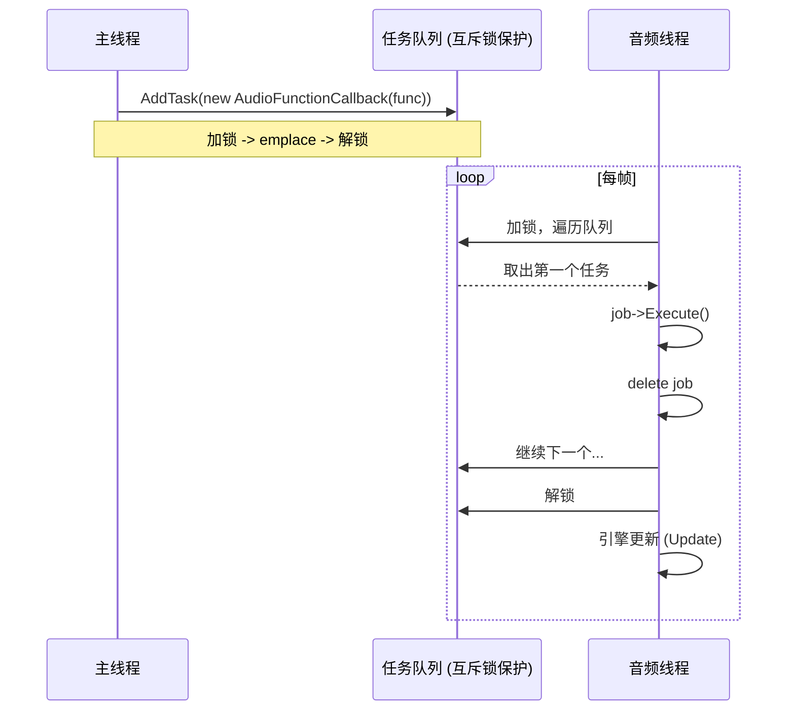
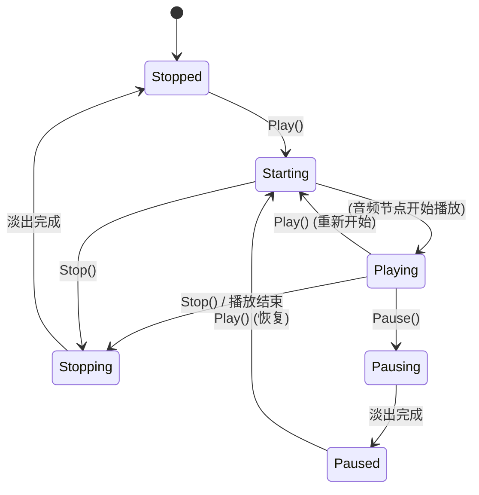
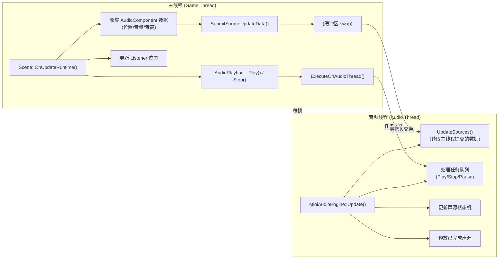
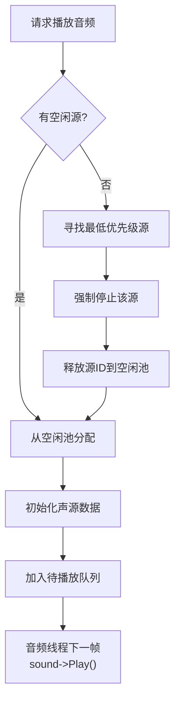
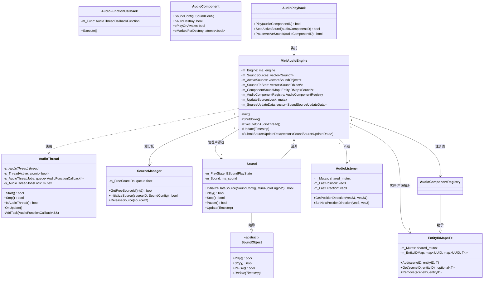

# Haoyue 引擎音频模块文档

## 目录

- [1. 概述](#1-概述)
- [2. 多线程架构详解](#2-多线程架构详解)
  - [2.1 为什么需要独立音频线程](#21-为什么需要独立音频线程)
  - [2.2 音频线程的生命周期](#22-音频线程的生命周期)
  - [2.3 任务队列机制](#23-任务队列机制)
  - [2.4 跨线程通信与同步](#24-跨线程通信与同步)
  - [2.5 线程安全的数据结构](#25-线程安全的数据结构)
- [3. 设计决策分析](#3-设计决策分析)
  - [3.1 为什么选择 miniaudio](#31-为什么选择-miniaudio)
  - [3.2 为什么音频源使用对象池模式](#32-为什么音频源使用对象池模式)
  - [3.3 为什么使用 EntityIDMap 而不是直接指针](#33-为什么使用-entityidmap-而不是直接指针)
  - [3.4 为什么 AudioComponent 分离于引擎核心](#34-为什么-audiocomponent-分离于引擎核心)
  - [3.5 为什么状态机如此设计](#35-为什么状态机如此设计)
- [4. 引擎运行时集成](#4-引擎运行时集成)
  - [4.1 生命周期总览](#41-生命周期总览)
  - [4.2 初始化流程](#42-初始化流程)
  - [4.3 游戏线程中的每帧流程](#43-游戏线程中的每帧流程)
  - [4.4 音频线程中的每帧循环](#44-音频线程中的每帧循环)
  - [4.5 场景切换与上下文管理](#45-场景切换与上下文管理)
  - [4.6 完整的跨线程数据流](#46-完整的跨线程数据流)
- [5. 3D 空间音频系统](#5-3d-空间音频系统)
  - [5.1 听者（Listener）系统](#51-听者listener系统)
  - [5.2 声源衰减模型](#52-声源衰减模型)
  - [5.3 多普勒效应](#53-多普勒效应)
- [6. 音频源管理与优先级](#6-音频源管理与优先级)
- [7. 音频播放接口（AudioPlayback）](#7-音频播放接口audioplayback)
- [8. 性能与调试](#8-性能与调试)
- [附录：类图](#附录类图)

---

## 1. 概述

Haoyue 引擎的音频模块基于 **miniaudio**（一个轻量级、单文件 C 音频库）构建，采用**双线程架构**：一个专用的音频线程负责所有音频相关的操作，游戏主线程通过线程安全的机制向其提交请求。这种设计将音频处理与游戏逻辑解耦，确保音频播放不会受到游戏逻辑卡顿的影响。

音频模块的核心架构分为以下层次：

| 层次 | 包含 | 职责 |
|------|------|------|
| **音频线程层** | `AudioThread`, `AudioFunctionCallback` | 线程生命周期管理，任务调度 |
| **引擎层** | `MiniAudioEngine` | 音频引擎初始化、更新、场景管理 |
| **声源管理层** | `SourceManager`, `Sound`, `SoundObject` | 音频源分配/回收，播放控制 |
| **组件层** | `AudioComponent`, `AudioListenerComponent` | ECS 集成，编辑器可编辑的音频属性 |
| **API 层** | `AudioPlayback` | 对外音频控制接口 |

---

## 2. 多线程架构详解

### 2.1 为什么需要独立音频线程

游戏引擎中，音频系统对**实时性**有着极为苛刻的要求。音频缓冲区必须在规定时间内填满，否则会产生可闻的爆音（glitch）、卡顿（dropout）甚至完全无声。然而游戏主线程的运行具有天然的不确定性：

- 物理模拟、AI 更新、渲染提交等密集计算可能导致单帧耗时暴增
- 垃圾回收或资源加载可能带来不可预测的停顿
- 调试、日志输出等操作也可能影响主线程的实时性

将这些不可预测的延迟引入音频管线会导致极差的用户体验。因此，音频模块被设计为**在专用线程上运行**，该线程的职责单一且优先级高，能够保证音频数据流的连续性。

### 2.2 音频线程的生命周期

音频线程由 `AudioThread` 类管理，其生命周期完全由 `MiniAudioEngine` 的构造/析构控制：

```cpp
// MiniAudioEngine 构造函数中启动线程
MiniAudioEngine::MiniAudioEngine()
{
    AudioThread::BindUpdateFunction([this](Haoyue::Timestep ts) { Update(ts); });
    AudioThread::Start();          // 启动音频线程
    ExecuteOnAudioThread([this] { Initialize(); }, "InitializeAudioEngine");  // 在线程上初始化引擎
}
```

**启动过程** (`AudioThread::Start`)：

1. 设置 `s_ThreadActive = true`
2. 创建 `std::thread`，线程入口立刻执行一个 while 循环
3. 在 Windows 平台上通过 `SetThreadDescription` 将线程命名为 `"Haoyue Audio Thread"`，便于调试器识别
4. 立即将线程 `detach()`——线程独立运行，不与任何 `std::thread` 对象绑定
5. 存储线程 ID，供后续 `IsAudioThread()` 检查

**主循环逻辑** (`AudioThread::OnUpdate`)：

```cpp
while (s_ThreadActive)
{
    OnUpdate();
}
```

`OnUpdate()` 的每一帧执行两个动作：
1. **处理任务队列**——按 FIFO 顺序执行从游戏线程提交过来的任务
2. **调用绑定的更新回调**——即 `MiniAudioEngine::Update(ts)`，该方法负责更新所有活跃声源的状态机、启动待播音频、释放已完成音频

**停止过程** (`AudioThread::Stop`)：

只需将 `s_ThreadActive` 设为 `false`。由于线程已被 detach，下一个循环条件检查失败后线程自然退出。这种轻量级的停止方式避免了复杂的线程 join 操作，但要求线程内的所有操作都是可中断且安全的。

### 2.3 任务队列机制

由于音频引擎的 API 调用必须发生在音频线程上，主线程不能直接调用 `ma_sound_start()`、`ma_sound_stop()` 等函数。为此，模块设计了**任务队列**（Job Queue）模式。

**任务定义**：

```cpp
class AudioFunctionCallback
{
    AudioThreadCallbackFunction const m_Func;  // 可调用对象
    const char* m_JobID;                       // 调试标识
};
```

**任务提交**（从主线程调用）：

```cpp
void AudioThread::AddTask(AudioFunctionCallback*&& funcCb)
{
    std::scoped_lock lock(s_AudioThreadJobsLock);
    s_AudioThreadJobs.emplace(std::move(funcCb));
}
```

**任务消费**（在音频线程中调用）：

```cpp
void AudioThread::OnUpdate()
{
    // ...
    std::scoped_lock lock(s_AudioThreadJobsLock);
    for (int i = s_AudioThreadJobs.size() - 1; i >= 0; i--)
    {
        auto job = s_AudioThreadJobs.front();
        job->Execute();
        s_AudioThreadJobs.pop();
        delete job;  // 执行完毕后自动释放
    }
    // ...
}
```



**为什么从队列尾部开始遍历（逆序）？**

`OnUpdate()` 中使用了 `for (int i = s_AudioThreadJobs.size() - 1; i >= 0; i--)` 而非标准的 `while (!queue.empty())`。这是因为在遍历过程中，当前帧提交的任务可能产生新的依赖任务（比如 "StartSound" 任务会触发后续的播放状态更新）。逆序遍历确保当帧任务在一个循环中被处理，而不会因为队列增长导致无限循环。

**为什么任务对象是裸指针且由音频线程 delete？**

使用裸指针而非 `shared_ptr` 是经过考量的性能决策：音频任务大多是快速的一次性调用，`shared_ptr` 的原子引用计数开销在这种高频小对象场景中不可忽视。任务在提交时由主线程 `new`，在消费时由音频线程 `delete`，生命周期清晰可控。

### 2.4 跨线程通信与同步

音频模块中存在多种跨线程通信模式，每种模式都使用了最适配的同步原语：

#### 模式一：任务提交（主线程 → 音频线程）

| 提交方 | 接收方 | 同步方式 | 数据方向 |
|--------|--------|----------|----------|
| 主线程 | 音频线程 | `std::mutex` + 队列 | 单向 |

`MiniAudioEngine::ExecuteOnAudioThread()` 是统一的提交入口。当调用者不确定自己当前在哪个线程上时，可以这样编写安全代码：

```cpp
void MiniAudioEngine::SubmitSoundToPlay(uint64_t audioComponentID, const SoundConfig& sourceConfig)
{
    auto startSound = [this, audioComponentID, sourceConfig] { /* ... */ };
    
    // 安全检查：如果已经在音频线程上，直接执行；否则提交到队列
    AudioThread::IsAudioThread() ? startSound() : ExecuteOnAudioThread(startSound, "StartSound");
}
```

这种模式避免了不必要的跨线程跳转：当场景初始化时批量启动音频，这些调用往往已经发生在音频线程上。

#### 模式二：批量数据交换（主线程 → 音频线程）

对于每帧都需要更新的声源位置、音量等数据，使用独立的**数据交换缓冲区**，通过 `std::mutex` 保护：

```cpp
// 主线程提交更新数据
void MiniAudioEngine::SubmitSourceUpdateData(std::vector<SoundSourceUpdateData> updateData)
{
    std::scoped_lock lock{ m_UpdateSourcesLock };
    m_SourceUpdateData.swap(updateData);  // swap 而非 copy，零拷贝
}

// 音频线程消费
void MiniAudioEngine::UpdateSources()
{
    std::scoped_lock lock{ m_UpdateSourcesLock };
    for (auto& data : m_SourceUpdateData)
    {
        // 更新对应声源的位置、音量、音高...
    }
}
```

使用 `std::vector::swap` 而非拷贝，将主线程的独占数据直接交换给音频线程，避免了大量的元素复制开销。

#### 模式三：原子变量

对于简单的布尔或数值状态，使用 `std::atomic` 避免加锁：

- `std::atomic<bool> s_ThreadActive` —— 控制音频线程运行/停止
- `std::atomic<std::thread::id> s_AudioThreadID` —— 存储音频线程 ID
- `std::atomic<float> s_LastFrameTime` —— 音频线程每帧耗时（供统计用）
- `std::atomic<bool> bMarkedForDestroy` —— 标记"一次性音效"所属实体待销毁

#### 模式四：共享互斥锁（Listener 数据）

对于读多写少的场景（听者位置），使用 `std::shared_mutex`：

```cpp
struct AudioListener
{
    void GetPositionDirection(glm::vec3& position, glm::vec3& direction) const
    {
        std::shared_lock lock{ m_Mutex };  // 共享锁：可并发读
        position = m_LastPosition;
        direction = m_LastDirection;
    }

    void SetNewPositionDirection(const glm::vec3& newPosition, const glm::vec3& newDirection)
    {
        std::unique_lock lock{ m_Mutex };   // 唯一锁：写入时独占
        m_LastPosition = newPosition;
        m_LastDirection = newDirection;
        m_Changed = true;
    }
};
```

#### 线程安全检查工具

`Audio::IsAudioThread()` 是一个方便的内联函数，可供任何代码在运行时检查当前执行上下文：

```cpp
static inline bool IsAudioThread()
{
    return std::this_thread::get_id() == AudioThread::GetThreadID();
}
```

### 2.5 线程安全的数据结构

#### EntityIDMap

`EntityIDMap<T>` 是一个泛型的线程安全映射，用于在场景ID和实体ID之间索引音频相关对象：

```cpp
template<typename T>
struct EntityIDMap
{
    void Add(Haoyue::UUID sceneID, Haoyue::UUID entityID, T object);   // 写操作：互斥锁
    std::optional<T> Get(Haoyue::UUID sceneID, Haoyue::UUID entityID) const;  // 读操作：共享锁
    void Remove(Haoyue::UUID sceneID, Haoyue::UUID entityID);  // 写操作：互斥锁
    void Clear(Haoyue::UUID sceneID);  // 写操作：互斥锁
};
```

这个结构是被音频线程和主线程**并发访问**的关键数据。主线程在销毁实体时调用 `Remove`，音频线程在播放结束后也调用 `Remove`。使用 `shared_mutex` 确保读操作可以并发，写操作互斥。

---

## 3. 设计决策分析

### 3.1 为什么选择 miniaudio

| 特性 | miniaudio | FMOD | Wwise | OpenAL |
|------|-----------|------|-------|--------|
| 许可证 | **公有领域 (Public Domain)** | 商业收费 | 商业收费 | LGPL |
| 集成方式 | **单头文件/单C文件** | SDK 安装 | SDK 安装 | 系统库 |
| 大小 | ~100KB 编译后 | 数 MB | 数 GB | 系统依赖 |
| 功能完整度 | 高 | 极高 | 极高 | 基础 |
| 自研友好度 | **★★★★★** | ★★ | ★ | ★★★ |

选择 miniaudio 的核心原因与引擎的自研定位高度一致：

1. **零成本集成**：公有领域许可证，无任何商业限制，引擎可以自由修改和分发
2. **极致轻量**：引擎的自有 `miniaudio.cpp` 仅 65KB，编译后对最终二进制体积影响极小
3. **完整功能**：支持 3D 空间音频、多普勒效应、音频衰减模型、实时效果链、多格式解码（WAV/MP3/FLAC/OGG 等）、流式加载、资源管理器
4. **可控性强**：没有黑盒，所有分配回调、日志回调都可自定义，便于集成引擎自身的调试和统计系统
5. **跨平台**：Windows/macOS/Linux/Android/iOS 全平台支持

### 3.2 为什么音频源使用对象池模式

模块在初始化时预分配 32 个 `Sound` 对象，通过 `SourceManager` 管理其分配和回收：

```cpp
void MiniAudioEngine::CreateSources()
{
    m_SoundSources.reserve(m_NumSources);  // 32
    for (int i = 0; i < m_NumSources; i++)
    {
        Sound* soundSource = new Sound();
        soundSource->m_SoundSourceID = i;
        m_SoundSources.push_back(soundSource);
        m_SourceManager.m_FreeSourcIDs.push(i);  // 空闲ID入队
    }
}
```

**为什么使用对象池而不是动态创建/销毁？**

1. **消除运行时分配**：音频线程是实时线程，`new`/`delete` 可能触发堆锁竞争或页面错误，在音频线程上调用是不可预测的
2. **音频源上限可控**：32 个源意味着无论场景中有多少 AudioComponent，同时播放的声音不超过 32 个。超出时，引擎通过优先级驱逐最低优先级的源（详见第 6 节）
3. **避免反复构造/析构**：`Sound` 内部封装了 `ma_sound`，反复构造销毁会频繁调用 miniaudio 的底层 API，产生不必要的开销

### 3.3 为什么使用 EntityIDMap 而不是直接指针

音频组件（`AudioComponent`）是 ECS 组件，实体的生命周期由 ECS 管理。直接存储指向 `AudioComponent` 的指针是不安全的——实体被销毁后指针悬空。

`EntityIDMap` 通过双重 UUID 索引（场景 ID + 实体 ID）来定位音频对象：

```
EntityIDMap<Sound*>
    ├── sceneID_1 ───┬── entityID_A ──→ Sound* (正在播放)
    │                 └── entityID_B ──→ Sound* (正在播放)
    └── sceneID_2 ───┬── entityID_C ──→ Sound* (正在播放)
                      └── entityID_D ──→ Sound* (正在播放)
```

这种方法的好处：
- **不持有指针**：即使实体被销毁，`EntityIDMap` 中的 ID 不会变成悬空指针
- **场景隔离**：每个场景的音频映射独立，场景切换时只需 `Clear(sceneID)` 即可清理
- **异常安全**：`Get()` 返回 `std::optional`，调用方必须检查值是否存在

### 3.4 为什么 AudioComponent 分离于引擎核心

`AudioComponent` 是 ECS 组件，定义在 `AudioComponent.h` 中，包含的是**描述性数据**而非运行时状态：

```cpp
struct AudioComponent
{
    SoundConfig SoundConfig;       // 音频配置（文件、空间化参数等）
    bool bAutoDestroy = false;     // 播放完成后自动销毁所属实体
    bool bPlayOnAwake = false;     // 场景启动时自动播放
    float VolumeMultiplier = 1.0f; // 音量倍率
    float PitchMultiplier = 1.0f;  // 音高倍率
    glm::vec3 SourcePosition;      // 声源位置
    std::atomic<bool> bMarkedForDestroy = false;  // 待销毁标记（线程安全）
};
```

这种分离设计的原因：

1. **ECS 架构一致性**：音频组件的配置数据存储在场景的 ECS Registry 中，随场景序列化/反序列化，与引擎实例解耦
2. **编辑器友好**：这些属性可以直接暴露在 Editor 的 Inspector 面板中，无需通过引擎 API 间接设置
3. **场景切换零成本**：切换场景时只需加载新场景的 `AudioComponent` 列表，引擎在 `SetSceneContext` 中重新注册即可

### 3.5 为什么状态机如此设计

`Sound` 类内部维护了一个精细的状态机来控制音频播放生命周期：



**为什么设计如此多的状态？**

1. **消除音频毛刺（Pop/Click）**：直接从"播放"跳到"暂停"或"停止"会产生突变，引起可闻的冲击声。过渡状态（`Stopping`、`Pausing`、`Starting`）确保音量通过淡入/淡出平滑变化
2. **状态一致性**：每个操作的合法性都由当前状态决定。比如在 `Stopping` 状态下再次调用 `Stop()` 不会重启淡出流程，而是直接调用 `StopNow()` 强制停止
3. **异步节点状态同步**：miniaudio 的 `ma_sound` 内核状态与引擎状态之间有一个"等待"的过程。`Starting` 状态等待 `ma_sound_is_playing()` 返回 `true` 后再切换到 `Playing`，确保状态机反映的是底层硬件的真实状态

**StopFade 机制**：

`StopFade` 通过 miniaudio 内置的淡出系统实现，避免手动计算采样值：

```cpp
bool Sound::StopFade(uint64_t numSamples)
{
    // 负数的 volumeBeg 表示从当前音量开始
    ma_result result = ma_sound_set_fade_in_pcm_frames(&m_Sound, -1.0f, 0.0f, numSamples);
    return result == MA_SUCCESS;
}
```

`STOPPING_FADE_MS` 定义为 28ms——这个数值低于人类感知"咔嗒声"的阈值（约 50ms），同时足够长以避免音频波形截断产生的毛刺。

---

## 4. 引擎运行时集成

### 4.1 生命周期总览

```
引擎启动
    │
    ├── Application::Init()
    │      └── Audio::MiniAudioEngine::Init()
    │             ├── new MiniAudioEngine()
    │             │      ├── AudioThread::BindUpdateFunction(...)  // 绑定引擎更新函数
    │             │      ├── AudioThread::Start()                  // 启动音频线程
    │             │      └── ExecuteOnAudioThread(Initialize)      // 初始化 miniaudio
    │             └── (线程独立运行)
    │
    ├── 运行时循环
    │      ├── 主线程：Scene::OnUpdateRuntime()
    │      │      ├── 收集 AudioComponent 数据 → SubmitSourceUpdateData()
    │      │      ├── 更新 AudioListener 位置
    │      │      └── 销毁 markedForDestroy 的实体
    │      │
    │      └── 音频线程：MiniAudioEngine::Update()
    │             ├── UpdateSources()       // 应用主线程提交的位置/音量更新
    │             ├── 启动待播放音频
    │             ├── 更新所有活跃声源状态机
    │             └── 释放已完成声源
    │
    └── Application::Shutdown()
           └── Audio::MiniAudioEngine::Shutdown()
                  ├── StopAll(true)          // 立即停止所有音频
                  ├── AudioThread::Stop()    // 停止音频线程
                  └── ma_engine_uninit()     // 销毁 miniaudio 引擎
```

### 4.2 初始化流程

`Application::Init()` 按顺序初始化各子系统：

```
ScriptEngine::Init() → Physics::Init() → Audio::MiniAudioEngine::Init() → AssetManager::Init()
```

音频子系统在物理引擎之后、资源管理器之前初始化。这个顺序并非随意——音频引擎初始化后会立即向任务队列提交一个 `InitializeAudioEngine` 任务。由于音频线程已经启动，初始化操作在音频线程上异步完成。

`MiniAudioEngine::Initialize()` 的详细步骤：

1. 配置 `ma_engine_config`：
   - `periodSizeInFrames = PCM_FRAME_CHUNK_SIZE (1024)` —— 控制音频缓冲区大小，越小延迟越低
   - 注入自定义内存分配回调，用于统计音频引擎内存占用
2. 调用 `ma_engine_init()` 初始化 miniaudio 引擎
3. 设置 miniaudio 的日志回调，将日志重定向到引擎的 `HY_CORE_INFO`
4. 为资源管理器注入独立的内存分配回调（区分引擎内存和资源管理器内存）
5. 分配 32 个音频源（`CreateSources()`）

### 4.3 游戏线程中的每帧流程

在 `Scene::OnUpdateRuntime()` 中，音频相关操作分为三个步骤：

#### 步骤一：更新音频组件数据

遍历场景中所有 `AudioComponent`：

```cpp
auto view = m_Registry.view<Audio::AudioComponent>();
for (auto entity : view)
{
    Entity e = { entity, this };
    auto& audioComponent = e.GetComponent<Audio::AudioComponent>();

    // 处理"一次性音效"的自动销毁
    if (audioComponent.bAutoDestroy && audioComponent.bMarkedForDestroy)
    {
        deadEntities.push_back(e);
        continue;
    }

    // 收集当前帧数据
    updateData.emplace_back(SoundSourceUpdateData{
        e.GetUUID(),
        audioComponent.VolumeMultiplier,
        audioComponent.PitchMultiplier,
        worldSpaceTransform.Translation,
        velocity
    });
}
```

#### 步骤二：批量提交给音频引擎

```cpp
Audio::MiniAudioEngine::Get().SubmitSourceUpdateData(updateData);
```

`SubmitSourceUpdateData` 使用 `swap` 将数据从主线程的 `vector` 转移到音频引擎的缓冲区，零拷贝。

#### 步骤三：更新听者位置

```cpp
auto view = m_Registry.view<AudioListenerComponent>();
for (auto entity : view)
{
    if (e.GetComponent<AudioListenerComponent>().Active)
    {
        Audio::MiniAudioEngine::Get().UpdateListenerPosition(
            worldSpaceTransform.Translation,
            worldSpaceTransform.Forward
        );
        break;
    }
}
```

如果用户没有显式添加 `AudioListenerComponent`，系统会自动在主相机上创建一个。

### 4.4 音频线程中的每帧循环

音频线程的 `OnUpdate()` 方法是一个紧密循环：

```
┌───────────────────────────────────────┐
│  1. Timer.Reset()                      │
│                                       │
│  2. 处理任务队列                       │
│     ┌─ StopSound                      │
│     ├─ StartSound                     │
│     ├─ PauseSound                     │
│     └─ ...                            │
│                                       │
│  3. MiniAudioEngine::Update(ts)        │
│     ├─ UpdateSources()                │
│     │   └─ 应用位置、音量、音高更新    │
│     ├─ 遍历 m_SoundsToStart           │
│     │   └─ sound->Play()              │
│     ├─ 遍历 m_ActiveSounds            │
│     │   └─ sound->Update(ts)          │
│     │       └─ 状态机推进              │
│     └─ ReleaseFinishedSources()        │
│         └─ 将已完成声源放回空闲池      │
│                                       │
│  4. s_LastFrameTime = 当前帧耗时       │
└───────────────────────────────────────┘
```

关键点：音频线程的更新与底层音频回调（miniaudio 的 `ma_device` 数据回调）是**两个独立的层级**。miniaudio 的后端设备回调负责在独立的音频中断上下文中填充硬件缓冲区——这是硬实时操作。而 `MiniAudioEngine::Update` 运行在普通线程中，负责管理音频对象的状态，不直接参与音频数据的混合。这种分层设计降低了引擎代码对硬实时约束的敏感度。

### 4.5 场景切换与上下文管理

当场景切换时，`MiniAudioEngine::SetSceneContext` 被调用：

```cpp
void MiniAudioEngine::SetSceneContext(const Haoyue::Ref<Haoyue::Scene>& scene)
{
    StopAll();                  // 停止所有音频（淡出）
    m_SceneContext = scene;     // 切换场景上下文
    m_CurrentSceneID = newSceneID;

    // 重新注册新场景中的所有 AudioComponent
    auto view = newScene->GetAllEntitiesWith<Audio::AudioComponent>();
    for (auto entity : view)
    {
        Haoyue::Entity e = { entity, newScene };
        RegisterAudioComponent(e);
    }
}
```

注意 `StopAll()` 使用淡出停止而非立即停止，避免了场景切换时突兀的音频中断。淡出由 `Sound::Stop()` 触发，时长 28ms。

场景销毁时，`OnSceneDestruct` 清理对应场景的 audio component registry：

```cpp
void MiniAudioEngine::OnSceneDestruct(Haoyue::UUID sceneID)
{
    Get().m_AudioComponentRegistry.Clear(sceneID);
}
```

### 4.6 完整的跨线程数据流



---

## 5. 3D 空间音频系统

### 5.1 听者（Listener）系统

听者代表了用户在三维空间中的耳朵。引擎支持场景中**唯一一个活跃听者**，通常绑定在主相机上。

**线程安全设计**：

`AudioListener` 结构使用 `shared_mutex` 实现读写分离。主线程每帧写入最新位置，音频线程在 `UpdateListener()` 中读取：

```cpp
void MiniAudioEngine::UpdateListener()
{
    if (m_AudioListener.HasChanged(true))
    {
        glm::vec3 pos, dir, vel;
        m_AudioListener.GetPositionDirection(pos, dir);
        m_AudioListener.GetVelocity(vel);

        ma_engine_listener_set_position(&m_Engine, 0, pos.x, pos.y, pos.z);
        ma_engine_listener_set_direction(&m_Engine, 0, dir.x, dir.y, dir.z);
        ma_engine_listener_set_velocity(&m_Engine, 0, vel.x, vel.y, vel.z);
    }
}
```

**变更检测优化**：

`HasChanged()` 使用原子布尔标记，避免每帧都加锁读取。主线程写入时设置标记，音频线程消费后自动清除。

### 5.2 声源衰减模型

模块支持四种衰减模型，通过 `AttenuationModel` 枚举控制：

| 模型 | 适用场景 | 物理含义 |
|------|----------|----------|
| `None` | UI 音效、背景音乐 | 无距离衰减，无双耳空间化 |
| `Inverse`（默认） | 3D 游戏通用 | 模拟真实声音衰减，能量与距离平方成反比 |
| `Linear` | 特定风格需求 | 音量随距离线性衰减 |
| `Exponential` | 夸张效果 | 指数衰减，衰减速度可调 |

每个声源可以独立配置其空间化参数：

```cpp
struct SpatializationConfig
{
    AttenuationModel AttenuationMod;
    float MinGain;           // 最小音量
    float MaxGain;           // 最大音量
    float MinDistance;       // 开始衰减的距离
    float MaxDistance;       // 停止衰减的距离
    float ConeInnerAngle;    // 声锥内角（定向声源）
    float ConeOuterAngle;    // 声锥外角
    float ConeOuterGain;     // 声锥外音量倍率
    float Rolloff;           // 衰减曲线陡度
};
```

**初始化声源空间化配置**：

```cpp
// Sound::InitializeDataSource() 中
if (isSpatializationEnabled)
{
    auto& spatializer = m_Sound.engineNode.spatializer;
    m_Sound.engineNode.isSpatializationDisabled = false;

    spatializer.config.attenuationModel = attMod;
    spatializer.config.minGain = spatialization.MinGain;
    spatializer.config.maxGain = spatialization.MaxGain;
    spatializer.config.rolloff = spatialization.Rolloff;
    // ... 更多参数
}
```

### 5.3 多普勒效应

当听者或声源有相对速度时，引擎自动计算多普勒频移。速度数据来源于物理引擎（`PhysicsActor::GetLinearVelocity()`）：

```cpp
if (auto physicsActor = Physics::GetActorForEntity(listener))
{
    if (physicsActor->IsDynamic())
        Audio::MiniAudioEngine::Get().UpdateListenerVelocity(physicsActor->GetLinearVelocity());
}
```

多普勒效应的强度通过 `SpatializationConfig::DopplerFactor` 控制，设为 0 可完全禁用以获得更稳定的音频体验。

---

## 6. 音频源管理与优先级

引擎预分配固定数量的音频源（32 个）。当所有源都在使用时，新声源通过优先级系统驱逐已有源。

**优先级计算**：

```cpp
float Sound::GetPriority()
{
    return GetCurrentFadeVolume() * ((float)m_Priority / 255.0f);
}
```

优先级综合了**当前淡入淡出音量**和**基础优先级值**（`m_Priority`，默认 64/255）。这意味着一个正在淡出的声源优先级自然降低，容易被新声源取代。

**驱逐策略**（`FreeLowestPrioritySource`）：

1. 优先驱逐处于 `Stopping` 状态的源（即将结束，影响最小）
2. 其次驱逐优先级最低的非循环源（非循环的通常比循环的"更不重要"）
3. 最后驱逐优先级最低的循环源
4. 同优先级时，比较播放进度百分比，更靠后的优先被驱逐

**源管理流程图**：



---

## 7. 音频播放接口（AudioPlayback）

`AudioPlayback` 是暴露给上层逻辑（C# 脚本、编辑器等）的静态接口：

```cpp
class AudioPlayback
{
    static bool Play(uint64_t audioComponentID, float startTime = 0.0f);
    static bool StopActiveSound(uint64_t audioComponentID);
    static bool PauseActiveSound(uint64_t audioComponentID);
    static bool IsPlaying(uint64_t audioComponentID);
};
```

这些接口通过 `audioComponentID`（实体的 UUID）而非直接引用 `AudioComponent` 来操作，与 `EntityIDMap` 的索引机制一致。

**典型使用场景**：

```cpp
// 从脚本触发一个"一次性音效"
AudioPlayback::Play(entityID);

// 停止特定实体的音效
AudioPlayback::StopActiveSound(entityID);
```

当带有 `bAutoDestroy = true` 的 `AudioComponent` 播放完毕时，音频线程会通过 `onPlaybackComplete` 回调将 `bMarkedForDestroy` 设为 `true`。游戏主线程在下一帧检测到该标记后，销毁对应实体：

```cpp
// Scene.cpp 中
if (audioComponent.bAutoDestroy && audioComponent.bMarkedForDestroy)
{
    deadEntities.push_back(e);
    continue;
}
```

---

## 8. 性能与调试

**统计信息**：

引擎通过 `Stats` 结构暴露音频模块的运行状态，可供 ImGui 调试面板使用：

```cpp
struct Stats
{
    uint32_t NumActiveSounds;   // 当前活跃声源数
    uint32_t TotalSources;      // 总声源数（32）
    uint64_t MemEngine;         // 引擎内存占用（字节）
    uint64_t MemResManager;     // 资源管理器内存占用（字节）
    float    FrameTime;         // 音频线程帧耗时（毫秒）
    uint64_t NumAudioComps;     // 场景中 AudioComponent 数量
};
```

**内存追踪**：

通过自定义分配回调精确追踪 miniaudio 的内存分配。分配回调在每个分配的头部多分配 `sizeof(int)` 字节用于存储分配大小，从而在释放时能够准确减去对应内存量：

```cpp
void* MemAllocCallback(size_t sz, void* pUserData)
{
    char* buffer = (char*)malloc(sz + offset);
    int* sizeBox = (int*)buffer;
    *sizeBox = sz;
    // 存储分配大小，释放时读取
    return buffer + offset;
}
```

---

## 附录：类图


