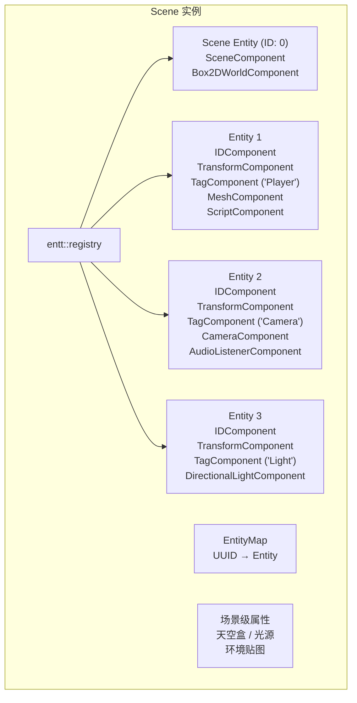
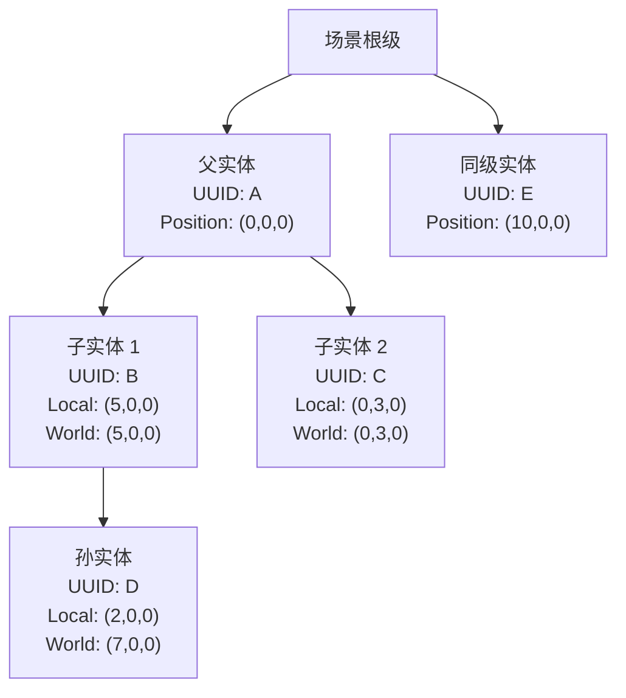
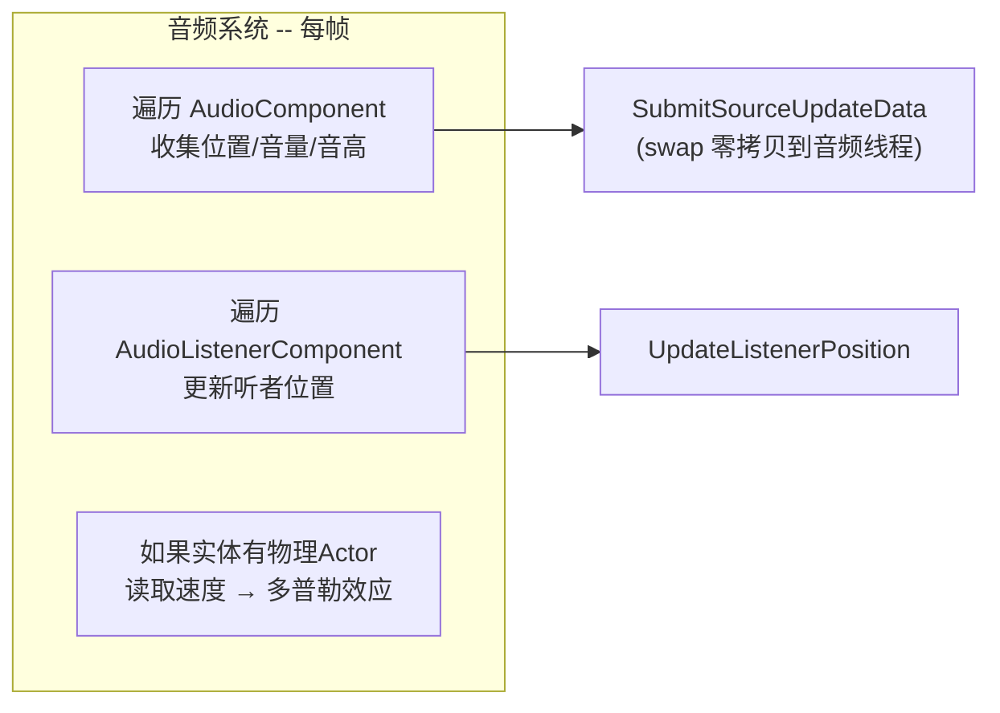
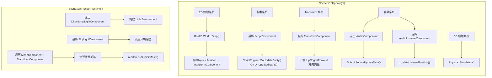
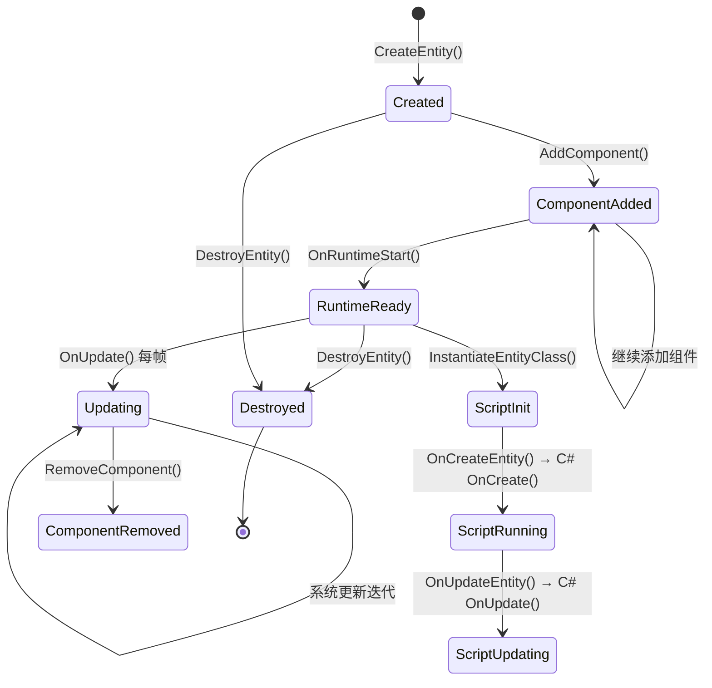

# Haoyue 引擎 ECS 模块文档

## 目录

- [1. 概述](#1-概述)
- [2. EnTT 集成架构详解](#2-enth-集成架构详解)
  - [2.1 为什么选择 EnTT](#21-为什么选择-enth)
  - [2.2 EnTT Registry 在引擎中的封装](#22-enth-registry-在引擎中的封装)
  - [2.3 Entity —— 轻量级句柄](#23-entity--轻量级句柄)
- [3. 组件系统](#3-组件系统)
  - [3.1 核心组件](#31-核心组件)
  - [3.2 渲染组件](#32-渲染组件)
  - [3.3 物理组件](#33-物理组件)
  - [3.4 脚本与音频组件](#34-脚本与音频组件)
  - [3.5 组件设计原则](#35-组件设计原则)
- [4. Scene —— ECS 的承载体](#4-scene--ecs-的承载体)
  - [4.1 Scene 的核心数据结构](#41-scene-的核心数据结构)
  - [4.2 EntityMap —— 双重索引机制](#42-entitymap--双重索引机制)
  - [4.3 实体创建与销毁](#43-实体创建与销毁)
  - [4.4 场景层级关系系统](#44-场景层级关系系统)
  - [4.5 场景复制（CopyTo）](#45-场景复制copyto)
- [5. 响应式 ECS —— 事件驱动架构](#5-响应式-ecs--事件驱动架构)
  - [5.1 EnTT 的观察者模式](#51-enth-的观察者模式)
  - [5.2 脚本组件的响应式管理](#52-脚本组件的响应式管理)
  - [5.3 音频组件的响应式管理](#53-音频组件的响应式管理)
- [6. 运行时系统编排](#6-运行时系统编排)
  - [6.1 系统更新总览](#61-系统更新总览)
  - [6.2 2D 物理系统](#62-2d-物理系统)
  - [6.3 脚本系统](#63-脚本系统)
  - [6.4 Transform 系统](#64-transform-系统)
  - [6.5 3D 物理系统](#65-3d-物理系统)
  - [6.6 音频系统](#66-音频系统)
  - [6.7 渲染系统](#67-渲染系统)
- [7. 场景序列化](#7-场景序列化)
  - [7.1 YAML 格式](#71-yaml-格式)
  - [7.2 组件序列化/反序列化](#72-组件序列化反序列化)
- [8. 设计决策分析](#8-设计决策分析)
  - [8.1 为什么 Entity 是轻量句柄而非继承基类](#81-为什么-entity-是轻量句柄而非继承基类)
  - [8.2 为什么 Scene 同时持有 Registry 和 EntityMap](#82-为什么-scene-同时持有-registry-和-entitymap)
  - [8.3 为什么 Transform 用欧拉角而非四元数存储](#83-为什么-transform-用欧拉角而非四元数存储)
  - [8.4 为什么物理组件使用 void* 运行时存储](#84-为什么物理组件使用-void-运行时存储)
  - [8.5 为什么 Scene 继承 Asset](#85-为什么-scene-继承-asset)
- [附录：类图与数据流](#附录类图与数据流)

---

## 1. 概述

Haoyue 引擎的 ECS（Entity-Component-System）架构基于 **EnTT**（一个高性能现代 C++ 实体组件系统库）构建。Scene 作为 ECS 的容器，持有 `entt::registry` 管理所有实体和组件；`Entity` 是一个轻量级句柄（仅包含 `entt::entity` 句柄和 `Scene*` 指针），所有游戏逻辑通过组件读写实现。

引擎当前实现了以下系统，按更新顺序排列：

| 系统 | 更新相位 | 依赖 |
|------|---------|------|
| 2D 物理（Box2D） | `Scene::OnUpdate()` 开头 | Transform, RigidBody2D |
| C# 脚本 | `Scene::OnUpdate()` | ScriptComponent |
| Transform 后处理 | `Scene::OnUpdate()` | Transform |
| 音频 | `Scene::OnUpdate()` | AudioComponent, AudioListener |
| 3D 物理（PhysX） | `Scene::OnUpdate()` 结尾 | RigidBody, Collider |
| 渲染 | `Scene::OnRenderRuntime/Editor()` | Mesh, Camera, Light |

---

## 2. EnTT 集成架构详解

### 2.1 为什么选择 EnTT

| 特性 | EnTT | Unity ECS | Bevy ECS (Rust) |
|------|------|-----------|-----------------|
| **许可证** | MIT | 专有 | MIT/Apache 2.0 |
| **语言** | C++17/20 | C# | Rust |
| **编译速度** | 快（头文件 only） | — | — |
| **性能** | **极高**（无虚函数、无继承开销） | 中等 | 极高 |
| **运行时类型信息** | 内置（哈希工具） | 反射系统 | 派生 trait |
| **观察者模式** | 内置 | 无 | 无 |

EnTT 被选中的核心原因：

1. **性能至上**：EnTT 使用稀疏数组（Sparse Set）存储组件，实体创建/销毁为 O(1)，迭代访问为线性内存访问（缓存友好）
2. **零继承开销**：不是"对象继承"模式，而是"数据组合"模式。`Entity` 不需要继承任何基类，不需要虚函数表
3. **响应式编程支持**：内置的 `on_construct`/`on_destroy`/`on_update` 观察者让 ECS 事件驱动的实现极其简洁
4. **头文件 only**：不需要额外的编译步骤，`#include "entt/entt.hpp"` 即可使用
5. **活跃的社区**：EnTT 是目前 C++ 生态中最流行的 ECS 实现，有活跃的维护和文档

### 2.2 EnTT Registry 在引擎中的封装

`Scene` 类持有 `entt::registry` 作为核心数据容器：

```cpp
class Scene : public Asset
{
    // ...
private:
    entt::registry m_Registry;  // ECS 核心——所有实体和组件存储于此
    EntityMap m_EntityIDMap;    // UUID → Entity 的辅助索引
    // ...
};
```

引擎没有直接暴露 `m_Registry` 给外部代码，而是通过 `Entity` 类的方法来间接操作：

```cpp
// Entity.h —— 所有组件操作通过 Entity 的模板方法
template<typename T, typename... Args>
T& AddComponent(Args&&... args)
{
    HY_CORE_ASSERT(!HasComponent<T>(), "Entity already has component!");
    return m_Scene->m_Registry.emplace<T>(m_EntityHandle, std::forward<Args>(args)...);
}

template<typename T>
T& GetComponent()
{
    HY_CORE_ASSERT(HasComponent<T>(), "Entity doesn't have component!");
    return m_Scene->m_Registry.get<T>(m_EntityHandle);
}

template<typename T>
bool HasComponent()
{
    return m_Scene->m_Registry.has<T>(m_EntityHandle);
}
```

EnTT Registry 的内部存储（稀疏数组原理）：

```
entt::registry
    │
    ├── Component Storage (entt::sparse_set)
    │    ├── TransformComponent:    [密集数组]  [稀疏数组] → 实体ID到索引的映射
    │    ├── MeshComponent:         [密集数组]  [稀疏数组]
    │    ├── ScriptComponent:       [密集数组]  [稀疏数组]
    │    └── ... 每个组件类型独立存储
    │
    ├── Entity (entt::entity):      // 实体的原生句柄（默认32位无符号整数）
    └── Observer (on_construct/on_destroy/on_update)
```

**稀疏数组原理**：

```
稀疏数组 (sparse)：   [实体ID → 索引]
    index = sparse[entity_id]    // O(1)

密集数组 (dense)：    [索引 → 组件实例]
    component = dense[index]     // O(1) + 缓存线性访问
```

这意味着：
- 通过 `Entity` 获取组件：`m_Registry.get<T>(handle)` → O(1)
- 遍历所有拥有某组件的实体：`m_Registry.view<T>()` → 直接遍历 dense 数组，缓存命中率极高
- 检查实体是否有组件：`m_Registry.has<T>(handle)` → O(1)

### 2.3 Entity —— 轻量级句柄

```cpp
class Entity
{
    entt::entity m_EntityHandle{ entt::null };  // 32位整数
    Scene* m_Scene = nullptr;                     // 所属场景指针
};
```

`Entity` 本身不存储任何组件数据，仅由两个指针大小的值组成（8 + 8 = 16 bytes）。它的拷贝成本极低：

```cpp
Entity a = scene->CreateEntity("Player");
Entity b = a;  // 拷贝句柄，b 和 a 指向同一个实体
a.GetComponent<TransformComponent>().Translation.x = 10.0f;
// b.GetComponent<TransformComponent>().Translation.x == 10.0f ✓
```

**为什么 Entity 不是 `entt::entity` 直接使用？**

`entt::entity` 只是一个无符号整数，仅能标识 Registry 内唯一的实体，但它无法定位到具体的 Scene 实例。引擎的 `Entity` 在 `entt::entity` 的基础上添加了 `Scene*`，使得同一个 Entity 对象可以自包含所有上下文：

```cpp
// 有了 Scene*，Entity 可以自己完成所有操作
entity.AddComponent<MeshComponent>(mesh);
auto& transform = entity.GetComponent<TransformComponent>();
entity.HasComponent<RigidBodyComponent>();
```

这样上层代码完全不需要接触 `entt::registry`，实现了对 EnTT 的良好封装。

---

## 3. 组件系统

引擎定义了约 20 种组件，全部位于 `Components.h` 中。它们是**纯数据结构**（POD 或类似 POD），不含业务逻辑方法。

### 3.1 核心组件

**IDComponent**

```cpp
struct IDComponent
{
    UUID ID = 0;  // 全局唯一标识（64位）
};
```

每个实体在创建时自动分配一个 `UUID`，该 ID 是实体的**全局唯一身份**，在场景保存/加载、跨场景引用、脚本实体查找中统一使用。使用 UUID 而非 `entt::entity`（32位整数）序列化的核心原因是：entt::entity 的数值在每次运行时的 Registry 创建顺序中确定，无法持久化。

**TagComponent**

```cpp
struct TagComponent
{
    std::string Tag;  // 实体名称（如 "Player", "Main Camera"）
};
```

实体的可读名称，在编辑器的 SceneHierarchyPanel 中显示和编辑。

**RelationshipComponent**

```cpp
struct RelationshipComponent
{
    UUID ParentHandle = 0;          // 父实体 UUID
    std::vector<UUID> Children;     // 子实体 UUID 列表
};
```

实现实体父子层级关系，详见 4.4 节。

**TransformComponent**

```cpp
struct TransformComponent
{
    glm::vec3 Translation = { 0.0f, 0.0f, 0.0f };  // 位置
    glm::vec3 Rotation = { 0.0f, 0.0f, 0.0f };      // 欧拉角（度）
    glm::vec3 Scale = { 1.0f, 1.0f, 1.0f };          // 缩放

    // 缓存的方向向量（每帧更新）
    glm::vec3 Up = { 0.0f, 1.0f, 0.0f };
    glm::vec3 Right = { 1.0f, 0.0f, 0.0f };
    glm::vec3 Forward = { 0.0f, 0.0f, -1.0f };

    glm::mat4 GetTransform() const
    {
        return glm::translate(glm::mat4(1.0f), Translation)
             * glm::toMat4(glm::quat(Rotation))
             * glm::scale(glm::mat4(1.0f), Scale);
    }
};
```

### 3.2 渲染组件

| 组件 | 关键字段 | 用途 |
|------|---------|------|
| `CameraComponent` | `SceneCamera Camera` + `bool Primary` | 场景主相机 |
| `MeshComponent` | `Ref<Mesh> Mesh` | 3D 网格渲染 |
| `SpriteRendererComponent` | `vec4 Color` + `Ref<Texture2D> Texture` | 2D 精灵渲染 |
| `DirectionalLightComponent` | `vec3 Radiance` + `float Intensity` + `bool CastShadows` | 方向光 |
| `SkyLightComponent` | `Ref<Environment> SceneEnvironment` + `bool DynamicSky` | 环境光照 |

**渲染管线中的组件迭代**：

```cpp
// Scene::OnRenderRuntime() 中——使用 EnTT group 迭代
auto group = m_Registry.group<MeshComponent>(entt::get<TransformComponent>);
for (auto entity : group)
{
    auto [transformComponent, meshComponent] = group.get<TransformComponent, MeshComponent>(entity);
    // 提交给 SceneRenderer
    renderer->SubmitMesh(meshComponent, transform);
}
```

`entt::group` 比 `entt::view` 更高效——它强制拥有两个组件的实体在内存中按主组件（MeshComponent）的顺序排列，进一步优化缓存局部性。

### 3.3 物理组件

**2D 物理（Box2D）**

| 组件 | 用途 |
|------|------|
| `RigidBody2DComponent` | 2D 刚体（Static/Dynamic/Kinematic） |
| `BoxCollider2DComponent` | 2D 盒子碰撞体 |
| `CircleCollider2DComponent` | 2D 圆形碰撞体 |

**3D 物理（PhysX）**

| 组件 | 用途 |
|------|------|
| `RigidBodyComponent` | 3D 刚体（Static/Dynamic），含质量、阻力、锁定轴 |
| `BoxColliderComponent` | 3D 盒子碰撞体 |
| `SphereColliderComponent` | 3D 球体碰撞体 |
| `CapsuleColliderComponent` | 3D 胶囊碰撞体 |
| `MeshColliderComponent` | 3D 网格碰撞体 |

**运行时 Body 存储契约**：

物理组件存放物理引擎运行时数据的字段使用 `void*` 指针：

```cpp
struct RigidBody2DComponent
{
    Type BodyType;
    bool FixedRotation = false;
    void* RuntimeBody = nullptr;         // → b2Body*（运行时设置）
};
```

运行前，`RuntimeBody` 为 `nullptr`；运行时启动时，Box2D `b2Body*` 被创建并赋值给此字段；运行时停止时，此字段应被归零。这种设计避免了对物理引擎头文件的编译时依赖（不需要在 ECS 组件中包含 Box2D 或 PhysX 的复杂类型）。

### 3.4 脚本与音频组件

```cpp
struct ScriptComponent
{
    std::string ModuleName;  // C# 类全名，如 "ExampleApp.ExampleEntity"
};
```

```cpp
struct AudioComponent       // 定义在 AudioComponent.h（引擎模块级）
{
    SoundConfig SoundConfig;
    bool bAutoDestroy = false;
    bool bPlayOnAwake = false;
    float VolumeMultiplier = 1.0f;
    float PitchMultiplier = 1.0f;
    glm::vec3 SourcePosition = { 1.0f, 1.0f, 1.0f };
    std::atomic<bool> bMarkedForDestroy = false;
};

struct AudioListenerComponent
{
    bool Active = false;
    // ...
};
```

注意 `AudioComponent` 和 `AudioListenerComponent` 被定义在 `Audio/` 子目录而非 `Scene/Components.h` 中。这种按模块组织的组件定义体现了引擎的分层架构——每个子系统可以定义自己的组件。

### 3.5 组件设计原则

引擎的组件系统遵循以下原则：

1. **纯数据结构**：组件不包含业务逻辑方法，只有构造函数和类型转换运算符
2. **可拷贝语义**：所有组件都显式定义了拷贝构造函数（`= default`），以便场景复制和序列化
3. **最小化依赖**：物理组件中使用 `void*` 而非具体类型来避免对物理引擎的编译时依赖
4. **编辑器友好**：所有组件的字段都定义为 `public`，便于 ImGui 直接反射编辑
5. **POD 优先**：优先使用基本类型和 glm 向量，避免字符串等重类型（ScriptComponent.ModuleName 是例外）

---

## 4. Scene —— ECS 的承载体

### 4.1 Scene 的核心数据结构

```cpp
class Scene : public Asset
{
    UUID m_SceneID;                    // 场景的唯一 ID
    entt::registry m_Registry;         // ECS 核心：实体和组件的存储
    EntityMap m_EntityIDMap;           // UUID → Entity 辅助索引

    entt::entity m_SceneEntity;        // 场景标记实体（持有 SceneComponent 和 Box2DWorldComponent）
    std::string m_DebugName;           // 场景名称

    Ref<Environment> m_Environment;    // 环境光照
    LightEnvironment m_LightEnvironment; // 光源环境
    Light m_Light;                     // 场景光源
    // ... 更多场景级别属性
};
```



### 4.2 EntityMap —— 双重索引机制

场景同时维护了两个索引系统：

```
实体检索方式：
    entt::entity handle (32-bit int)    ← 内部索引，Registry 原生使用
        │
        └──→ EntityMap (UUID → Entity)  ← 外部索引，持久化使用
```

**为什么需要双重索引？**

| 索引 | 类型 | 用途 | 性能 |
|------|------|------|------|
| `entt::entity` | 32-bit 整数 | 所有组件操作 | O(1) |
| `UUID` | 64-bit 整数 | 序列化、跨场景引用、脚本操作 | O(1) hash |

`entt::entity` 仅在当前进程的 Registry 生命周期内有效。重启引擎后，Registry 重新创建，句柄值可能不同。而 UUID 是全局唯一且持久化的，因此：

- **运行时内部**使用 `entt::entity` 进行所有组件操作（无需哈希）
- **场景保存/加载**使用 UUID 引用实体
- **C# 脚本**使用 `entityID`（即 UUID）引用引擎实体

`CreateEntity` 将自动填充两个索引：

```cpp
Entity Scene::CreateEntity(const std::string& name)
{
    auto entity = Entity{ m_Registry.create(), this };
    auto& idComponent = entity.AddComponent<IDComponent>();
    idComponent.ID = {};                    // 生成新 UUID

    entity.AddComponent<TransformComponent>();
    entity.AddComponent<RelationshipComponent>();
    if (!name.empty())
        entity.AddComponent<TagComponent>(name);

    m_EntityIDMap[idComponent.ID] = entity;  // 填充 EntityMap
    return entity;
}
```

`FindEntityByUUID` 通过遍历 `IDComponent` 的方式查找（而非使用 EntityMap 的反向索引）。这是一个 O(n) 操作，但在引擎的当前规模下（场景数百到数千实体）完全可接受：

```cpp
Entity Scene::FindEntityByUUID(UUID id)
{
    auto view = m_Registry.view<IDComponent>();
    for (auto entity : view)
    {
        auto& idComponent = m_Registry.get<IDComponent>(entity);
        if (idComponent.ID == id)
            return Entity(entity, this);
    }
    return Entity{};
}
```

### 4.3 实体创建与销毁

**创建（CreateEntity）**：

1. `m_Registry.create()` —— 在 EnTT 中创建一个新的实体，返回 `entt::entity` 句柄
2. 默认添加的组件：`IDComponent`（UUID）、`TransformComponent`、`RelationshipComponent`
3. 如果提供了名称，添加 `TagComponent`
4. 将 `UUID → Entity` 映射存入 `m_EntityIDMap`

**带 ID 创建（CreateEntityWithID）**：

用于场景反序列化和场景复制，使用指定的 UUID 而非生成新的。

**销毁（DestroyEntity）**：

```cpp
void Scene::DestroyEntity(Entity entity)
{
    // 1. 通知脚本引擎（如果实体有 ScriptComponent）
    if (entity.HasComponent<ScriptComponent>())
        ScriptEngine::OnScriptComponentDestroyed(m_SceneID, entity.GetUUID());

    // 2. 通知音频引擎（如果实体有 AudioComponent）
    if (entity.HasComponent<Audio::AudioComponent>())
        Audio::MiniAudioEngine::Get().UnregisterAudioComponent(m_SceneID, entity.GetUUID());

    // 3. 从 Registry 中销毁实体（EnTT 自动清理所有组件）
    m_Registry.destroy(entity.m_EntityHandle);

    // 注：此时 entity 引用悬空，不应继续使用
}
```

**为什么手动通知脚本引擎和音频引擎而不是使用 EnTT observer？**

因为 `on_destroy` 的回调在 `m_Registry.destroy()` 时触发，但调用时场景的 `IDComponent` 可能已经被销毁，导致无法获取 `sceneID` 和 `entityID`。因此 `Scene::DestroyEntity` 在销毁实体前手动通知各个子系统。

### 4.4 场景层级关系系统

引擎通过 `RelationshipComponent` 实现了实体的父子层级结构：

```cpp
struct RelationshipComponent
{
    UUID ParentHandle = 0;          // 父实体的 UUID（0 = 无父级）
    std::vector<UUID> Children;     // 子实体 UUID 列表
};
```

**层级变换计算**：

```cpp
glm::mat4 Scene::GetTransformRelativeToParent(Entity entity)
{
    glm::mat4 transform(1.0f);

    Entity parent = FindEntityByUUID(entity.GetParentUUID());
    if (parent)
        transform = GetTransformRelativeToParent(parent);  // 递归计算父级变换

    return transform * entity.Transform().GetTransform();  // 级联
}
```

**父级绑定**：

```cpp
void Scene::ParentEntity(Entity entity, Entity parent)
{
    // 环形检测：防止 entity 成为自己的祖先
    if (parent.IsDescendantOf(entity))
    {
        UnparentEntity(parent);
        Entity newParent = FindEntityByUUID(entity.GetParentUUID());
        if (newParent)
        {
            UnparentEntity(entity);
            ParentEntity(parent, newParent);
        }
    }

    // 如果已有父级，先解绑
    Entity previousParent = FindEntityByUUID(entity.GetParentUUID());
    if (previousParent)
        UnparentEntity(entity);

    // 绑定到新父级
    entity.SetParentUUID(parent.GetUUID());
    parent.Children().push_back(entity.GetUUID());

    ConvertToLocalSpace(entity);  // 将世界坐标转换为局部坐标
}
```

**场景层级树**：



### 4.5 场景复制（CopyTo）

`Scene::CopyTo` 用于将编辑场景复制为运行时场景。其核心是**按 UUID 重建所有实体和组件**：

```cpp
void Scene::CopyTo(Ref<Scene>& target)
{
    // 第一阶段：创建所有实体（带 UUID）
    std::unordered_map<UUID, entt::entity> enttMap;
    auto idComponents = m_Registry.view<IDComponent>();
    for (auto entity : idComponents)
    {
        auto uuid = m_Registry.get<IDComponent>(entity).ID;
        Entity e = target->CreateEntityWithID(uuid);  // 保持 UUID 一致
        enttMap[uuid] = e.m_EntityHandle;              // 建立映射
    }

    // 第二阶段：批量拷贝所有组件（使用模板函数）
    CopyComponent<TagComponent>(target->m_Registry, m_Registry, enttMap);
    CopyComponent<TransformComponent>(target->m_Registry, m_Registry, enttMap);
    CopyComponent<MeshComponent>(target->m_Registry, m_Registry, enttMap);
    // ... 所有组件类型逐一拷贝
}
```

`CopyComponent` 模板函数通过 `entt::registry::view<T>()` 遍历源 Registry 中所有拥有该组件的实体，利用 `enttMap` 查找对应的目标实体，执行深拷贝：

```cpp
template<typename T>
static void CopyComponent(entt::registry& dstRegistry, entt::registry& srcRegistry,
    const std::unordered_map<UUID, entt::entity>& enttMap)
{
    auto components = srcRegistry.view<T>();
    for (auto srcEntity : components)
    {
        entt::entity destEntity = enttMap.at(srcRegistry.get<IDComponent>(srcEntity).ID);
        auto& srcComponent = srcRegistry.get<T>(srcEntity);
        auto& destComponent = dstRegistry.emplace_or_replace<T>(destEntity, srcComponent);
    }
}
```

---

## 5. 响应式 ECS —— 事件驱动架构

### 5.1 EnTT 的观察者模式

EnTT 的 `registry` 提供三个观察者事件：

- `on_construct<T>()` —— 当有实体添加组件 T 时触发
- `on_destroy<T>()` —— 当有实体移除组件 T 时触发
- `on_update<T>()` —— 当有实体的组件 T 被替换时触发

Haoyue 引擎使用 `on_construct` 和 `on_destroy` 实现了子系统与 ECS 的自动同步：

```cpp
// Scene 构造函数中
m_Registry.on_construct<ScriptComponent>().connect<&OnScriptComponentConstruct>();
m_Registry.on_destroy<ScriptComponent>().connect<&OnScriptComponentDestroy>();
m_Registry.on_construct<Audio::AudioComponent>().connect<&OnAudioComponentConstruct>();
```

一旦连接建立，**不需要任何轮询**——当编辑器用户通过 Inspector 面板添加或删除组件时，对应的回调自动被触发。

### 5.2 脚本组件的响应式管理

**组件添加时**：

```cpp
static void OnScriptComponentConstruct(entt::registry& registry, entt::entity entity)
{
    // 1. 找到所属场景
    auto sceneView = registry.view<SceneComponent>();
    UUID sceneID = registry.get<SceneComponent>(sceneView.front()).SceneID;
    Scene* scene = s_ActiveScenes[sceneID];

    // 2. 通知 ScriptEngine 初始化脚本实体
    auto entityID = registry.get<IDComponent>(entity).ID;
    ScriptEngine::InitScriptEntity(scene->m_EntityIDMap.at(entityID));
}
```

**组件销毁时**：

```cpp
static void OnScriptComponentDestroy(entt::registry& registry, entt::entity entity)
{
    auto sceneView = registry.view<SceneComponent>();
    UUID sceneID = registry.get<SceneComponent>(sceneView.front()).SceneID;
    Scene* scene = s_ActiveScenes[sceneID];

    auto entityID = registry.get<IDComponent>(entity).ID;
    ScriptEngine::OnScriptComponentDestroyed(sceneID, entityID);
}
```

### 5.3 音频组件的响应式管理

**组件添加时**：

```cpp
static void OnAudioComponentConstruct(entt::registry& registry, entt::entity entity)
{
    // ... 查找场景
    registry.get<Audio::AudioComponent>(entity).ParentHandle = entityID;
    Audio::MiniAudioEngine::Get().RegisterAudioComponent(scene->m_EntityIDMap.at(entityID));
}
```

**组件销毁时**（目前存在已知问题——IDComponent 可能已被销毁导致断言失败）：

```cpp
static void OnAudioComponentDestroy(entt::registry& registry, entt::entity entity)
{
    // ? This just throws that entity does not exist when looking for IDComponent
    // 因此 AudioComponent 的清理在 Scene::DestroyEntity() 中主动完成
}
```

---

## 6. 运行时系统编排

### 6.1 系统更新总览

Scene 的 `OnUpdate` 方法在每一帧被调用，其中完成了 ECS 系统的编排：

```cpp
void Scene::OnUpdate(Timestep ts)
{
    // 1. 2D 物理系统 —— Box2D 仿真步进
    box2DWorld->Step(ts, 6, 2);
    // 将 Box2D 位置写回 Transform

    // 2. 脚本系统 —— 调用 C# OnUpdate
    // 遍历 ScriptComponent → ScriptEngine::OnUpdateEntity()

    // 3. Transform 后处理 —— 计算方向向量
    // 遍历 TransformComponent → 计算 Up/Right/Forward

    // 4. 音频系统 —— 更新声源位置和听者
    // 遍历 AudioComponent → SubmitSourceUpdateData
    // 遍历 AudioListenerComponent → UpdateListenerPosition

    // 5. 3D 物理系统 —— PhysX 仿真
    Physics::Simulate(ts);
}
```

### 6.2 2D 物理系统

```cpp
// 1. Box2D 仿真步进
auto& box2DWorld = m_Registry.get<Box2DWorldComponent>(sceneView.front()).World;
box2DWorld->Step(ts, 6, 2);  // 6 velocity iterations, 2 position iterations

// 2. 将 Box2D 位置/角度写回 TransformComponent
auto view = m_Registry.view<RigidBody2DComponent>();
for (auto entity : view)
{
    Entity e = { entity, this };
    auto& rb2d = e.GetComponent<RigidBody2DComponent>();
    b2Body* body = static_cast<b2Body*>(rb2d.RuntimeBody);

    auto& position = body->GetPosition();
    auto& transform = e.GetComponent<TransformComponent>();
    transform.Translation.x = position.x;
    transform.Translation.y = position.y;
    transform.Rotation.z = body->GetAngle();
}
```

### 6.3 脚本系统

```cpp
auto view = m_Registry.view<ScriptComponent>();
for (auto entity : view)
{
    Entity e = { entity, this };
    if (ScriptEngine::ModuleExists(e.GetComponent<ScriptComponent>().ModuleName))
        ScriptEngine::OnUpdateEntity(e, ts);
}
```

每帧遍历所有拥有 `ScriptComponent` 的实体，调用对应的 C# `OnUpdate(float ts)` 方法。

### 6.4 Transform 系统

```cpp
auto view = m_Registry.view<TransformComponent>();
for (auto entity : view)
{
    auto& transformComponent = view.get(entity);
    Entity e = Entity(entity, this);
    glm::mat4 transform = GetTransformRelativeToParent(e);
    glm::vec3 translation, rotation, scale;
    Math::DecomposeTransform(transform, translation, rotation, scale);

    glm::quat rotationQuat = glm::quat(rotation);
    transformComponent.Up = glm::normalize(glm::rotate(rotationQuat, glm::vec3(0.0f, 1.0f, 0.0f)));
    transformComponent.Right = glm::normalize(glm::rotate(rotationQuat, glm::vec3(1.0f, 0.0f, 0.0f)));
    transformComponent.Forward = glm::normalize(glm::rotate(rotationQuat, glm::vec3(0.0f, 0.0f, -1.0f)));
}
```

每帧从欧拉角→四元数计算出世界空间的 `Up/Right/Forward` 方向向量。为什么放在脚本更新之后？因为脚本可能在 `OnUpdate` 中修改了 Transform。

### 6.5 3D 物理系统

`Physics::Simulate(ts)` 驱动 PhysX 引擎的仿真步进。3D 物理的碰撞事件（`OnCollisionBegin/End`、`OnTriggerBegin/End`）通过 PhysX 回调触发。

### 6.6 音频系统



### 6.7 渲染系统

渲染系统在 `OnRenderRuntime` / `OnRenderEditor` 中运行，通过 EnTT 的 `group` 迭代提交绘制命令：

| 步骤 | 遍历方式 | 描述 |
|------|---------|------|
| 光源收集 | `m_Registry.group<DirectionalLightComponent>(entt::get<TransformComponent>)` | 构建 LightEnvironment |
| 天空盒收集 | `m_Registry.group<SkyLightComponent>(entt::get<TransformComponent>)` | 设置环境贴图 |
| 网格提交 | `m_Registry.group<MeshComponent>(entt::get<TransformComponent>)` | 提交所有网格到 SceneRenderer |

---

## 7. 场景序列化

场景序列化使用 YAML 格式，通过 `yaml-cpp` 库实现。

### 7.1 YAML 格式

场景文件的顶层结构：

```yaml
Scene:
  SceneID: 7a3f1e2d-b8c4-4f90-9d1a-5e6b3c2a1f0d
  Name: MyScene
  Entities:
    - Entity:
        ID: a1b2c3d4-e5f6-7890-abcd-ef1234567890
        TagComponent:
          Tag: Player
        TransformComponent:
          Translation: [0.0, 1.5, 0.0]
          Rotation: [0.0, 45.0, 0.0]
          Scale: [1.0, 1.0, 1.0]
        MeshComponent:
          Mesh: Resources/meshes/Player.fbx
        ScriptComponent:
          ModuleName: ExampleApp.PlayerController
    - Entity:
        ID: b2c3d4e5-f6a7-8901-bcde-f12345678901
        TagComponent:
          Tag: Directional Light
        # ...
```

### 7.2 组件序列化/反序列化

每个组件在 `SceneSerializer.cpp` 中有对应的序列化和反序列化代码。YAML 格式的类型转换器（如 `glm::vec3`）在文件头注册，使得组件可以直接序列化为 YAML 节点：

```cpp
// 序列化 TransformComponent
out["TransformComponent"]["Translation"] = tc.Translation;
out["TransformComponent"]["Rotation"]    = tc.Rotation;
out["TransformComponent"]["Scale"]       = tc.Scale;
```

```cpp
// 反序列化 TransformComponent
glm::vec3 translation = entity["Translation"].as<glm::vec3>();
glm::vec3 rotation    = entity["Rotation"].as<glm::vec3>();
glm::vec3 scale       = entity["Scale"].as<glm::vec3>();
transformComponent.Translation = translation;
transformComponent.Rotation    = rotation;
transformComponent.Scale       = scale;
```

---

## 8. 设计决策分析

### 8.1 为什么 Entity 是轻量句柄而非继承基类

| 方案 | 代表引擎 | 优点 | 缺点 |
|------|---------|------|------|
| **轻量句柄**（Haoyue） | EnTT 生态 | 无虚表开销，数据与逻辑分离，组合灵活 | 调试时需手动跟踪句柄 |
| 继承基类 `Entity` | Unity | 直觉自然，OO 友好 | 菱形继承、虚函数开销、缓存不友好 |
| GameObject 模式 | Unity / Unreal | 组件树，脚本友好 | 对象较大，迭代效率低 |

EnTT 的纯数据 + 外部系统模式是 Haoyue 选择轻量句柄的根本原因：

```cpp
Entity player = scene->CreateEntity("Player");

// 添加组件——不涉及虚函数、不涉及继承
player.AddComponent<MeshComponent>(mesh);
player.AddComponent<RigidBodyComponent>();
player.AddComponent<ScriptComponent>("ExampleApp.PlayerController");

// 读取组件——直接内存访问，无虚函数间接
auto& transform = player.GetComponent<TransformComponent>();
transform.Translation.x += 1.0f;
```

### 8.2 为什么 Scene 同时持有 Registry 和 EntityMap

```
entt::registry——运行时组件操作
    │
    ├── Entity 迭代：view<T>() / group<T>()
    ├── 组件 CRUD：emplace<T>() / get<T>() / remove<T>()
    └── 事件：on_construct / on_destroy
    
EntityMap (UUID → Entity)——持久化索引
    │
    ├── 场景加载：通过 UUID 重建实体
    ├── C# 脚本：通过 entityID 查找实体
    └── 场景复制：UUID 一致性映射
```

两者的分工清晰：Registry 负责"运行时高效操作"，EntityMap 负责"持久化标识"。前者使用 `entt::entity`（32位 int）作为 key，后者使用 `UUID`（64位）作为 key。API 也对应分离——运行时操作通过 `Entity::GetComponent<>()`，持久化操作通过 `EntityMap` 或 `FindEntityByUUID`。

### 8.3 为什么 Transform 用欧拉角而非四元数存储

这是一个方便编辑器编辑的决策：

```cpp
struct TransformComponent
{
    glm::vec3 Translation = { 0.0f, 0.0f, 0.0f };
    glm::vec3 Rotation = { 0.0f, 0.0f, 0.0f };  // 欧拉角（度）
    glm::vec3 Scale = { 1.0f, 1.0f, 1.0f };
};
```

| 存储格式 | 编辑器友好度 | 精度 | 万向锁 | 矩阵转换 |
|----------|-------------|------|--------|---------|
| **欧拉角** | ★★★★★（三个 DragFloat） | 中等 | 有（在层级变换时解决） | 需要转四元数 |
| 四元数 | ★（四个值不可直观理解） | 高 | 无 | 直接 |
| 3x4 矩阵 | ★★（16 个值） | 高 | 无 | 直接 |

引擎的解决方式是**存储用欧拉角、计算转四元数**：

```cpp
glm::mat4 GetTransform() const
{
    return glm::translate(glm::mat4(1.0f), Translation)
         * glm::toMat4(glm::quat(glm::radians(Rotation)))  // 欧拉角 → 四元数 → 矩阵
         * glm::scale(glm::mat4(1.0f), Scale);
}
```

### 8.4 为什么物理组件使用 void* 运行时存储

```cpp
struct RigidBody2DComponent
{
    Type BodyType;
    bool FixedRotation = false;
    void* RuntimeBody = nullptr;         // → b2Body*
};
```

**为什么不用 `b2Body*` 或 `std::unique_ptr<b2Body>`？**

1. **避免编译时依赖**：`Components.h` 被整个引擎引用。包含 Box2D 或 PhysX 头文件会将物理引擎的编译依赖传播到所有引用 `Components.h` 的文件
2. **生命周期的清晰归属**：物理引擎的 Body 由物理引擎管理（`b2World::CreateBody`），而非 ECS 管理。`void*` 指针只是一个"运行时令牌"
3. **跨 DLL 兼容**：`void*` 是 C++ ABI 中最为稳定的类型，不存在 RTTI 或内存布局差异

### 8.5 为什么 Scene 继承 Asset

```cpp
class Scene : public Asset { ... };
```

这允许场景文件作为引擎资源管理系统的一等公民：
- 场景可以被 `AssetManager` 管理，支持引用计数和依赖追踪
- 场景文件路径可以通过 `AssetMetadata` 管理
- 后续可以实现场景的异步加载（与纹理、网格等资源统一调度）

---

## 附录：类图与数据流

### ECS 核心类图

```mermaid
classDiagram
    class Scene {
        -m_Registry: entt::registry
        -m_EntityIDMap: EntityMap
        -m_SceneID: UUID
        +CreateEntity(name) Entity
        +DestroyEntity(entity)
        +FindEntityByUUID(id) Entity
        +OnUpdate(ts)
        +CopyTo(target)
    }

    class Entity {
        -m_EntityHandle: entt::entity
        -m_Scene: Scene*
        +AddComponent~T~(args) T&
        +GetComponent~T~() T&
        +HasComponent~T~() bool
        +RemoveComponent~T~()
        +GetUUID() UUID
    }

    class IDComponent {
        ID: UUID
    }

    class TagComponent {
        Tag: string
    }

    class TransformComponent {
        Translation: vec3
        Rotation: vec3
        Scale: vec3
        Up/Right/Forward: vec3
        +GetTransform() mat4
    }

    class RelationshipComponent {
        ParentHandle: UUID
        Children: vector~UUID~
    }

    class MeshComponent {
        Mesh: Ref~Mesh~
    }

    class ScriptComponent {
        ModuleName: string
    }

    class CameraComponent {
        Camera: SceneCamera
        Primary: bool
    }

    class RigidBodyComponent {
        BodyType: Type
        Mass: float
        IsKinematic: bool
    }

    class AudioComponent {
        SoundConfig: SoundConfig
        bAutoDestroy: bool
        bPlayOnAwake: bool
    }

    Scene "1" --> "*" Entity : 管理
    Entity --> Scene : 引用

    Entity "*" --> IDComponent
    Entity "*" --> TagComponent
    Entity "*" --> TransformComponent
    Entity "*" --> RelationshipComponent
    Entity "*" --> MeshComponent
    Entity "*" --> ScriptComponent
    Entity "*" --> CameraComponent
    Entity "*" --> RigidBodyComponent
    Entity "*" --> AudioComponent

    note for Entity: "Entity 是轻量句柄<br/>(16 bytes: entt::entity + Scene*)"
    note for Scene: "Scene 是 ECS 容器<br/>(持有 Registry + EntityMap)"
```

### 每帧系统编排数据流



### 实体生命周期


