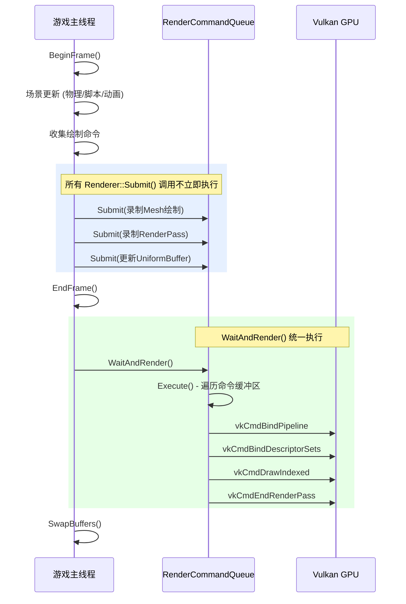
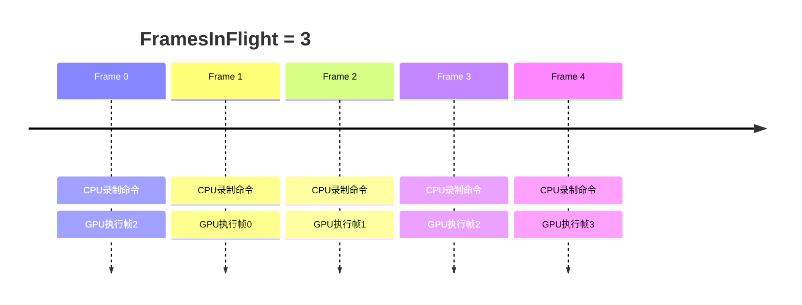
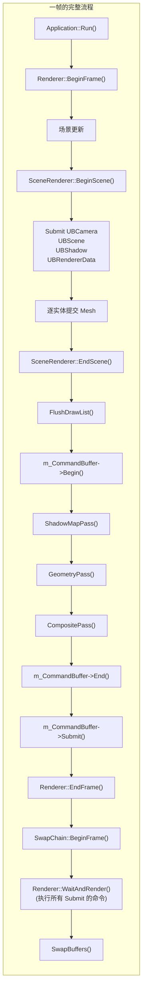
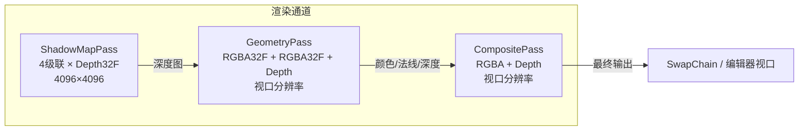
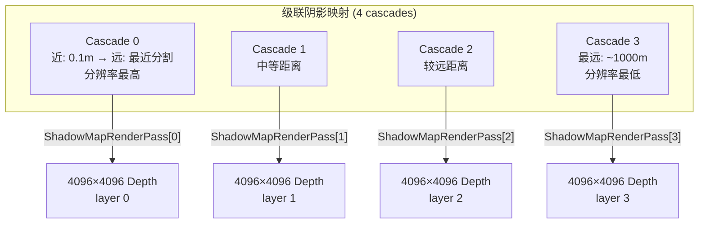
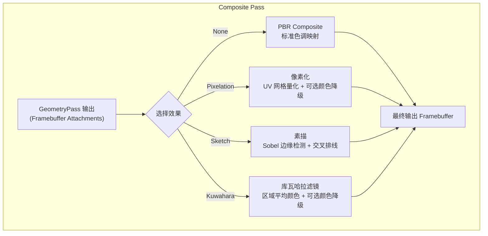
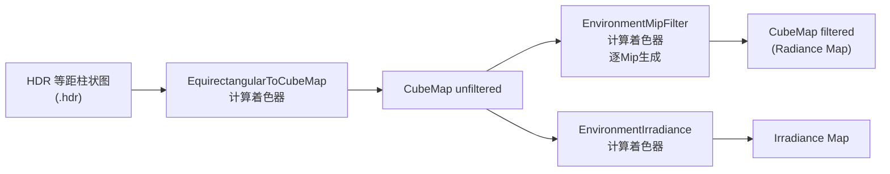
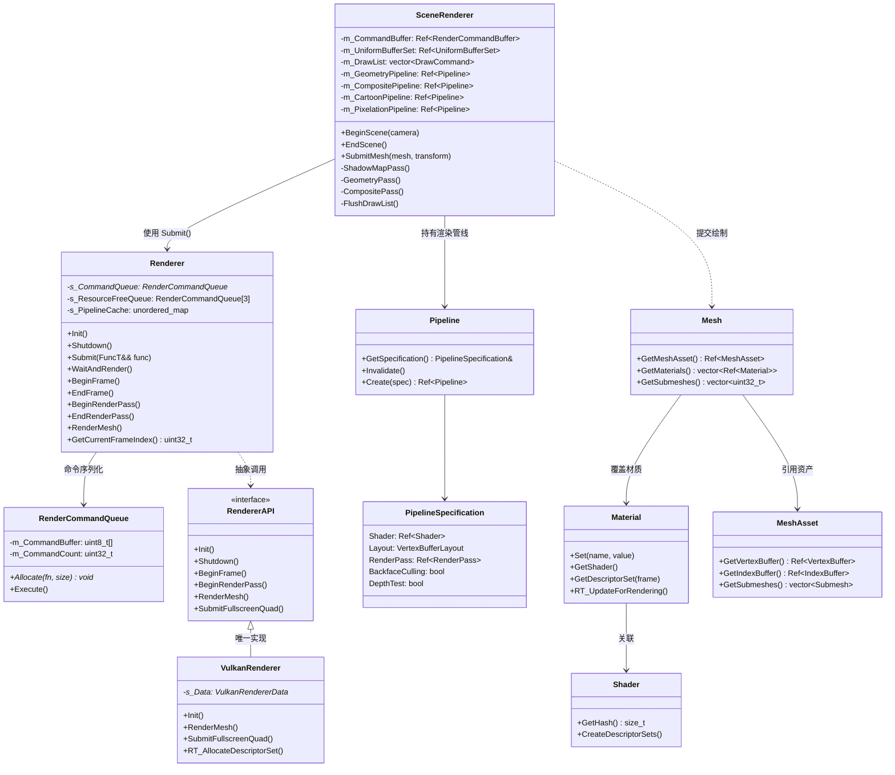
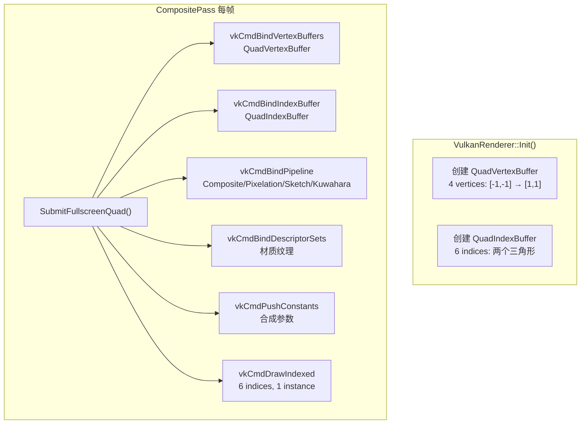
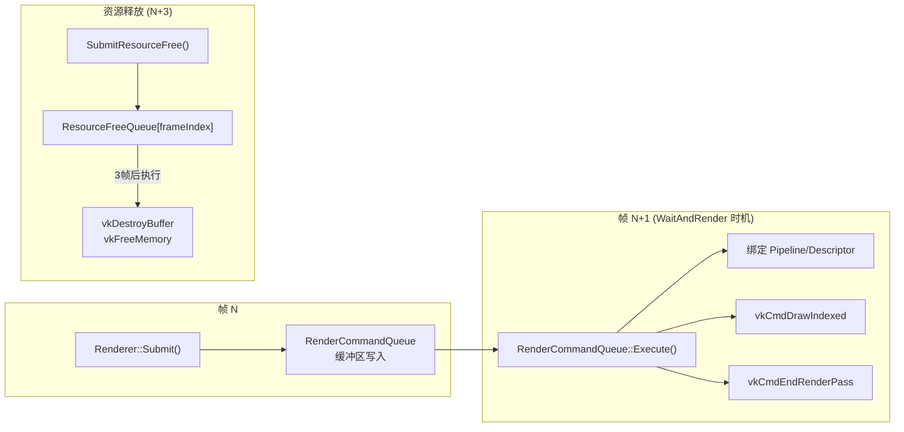

# Haoyue 引擎渲染模块文档

## 目录

- [1. 概述](#1-概述)
- [2. 多线程渲染架构详解](#2-多线程渲染架构详解)
  - [2.1 为什么需要渲染命令队列](#21-为什么需要渲染命令队列)
  - [2.2 RenderCommandQueue 的内部实现](#22-rendercommandqueue-的内部实现)
  - [2.3 延迟执行与主循环流程](#23-延迟执行与主循环流程)
  - [2.4 FramesInFlight 三重缓冲](#24-framesinflight-三重缓冲)
  - [2.5 资源安全释放机制](#25-资源安全释放机制)
- [3. 设计决策分析](#3-设计决策分析)
  - [3.1 为什么选择 Vulkan](#31-为什么选择-vulkan)
  - [3.2 为什么是 RenderCommandQueue 而非独立渲染线程](#32-为什么是-rendercommandqueue-而非独立渲染线程)
  - [3.3 为什么使用 Push Constants 而非 Uniform Buffer](#33-为什么使用-push-constants-而非-uniform-buffer)
  - [3.4 为什么 Pipeline 是独立的抽象层](#34-为什么-pipeline-是独立的抽象层)
  - [3.5 为什么 SceneRenderer 持有独立的渲染资源](#35-为什么-scenerenderer-持有独立的渲染资源)
  - [3.6 为什么 StylizedMode 在 CompositePass 中实现](#36-为什么-stylizedmode-在-compositepass-中实现)
- [4. 引擎运行时集成](#4-引擎运行时集成)
  - [4.1 生命周期总览](#41-生命周期总览)
  - [4.2 初始化流程](#42-初始化流程)
  - [4.3 每一帧的完整渲染流程](#43-每一帧的完整渲染流程)
  - [4.4 场景渲染管线详解](#44-场景渲染管线详解)
  - [4.5 ShadowMapPass：级联阴影映射](#45-shadowmappass级联阴影映射)
  - [4.6 GeometryPass：几何体绘制](#46-geometrypass几何体绘制)
  - [4.7 CompositePass：合成与风格化效果](#47-compositepass合成与风格化效果)
- [5. 资源管理体系](#5-资源管理体系)
  - [5.1 着色器管理（ShaderLibrary）](#51-着色器管理shaderlibrary)
  - [5.2 Pipeline 与 RenderPass](#52-pipeline-与-renderpass)
  - [5.3 材质系统](#53-材质系统)
  - [5.4 Mesh 与 Submesh 架构](#54-mesh-与-submesh-架构)
  - [5.5 环境贴图系统](#55-环境贴图系统)
- [6. 风格化渲染效果](#6-风格化渲染效果)
  - [6.1 卡通渲染（Cartoon）](#61-卡通渲染cartoon)
  - [6.2 像素化（Pixelation）](#62-像素化pixelation)
  - [6.3 素描风格（Sketch）](#63-素描风格sketch)
  - [6.4 库瓦哈拉滤镜（Kuwahara）](#64-库瓦哈拉滤镜kuwahara)
- [7. 调试与性能分析](#7-调试与性能分析)
- [附录：类图与数据流](#附录类图与数据流)

---

## 1. 概述

Haoyue 引擎的渲染模块基于 **Vulkan** API 构建，采用**命令队列延迟执行**架构。游戏线程通过 `Renderer::Submit()` 将渲染调用序列化为命令缓冲区，在确定性的 `WaitAndRender()` 时机统一提交给 GPU。这种设计将渲染命令录制与 GPU 提交解耦，既避免了多线程竞争 GPU 资源，又为未来的多线程渲染器（MULTI_THREAD 宏）预留了扩展空间。

渲染模块的核心架构分为以下层次：

| 层次 | 包含 | 职责 |
|------|------|------|
| **API 抽象层** | `RendererAPI`, `VulkanRenderer` | 定义渲染 API 接口，提供 Vulkan 实现 |
| **命令管理层** | `RenderCommandQueue`, `Renderer::Submit()` | 序列化渲染命令，延迟执行 |
| **场景渲染层** | `SceneRenderer` | 管理帧缓冲、渲染通道、绘制列表 |
| **资源层** | `Pipeline`, `Shader`, `Material`, `Mesh`, `Texture` | GPU 资源的抽象与生命周期管理 |
| **2D 渲染层** | `Renderer2D` | 提供 UI、调试绘制等 2D 渲染功能 |

当前引擎仅实现了 Vulkan 后端，但保留了 `RendererAPIType::OpenGL` 枚举作为未来扩展可能性。

---

## 2. 多线程渲染架构详解

### 2.1 为什么需要渲染命令队列

在现代游戏引擎中，渲染系统面临两个核心矛盾：

**矛盾一：线程安全性**

Vulkan API 本身要求 `VkCommandBuffer` 的录制和使用必须遵循严格的线程安全规则。如果游戏主线程和渲染线程同时访问 Vulkan 对象，会导致难以调试的竞争条件和 GPU 崩溃。为所有渲染调用加锁既不高效也不优雅。

**矛盾二：执行时机确定性**

渲染调用的提交时机直接影响帧延迟（Frame Pacing）。如果渲染调用随游戏逻辑零散地提交给 GPU，GPU 无法有效合并和调度工作量，导致帧时间不稳定。

Haoyue 引擎的解决方案是 **RenderCommandQueue（渲染命令队列）**：所有渲染调用不立即执行，而是序列化为带类型擦除的函数对象的命令，存入环形缓冲区。在每一帧结束时统一执行这些命令。

### 2.2 RenderCommandQueue 的内部实现

`RenderCommandQueue` 使用预分配的线性缓冲区（10MB）来存储序列化的命令：

```cpp
class RenderCommandQueue
{
    uint8_t* m_CommandBuffer;      // 预分配的 10MB 缓冲区
    uint8_t* m_CommandBufferPtr;   // 当前写入指针
    uint32_t m_CommandCount = 0;   // 命令计数
};
```

**每个命令的存储格式**：

```
┌────────────────────────────────────────────────────┐
│ 函数指针 (8 bytes) │ 数据大小 (4 bytes) │ 数据 (可变) │
└────────────────────────────────────────────────────┘
```

**命令录制**（游戏线程调用）：

```cpp
void RenderCommandQueue::Allocate(RenderCommandFn fn, uint32_t size)
{
    *(RenderCommandFn*)m_CommandBufferPtr = fn;     // 写入函数指针
    m_CommandBufferPtr += sizeof(RenderCommandFn);

    *(uint32_t*)m_CommandBufferPtr = size;           // 写入数据大小
    m_CommandBufferPtr += sizeof(uint32_t);

    void* memory = m_CommandBufferPtr;               // 返回数据存储位置
    m_CommandBufferPtr += size;                      // 移动写入指针

    m_CommandCount++;
    return memory;
}
```

**命令执行**（在主线程的 `WaitAndRender()` 中调用）：

```cpp
void RenderCommandQueue::Execute()
{
    byte* buffer = m_CommandBuffer;

    for (uint32_t i = 0; i < m_CommandCount; i++)
    {
        RenderCommandFn function = *(RenderCommandFn*)buffer;
        buffer += sizeof(RenderCommandFn);

        uint32_t size = *(uint32_t*)buffer;
        buffer += sizeof(uint32_t);

        function(buffer);  // 执行命令
        buffer += size;
    }

    // 重置缓冲区
    m_CommandBufferPtr = m_CommandBuffer;
    m_CommandCount = 0;
}
```

### 2.3 延迟执行与主循环流程

`Renderer::Submit()` 是提交渲染命令的统一入口。它使用模板元编程实现类型安全的函数序列化：

```cpp
template<typename FuncT>
static void Submit(FuncT&& func)
{
    // 创建类型擦除的包装函数
    auto renderCmd = [](void* ptr) {
        auto pFunc = (FuncT*)ptr;
        (*pFunc)();              // 在延迟执行时恢复类型并调用
        pFunc->~FuncT();         // 手动析构（lambda 不是 trivially destructible 的）
    };

    // 在命令队列中分配空间，placement new 构造 lambda
    auto storageBuffer = GetRenderCommandQueue().Allocate(renderCmd, sizeof(func));
    new (storageBuffer) FuncT(std::forward<FuncT>(func));
}
```



**主循环中的实际调用序列**（来自 `Application.cpp`）：

```cpp
while (!m_Closed)
{
    // ... 更新逻辑 ...

    Renderer::EndFrame();

    // 执行所有排队的渲染命令
    m_Window->GetSwapChain().BeginFrame();
    Renderer::WaitAndRender();      // ← 这是渲染命令实际执行的时刻
    m_Window->SwapBuffers();

    // ... 计算帧时间 ...
}
```

### 2.4 FramesInFlight 三重缓冲

```cpp
struct RendererConfig
{
    uint32_t FramesInFlight = 3;   // 三重缓冲
};
```

`FramesInFlight = 3` 意味着引擎同时维护 3 套独立的 GPU 资源：

- 3 个 `UniformBufferSet`（每个帧索引一组 Uniform Buffer）
- 3 个 `VkDescriptorPool`（每帧独立池，帧开始时重置）
- 3 个 `RenderCommandBuffer` 实例



这种设计的目的是让 CPU 和 GPU 可以并行工作：CPU 在录制第 N 帧的命令时，GPU 正在处理第 N-1 或 N-2 帧。它消除了 CPU 等待 GPU 完成的时间，但带来了一个副作用——Uniform Buffer 必须使用**环形缓冲**语义：

```cpp
// 获取当前帧对应的 Uniform Buffer
uint32_t bufferIndex = Renderer::GetCurrentFrameIndex();
instance->m_UniformBufferSet->Get(0, 0, bufferIndex)->RT_SetData(&cameraData, sizeof(cameraData));
```

每帧开始时，对应的 Descriptor Pool 被重置，避免描述符泄漏：

```cpp
void VulkanRenderer::BeginFrame()
{
    Renderer::Submit([]()
    {
        VkDevice device = VulkanContext::GetCurrentDevice()->GetVulkanDevice();
        uint32_t bufferIndex = swapChain.GetCurrentBufferIndex();
        vkResetDescriptorPool(device, s_Data->DescriptorPools[bufferIndex], 0);
    });
}
```

### 2.5 资源安全释放机制

Vulkan 中，GPU 可能仍在访问某资源（如 Buffer、Image）时 CPU 侧就释放了它。为了解决这个问题，引擎实现了**延迟释放队列**：

```cpp
template<typename FuncT>
static void SubmitResourceFree(FuncT&& func)
{
    Submit([renderCmd, func]()
    {
        uint32_t index = Renderer::GetCurrentFrameIndex();
        // 将资源释放操作延迟到 FramesInFlight 个帧之后
        auto storageBuffer = GetRenderResourceReleaseQueue(index).Allocate(renderCmd, sizeof(func));
        new (storageBuffer) FuncT(std::forward<FuncT>((FuncT&&)func));
    });
}
```

资源的实际释放被提交到**下一帧**的资源释放队列中。这样确保 GPU 在这段时间内已经完成了对资源的所有访问。

---

## 3. 设计决策分析

### 3.1 为什么选择 Vulkan

| 特性 | Vulkan | OpenGL | DirectX 12 |
|------|--------|--------|-------------|
| **跨平台** | Windows/Linux/Android/macOS(VKPortability) | 全平台 | Windows/Xbox 独占 |
| **显式控制** | ★★★★★ | ★★ | ★★★★★ |
| **调试工具** | RenderDoc, Nsight, Vulkan Validation Layers | RenderDoc | PIX |
| **自研友好度** | ★★★★★ | ★★★ | ★★★ |
| **驱动开销** | 低（细粒度控制） | 高（状态机管理） | 低 |

引擎选择 Vulkan 的核心原因：

1. **显式 GPU 控制**：Vulkan 要求应用程序显式管理资源生命周期、同步、内存分配。虽然增加了复杂度，但为引擎提供了最大限度的性能控制空间
2. **跨平台不被锁定**：与 DirectX 12 不同，Vulkan 在 Windows 和 Linux 上都能原生运行。引擎代码库可以一套代码覆盖多平台
3. **完善的调试生态**：Vulkan Validation Layers 在开发阶段提供权威的错误检查；RenderDoc + Nsight Aftermath 提供完善的 GPU 调试和分析能力
4. **管线对象预编译**：Vulkan Pipeline 是预编译的不可变对象，没有 OpenGL 的运行时状态变更开销。引擎在 `SceneRenderer::Init()` 中预先创建所有 Pipeline，运行时无 Pipeline 编译卡顿

### 3.2 为什么是 RenderCommandQueue 而非独立渲染线程

很多 AAA 引擎（如 Unreal Engine）使用独立的渲染线程，与游戏线程并行运行。Haoyue 引擎选择命令队列 + 同一线程延迟执行的方式，原因如下：

**对比分析**：

| 方案 | 优势 | 劣势 |
|------|------|------|
| 独立渲染线程 | CPU 利用率最大化，双核并行 | 同步复杂（双缓冲/三缓冲所有资源），调试困难 |
| 命令队列（延迟执行） | 实现简单，无竞态条件，调试友好 | 渲染与逻辑串行，一核满另一核空转 |
| 即时执行 | 延迟最低 | 渲染调用与逻辑深度耦合，无法优化 |

**为什么 Haoyue 选择了命令队列方案**：

1. **开发效率优先**：自研引擎在早期阶段，开发效率和迭代速度比极致性能更重要。命令队列方案避免了多线程渲染带来的数十种并发 Bug 类型
2. **Vulkan 的线程安全特性**：Vulkan 的 `VkCommandBuffer` 设计本身就支持多线程录制。当引擎需要多线程渲染时，只需要将 `FlushDrawList()` 中的渲染调用分配到多个线程并行录制，再在主线程提交。实际上 `SceneRenderer::EndScene()` 中已经预留了 `MULTI_THREAD` 宏：

```cpp
void SceneRenderer::EndScene()
{
#if MULTI_THREAD
    Ref<SceneRenderer> instance = this;
    s_ThreadPool.emplace_back([instance]() {
        instance->FlushDrawList();
    });
#else
    FlushDrawList();
#endif
    m_Active = false;
}
```

3. **调试简便**：所有渲染命令在同一线程中执行，断点、单步调试、Validation Layer 报错都能清晰定位问题

### 3.3 为什么使用 Push Constants 而非 Uniform Buffer

引擎大量使用 Vulkan 的 Push Constants 来传递每实例数据（如世界矩阵、材质参数）。在 `VulkanRenderer::RenderMesh` 中：

```cpp
// 世界矩阵通过 Push Constants 传递
vkCmdPushConstants(commandBuffer, layout, VK_SHADER_STAGE_VERTEX_BIT,
    0, sizeof(glm::mat4), &worldTransform);

// 材质参数也通过 Push Constants 传递（在矩阵之后）
vkCmdPushConstants(commandBuffer, layout, VK_SHADER_STAGE_FRAGMENT_BIT,
    sizeof(glm::mat4), uniformStorageBuffer.Size, uniformStorageBuffer.Data);
```

**为什么使用 Push Constants 而非 Uniform Buffer**：

1. **无需 Descriptor Set 管理**：每个 Uniform Buffer 都需要一个 Descriptor Set Slots。一个场景中可能有数百个实例，为每个实例单独分配 Descriptor 的开销极大
2. **更新无延迟**：Uniform Buffer 受 FramesInFlight 约束，更新一帧后要等到下一帧才生效。Push Constants 立即生效
3. **减少 API 调用**：无需 `vkUpdateDescriptorSets()`，一个 `vkCmdPushConstants` 即可完成所有每实例数据传递

**资源布局**：

```
Push Constants 布局（Vulkan 最大 128 bytes）：
┌────────────────────────────────────────────────────────┐
│ Vertex Shader Stage (偏移 0)                            │
│   glm::mat4 WorldTransform (64 bytes)                   │
├────────────────────────────────────────────────────────┤
│ Fragment Shader Stage (偏移 64)                          │
│   Material::UniformStorageBuffer (可变，最大 64 bytes)    │
└────────────────────────────────────────────────────────┘
```

**缺点**：Push Constants 大小极有限（Vulkan 规范保证至少 128 bytes）。对于卡通渲染这种参数较多的情况，需要特别设计结构体对齐以节省空间：

```cpp
struct CartoonPushConstants
{
    glm::vec3 AlbedoColor = { 1.0f, 1.0f, 1.0f };    // 12 bytes
    float Metalness = 0.0f;                             // 4 bytes
    float Roughness = 0.5f;                              // 4 bytes
    float EnvMapRotation = 0.0f;                         // 4 bytes
    bool UseNormalMap = false;                           // 4 bytes
    int ToonLevels = 3;                                  // 4 bytes
    float SpecularIntensity = 0.5f;                      // 4 bytes
    float RimLightIntensity = 0.8f;                      // 4 bytes
    glm::vec3 OutlineColor = { 0.0f, 0.0f, 0.0f };      // 12 bytes
    float Padding[3] = { 0.0f, 0.0f, 0.0f };            // 12 bytes (std140 对齐)
    // 总计: 64 bytes
};
```

### 3.4 为什么 Pipeline 是独立的抽象层

Pipeline 封装了 Vulkan 的 `VkPipeline` 对象和 `VkPipelineLayout`：

```cpp
struct PipelineSpecification
{
    Ref<Shader> Shader;              // 着色器
    VertexBufferLayout Layout;       // 顶点布局
    Ref<RenderPass> RenderPass;      // 关联的 RenderPass
    PrimitiveTopology Topology;      // 图元拓扑
    bool BackfaceCulling = true;     // 背面剔除
    bool DepthTest = true;           // 深度测试
    bool DepthWrite = true;          // 深度写入
    bool Wireframe = false;          // 线框模式
    float LineWidth = 1.0f;          // 线宽
};
```

Pipeline 的独立性源于 Vulkan 的核心设计理念：**Pipeline 是不可变对象（Immutable Object）**。一旦创建，其配置不可修改。要改变任何设置（如从 PBR 切换到卡通），必须创建一个新的 Pipeline。这与 OpenGL 那种"修改状态机上的一个设置"的模式完全不同。

Pipeline 被打包为独立类的意义在于：

1. **Pipeline 缓存**：`Renderer.cpp` 中的 `s_PipelineCache` 可按 PipelineSpecification 哈希缓存已创建的 Pipeline，相同的配置避免重复创建
2. **Shader 热重载**：当 Shader 重新编译时，依赖它的所有 Pipeline 需要 `Invalidate()`（重新创建）。Pipeline 的抽象使得依赖追踪成为可能：

```cpp
void Renderer::RegisterShaderDependency(Ref<Shader> shader, Ref<Pipeline> pipeline)
{
    s_ShaderDependencies[shader->GetHash()].Pipelines.push_back(pipeline);
}

void Renderer::OnShaderReloaded(size_t hash)
{
    for (auto& pipeline : s_ShaderDependencies.at(hash).Pipelines)
        pipeline->Invalidate();
}
```

### 3.5 为什么 SceneRenderer 持有独立的渲染资源

每个 `SceneRenderer` 实例维护一套完整的渲染资源：

```cpp
class SceneRenderer
{
    Ref<RenderCommandBuffer> m_CommandBuffer;  // 独立的命令缓冲区
    Ref<UniformBufferSet> m_UniformBufferSet;  // 独立的 Uniform Buffer 集

    Ref<Pipeline> m_GeometryPipeline;          // 几何管线
    Ref<Pipeline> m_CompositePipeline;         // 合成管线
    Ref<Pipeline> m_CartoonPipeline;           // 卡通管线
    // ... 更多风格化管线
};
```

这支持了**编辑器多视口（Multi-Viewport）**场景：编辑器可以同时打开场景视口和游戏视口，每个视口有自己独立的 `SceneRenderer` 实例。每个视口：

- 使用自己的 Camera
- 使用自己的 Framebuffer（不同分辨率）
- 渲染到不同的最终输出
- 拥有独立的风格化渲染配置

`SetViewportSize()` 在尺寸变化时触发 Framebuffer Resize，但不会影响其他视口：

```cpp
void SceneRenderer::SetViewportSize(uint32_t width, uint32_t height)
{
    if (m_ViewportWidth != width || m_ViewportHeight != height)
    {
        m_ViewportWidth = width;
        m_ViewportHeight = height;
        m_NeedsResize = true;  // 下一帧 BeginScene 时触发 Resize
    }
}
```

### 3.6 为什么 StylizedMode 在 CompositePass 中实现

风格化效果分为**两类**实现方式：

**方式一：替换 GeometryPass 的 Shader（适用于卡通）**

卡通效果需要修改光照计算，因此替换了整个几何通道的 Shader。PBR 管线使用 `PBR_Static.glsl`，卡通管线使用 `Cartoon.glsl`，两者在 `GeometryPass()` 中通过条件分支选择：

```cpp
if (m_Options.StylizedEffect == StylizedMode::Cartoon)
{
    // 使用卡通管线，通过 Push Constants 传递卡通参数
    Renderer::RenderMeshWithPushConstants(m_CommandBuffer, m_CartoonPipeline, ...);
}
else
{
    // 使用标准 PBR 管线
    Renderer::RenderMesh(m_CommandBuffer, m_GeometryPipeline, ...);
}
```

**方式二：在 CompositePass 中后处理（适用于像素化/素描/库瓦哈拉）**

像素化、素描和库瓦哈拉效果都是图像后处理（Post-Process），不修改几何体本身的渲染方式。它们在 `CompositePass()` 中使用全屏四边形应用：

```cpp
if (m_Options.StylizedEffect == StylizedMode::Pixelation)
{
    // 使用像素化 Shader 对 GeometryPass 的输出做后处理
    m_PixelationMaterial->Set("u_Texture", framebuffer->GetImage());
    Renderer::SubmitFullscreenQuad(m_CommandBuffer, m_PixelationPipeline, ...);
}
```

这种分离设计的优势在于：
- **互不干扰**：卡通和像素化可以分别独立调试和优化
- **避免不必要的 GPU 开销**：未激活的管线不参与渲染
- **管线数量可控**：每种效果有自己独立的 Pipeline，参数变更时不会影响其他效果

---

## 4. 引擎运行时集成

### 4.1 生命周期总览

```
引擎启动
    │
    ├── Application::Init()
    │      ├── Renderer::Init()
    │      │      ├── InitRendererAPI() → new VulkanRenderer()
    │      │      ├── 加载所有 Shader → ShaderLibrary
    │      │      ├── 创建默认纹理（白/黑）
    │      │      └── Renderer2D::Init()
    │      ├── Renderer::WaitAndRender()  ← 编译所有 Shader
    │      └── Audio::MiniAudioEngine::Init()
    │
    ├── 运行时循环
    │      ├── Renderer::BeginFrame()        ← 重置 Descriptor Pool
    │      ├── 场景更新
    │      │      ├── SceneRenderer::BeginScene()
    │      │      ├── SubmitMesh() 提交绘制命令到 DrawList
    │      │      ├── ... 物理/脚本/音频更新 ...
    │      │      └── SceneRenderer::EndScene()
    │      │             └── FlushDrawList() ← 录制 Vulkan 命令
    │      ├── Renderer::EndFrame()
    │      ├── SwapChain::BeginFrame()
    │      ├── Renderer::WaitAndRender()      ← 执行所有渲染命令
    │      └── SwapBuffers()                  ← Present 到屏幕
    │
    └── Application::Shutdown()
           ├── Renderer::WaitAndRender()      ← 确保 GPU 完成
           └── Renderer::Shutdown()
```

### 4.2 初始化流程

在 `Application::Init()` 中，渲染器的初始化分为两个阶段：

**第一阶段：创建资源**

```cpp
void Renderer::Init()
{
    // 1. 创建渲染器 API 实例（Vulkan）
    s_RendererAPI = InitRendererAPI();

    // 2. 创建 ShaderLibrary 并加载所有 Shader
    s_Data->m_ShaderLibrary = Ref<ShaderLibrary>::Create();
    Renderer::GetShaderLibrary()->Load("Resources/shaders/PBR_Static.glsl");
    Renderer::GetShaderLibrary()->Load("Resources/shaders/Cartoon.glsl");
    // ... 加载其他 Shader

    // 3. 创建默认纹理
    s_Data->WhiteTexture = Texture2D::Create(ImageFormat::RGBA, 1, 1, &whiteTextureData);
    s_Data->BlackCubeTexture = TextureCube::Create(ImageFormat::RGBA, 1, 1, ...);

    // 4. 初始化 Vulkan 后端
    s_RendererAPI->Init();

    // 5. 初始化 2D 渲染器
    Renderer2D::Init();
}
```

**第二阶段：编译 Shader**

```cpp
// 执行渲染命令队列，触发所有 Shader 的异步编译
Renderer::WaitAndRender();
```

这个两阶段设计保证了当引擎初始化其余子系统（物理、音频、资源管理器）时，Shader 编译已经在 GPU 上异步进行，利用了宝贵的启动时间。Shader 编译完成后，`VulkanRenderer::Init()` 中通过 `Submit` 提交的 Descriptor Pool 创建等命令也同时执行完毕。

### 4.3 每一帧的完整渲染流程



**关键观察**：`FlushDrawList()` 中的 Vulkan 命令录制（`vkCmdDrawIndexed` 等）被包裹在 `Renderer::Submit()` 中，不会立即执行。它们被序列化到 `RenderCommandQueue`，在下一时刻的 `WaitAndRender()` 中才实际调用。换句说，`BeginScene` 到 `EndScene` 之间所做的一切，只是在"记录"渲染指令的脚本，真正的 GPU 提交在 `WaitAndRender()` 时发生。

### 4.4 场景渲染管线详解

`SceneRenderer::FlushDrawList()` 驱动了完整的渲染管线：

```cpp
void SceneRenderer::FlushDrawList()
{
    m_CommandBuffer->Begin();
    ShadowMapPass();    // 第1通道：级联阴影映射
    GeometryPass();     // 第2通道：几何体绘制（PBR/卡通 + 天空盒 + 网格 + 碰撞体）
    CompositePass();    // 第3通道：合成（后处理效果）
    m_CommandBuffer->End();
    m_CommandBuffer->Submit();
}
```



### 4.5 ShadowMapPass：级联阴影映射

引擎实现了 **CSM（Cascaded Shadow Maps，级联阴影映射）**，将视锥体沿深度方向分割为 4 个级联，每个级联拥有独立的阴影贴图。

**级联分割计算**：

```cpp
for (uint32_t i = 0; i < SHADOW_MAP_CASCADE_COUNT; i++)
{
    float p = (i + 1) / (float)SHADOW_MAP_CASCADE_COUNT;
    float log = minZ * pow(ratio, p);          // 对数分割
    float uniform = minZ + range * p;          // 均匀分割
    float d = CascadeSplitLambda * (log - uniform) + uniform;  // 混合分割
    cascadeSplits[i] = (d - nearClip) / clipRange;
}
```

`CascadeSplitLambda`（默认 0.98）控制对数分割与均匀分割的混合比例。0.98 意味着几乎完全使用对数分割——近处级联较小（获得更高阴影分辨率），远处级联较大（牺牲精度换取覆盖范围）。



**稳定阴影（Stable Shadow）**：

引擎实现了阴影贴图抖动消除技术。在计算每一级联的光源矩阵后，通过将阴影贴图坐标对齐到纹素网格来消除随相机移动而产生的阴影边缘闪烁：

```cpp
glm::vec4 shadowOrigin = (shadowMatrix * glm::vec4(0.0f, 0.0f, 0.0f, 1.0f))
    * ShadowMapResolution / 2.0f;
glm::vec4 roundedOrigin = glm::round(shadowOrigin);
glm::vec4 roundOffset = roundedOrigin - shadowOrigin;
roundOffset = roundOffset * 2.0f / ShadowMapResolution;

lightOrthoMatrix[3] += roundOffset;
```

### 4.6 GeometryPass：几何体绘制

GeometryPass 使用一个多输出 Framebuffer（MRT），同时输出颜色、法线/粗糙度/金属度和深度：

```
Framebuffer 附件：
  → Attachment 0: RGBA32F  — 颜色（Albedo + 光照结果）
  → Attachment 1: RGBA32F  — 法线/粗糙度/金属度（延迟着色所需数据）
  → Attachment 2: Depth    — 深度缓冲
```

**绘制顺序**：

1. **天空盒**（使用 `SkyboxPipeline`，关深度写入）
2. **场景几何体**（PBR 或卡通，取决于 `StylizedMode`）
3. **选中实体高亮**（可选线框叠加）
4. **碰撞体线框**（可选调试）
5. **网格**（跟随相机移动的动态网格）

**PBR vs 卡通**：

当 `StylizedMode::None`（默认）时，使用标准 PBR Shader 和 `m_GeometryPipeline`。管线通过 `Renderer::RenderMesh()` 驱动，利用 `UniformBufferSet` 传递场景级 Uniform（相机矩阵、光源、环境贴图），Push Constants 传递每实例世界矩阵。

当 `StylizedMode::Cartoon` 时，使用 `m_CartoonPipeline` 和 `CartoonPushConstants`。参数（ToonLevels、SpecularIntensity、RimLightIntensity、OutlineColor）通过 `BeginScene()` 时从 `SceneRendererOptions` 读取。

### 4.7 CompositePass：合成与风格化效果

CompositePass 接收 GeometryPass 的输出，应用色调映射（Exposure）和风格化后处理效果：



CompositePass 始终使用**全屏四边形**（Fullscreen Quad）驱动，不同的只是 Shader 和参数。全屏四边形由 `VulkanRenderer::Init()` 创建，是一个覆盖整个 NDC 空间的矩形（从 `[-1, -1]` 到 `[1, 1]`），由 4 个顶点和 6 个索引组成。

---

## 5. 资源管理体系

### 5.1 着色器管理（ShaderLibrary）

引擎使用 `ShaderLibrary` 统一管理所有 Shader。Shader 文件使用引擎自定义的 `.glsl` 格式，在编译时被解析为 SPIR-V：

**加载阶段（`Renderer::Init`）**：

```cpp
// 几何着色器
Renderer::GetShaderLibrary()->Load("Resources/shaders/PBR_Static.glsl");
Renderer::GetShaderLibrary()->Load("Resources/shaders/Cartoon.glsl");
Renderer::GetShaderLibrary()->Load("Resources/shaders/Wireframe.glsl");
Renderer::GetShaderLibrary()->Load("Resources/shaders/ShadowMap.glsl");

// 合成/后处理着色器
Renderer::GetShaderLibrary()->Load("Resources/shaders/SceneComposite.glsl");
Renderer::GetShaderLibrary()->Load("Resources/shaders/Pixelation.glsl");
Renderer::GetShaderLibrary()->Load("Resources/shaders/Sketch.glsl");
Renderer::GetShaderLibrary()->Load("Resources/shaders/Kuwahara.glsl");

// 计算着色器（环境贴图）
Renderer::GetShaderLibrary()->Load("Resources/shaders/EnvironmentMipFilter.glsl");
Renderer::GetShaderLibrary()->Load("Resources/shaders/EquirectangularToCubeMap.glsl");
Renderer::GetShaderLibrary()->Load("Resources/shaders/EnvironmentIrradiance.glsl");
Renderer::GetShaderLibrary()->Load("Resources/shaders/PreethamSky.glsl");

// 2D 着色器
Renderer::GetShaderLibrary()->Load("Resources/shaders/Renderer2D.glsl");
Renderer::GetShaderLibrary()->Load("Resources/shaders/Renderer2D_Line.glsl");
Renderer::GetShaderLibrary()->Load("Resources/shaders/Renderer2D_Circle.glsl");
```

**Shader 热重载支持**：

Shader 编译后，引擎维护一个依赖图。当 Shader 因编辑而重载时，所有依赖该 Shader 的 Pipeline 和 Material 自动失效并重建：

```cpp
void Renderer::OnShaderReloaded(size_t hash)
{
    auto& dependencies = s_ShaderDependencies.at(hash);
    for (auto& pipeline : dependencies.Pipelines)
        pipeline->Invalidate();
    for (auto& material : dependencies.Materials)
        material->Invalidate();
}
```

### 5.2 Pipeline 与 RenderPass

Pipeline 和 RenderPass 在引擎中紧密关联。`PipelineSpecification` 中包含对 `RenderPass` 的引用：

```cpp
PipelineSpecification pipelineSpec;
pipelineSpec.Shader = Renderer::GetShaderLibrary()->Get("PBR_Static");
pipelineSpec.Layout = { /* 顶点布局 */ };
pipelineSpec.RenderPass = RenderPass::Create(renderPassSpec);  // 关联 RenderPass
m_GeometryPipeline = Pipeline::Create(pipelineSpec);
```

**为什么 Pipeline 必须关联 RenderPass？**

在 Vulkan 中，`VkGraphicsPipelineCreateInfo` 必须指定一个 `VkRenderPass` 和子通道索引。这是因为 GPU 需要知道 RenderPass 的附件格式来优化渲染管线的内部布局。如果不匹配，Vulkan 会报错。因此引擎中将 Pipeline 和 RenderPass 的配对关系显式化，防止运行时配置错误。

### 5.3 材质系统

Material 封装了 Shader 参数和渲染状态：

```
Material
 ├── Shader (关联的着色器)
 ├── UniformStorageBuffer (材质参数缓冲区)
 ├── Texture Resources (纹理引用)
 ├── Flags (DepthTest, TwoSided 等)
 └── DescriptorSet (Vulkan 描述符集合，每帧一个)
```

材质参数通过统一接口设置：

```cpp
material->Set("u_Uniforms.Exposure", exposure);
material->Set("u_Uniforms.PixelDensity", m_Options.PixelDensity);
material->Set("u_Texture", framebuffer->GetImage());
```

**Descriptor Set 分配策略**：

每个 Material 持有 FramesInFlight 个 Descriptor Set。当材质需要在渲染时更新其描述符时，通过 `RT_UpdateForRendering()` 完成：

```cpp
vulkanMaterial->RT_UpdateForRendering(writeDescriptors);
```

### 5.4 Mesh 与 Submesh 架构

引擎的 Mesh 系统分为两个层次：

```
Mesh (运行时实例)
 ├── Ref<MeshAsset> (引用资产)
 ├── Submesh 列表（选择渲染的子集）
 ├── Material 列表（覆盖材质）
 └── BoneInfo（骨骼动画数据）

MeshAsset (磁盘资产)
 ├── VertexBuffer (GPU 顶点缓冲)
 ├── IndexBuffer (GPU 索引缓冲)
 ├── Submesh 列表（全部子网格）
 │    ├── BaseVertex/BaseIndex/IndexCount
 │    └── MaterialIndex → Material
 └── 原始材质和纹理资源
```

这种分离使一个 MeshAsset 可以被多个 Mesh 实例以不同方式使用（例如选择不同的 Submesh 子集）。每个 Submesh 包含自己的 Material Index，使得多材质模型可以在一次绘制中完整渲染：

```cpp
for (uint32_t submeshIndex : submeshes)
{
    const Submesh& submesh = meshAssetSubmeshes[submeshIndex];
    auto& material = mesh->GetMaterials()[submesh.MaterialIndex];

    vkCmdBindDescriptorSets(commandBuffer, ...);
    vkCmdPushConstants(commandBuffer, ...);
    vkCmdDrawIndexed(commandBuffer, submesh.IndexCount, 1,
        submesh.BaseIndex, submesh.BaseVertex, 0);
}
```

### 5.5 环境贴图系统

环境贴图（Environment Map）为 PBR 渲染提供全局光照信息。生成流程如下：



```cpp
// 从 HDR 文件创建环境贴图
std::pair<Ref<TextureCube>, Ref<TextureCube>> envMaps =
    Renderer::CreateEnvironmentMap("Resources/environments/studio.hdr");

// 使用
environment = Ref<Environment>::Create(envMaps.first, envMaps.second);
```

环境贴图通过 `Renderer::SetSceneEnvironment()` 设置，最终作为 Shader 的 Descriptor Set 1（Renderer 级别）绑定：

| 绑定 | 纹理 | 用途 |
|------|------|------|
| `u_EnvRadianceTex` | Radiance Map | IBL 镜面反射采样 |
| `u_EnvIrradianceTex` | Irradiance Map | IBL 漫反射采样 |
| `u_BRDFLUTTexture` | BRDF LUT | BRDF 积分查找表 |
| `u_ShadowMapTexture` | Shadow Map Array | 级联阴影采样 |

引擎还支持程序化天空盒（Preetham Sky），通过计算着色器实时生成：

```cpp
Ref<TextureCube> sky = Renderer::CreatePreethamSky(turbidity, azimuth, inclination);
```

---

## 6. 风格化渲染效果

引擎支持多种风格化渲染效果，通过 `SceneRendererOptions::StylizedEffect` 切换。所有效果的参数都在编辑器面板中可调。

### 6.1 卡通渲染（Cartoon）

卡通效果在 **GeometryPass** 中实现，通过替换 PBR Shader 为卡通 Shader，替代了标准的光照计算。

**实现原理**：

```glsl
// Cartoon.glsl（伪代码）
// 将漫反射光照量化为离散级别
float diffuse = max(dot(normal, lightDir), 0.0);
float toonDiffuse = floor(diffuse * ToonLevels) / ToonLevels;

// 高光也做同样的量化
float specular = pow(max(dot(halfway, normal), 0.0), Shininess);
float toonSpecular = floor(specular * ToonLevels) / ToonLevels;

// 边缘光
float rim = 1.0 - max(dot(viewDir, normal), 0.0);
float toonRim = pow(rim, RimLightIntensity);
```

**引擎中的实现**：

在 `GeometryPass()` 中，当 `StylizedMode::Cartoon` 激活时，走独立的绘制路径：

```cpp
CartoonPushConstants cartoonPC;
cartoonPC.ToonLevels = m_Options.CartoonToonLevels;
cartoonPC.SpecularIntensity = m_Options.CartoonSpecularIntensity;
cartoonPC.RimLightIntensity = m_Options.CartoonRimLightIntensity;
cartoonPC.OutlineColor = m_Options.CartoonOutlineColor;

Buffer cartoonPushConstantBuffer(&cartoonPC, sizeof(CartoonPushConstants));

for (auto& dc : m_DrawList)
    Renderer::RenderMeshWithPushConstants(m_CommandBuffer, m_CartoonPipeline,
        m_UniformBufferSet, dc.Mesh, dc.Transform, cartoonPushConstantBuffer);
```

**可配置参数**：

| 参数 | 默认值 | 说明 |
|------|--------|------|
| `ToonLevels` | 3 | 漫反射量化级别数，值越高过渡越平滑 |
| `OutlineWidth` | 0.02 | 轮廓线宽度（边缘检测范围） |
| `OutlineColor` | 黑色 | 轮廓线颜色 |
| `SpecularIntensity` | 0.5 | 高光强度控制 |
| `RimLightIntensity` | 0.8 | 边缘光强度控制 |

### 6.2 像素化（Pixelation）

像素化在 **CompositePass** 中作为后处理效果实现。它的核心思想是**对 UV 坐标进行网格量化**，使图像看起来像低分辨率的像素风格：

```glsl
// Pixelation.glsl（伪代码）
vec2 pixelUV = floor(uv * PixelDensity) / PixelDensity;
vec3 color = texture(u_Texture, pixelUV).rgb;

// 可选：颜色降级（Color Posterization）
if (ColorLevels > 0.0)
    color = floor(color * ColorLevels) / ColorLevels;
```

**引擎中的实现**：

```cpp
m_PixelationMaterial->Set("u_Uniforms.PixelDensity", m_Options.PixelDensity);
m_PixelationMaterial->Set("u_Uniforms.ColorLevels", m_Options.PixelColorLevels);
m_PixelationMaterial->Set("u_Texture", framebuffer->GetImage());

Renderer::SubmitFullscreenQuad(m_CommandBuffer, m_PixelationPipeline, nullptr, m_PixelationMaterial);
```

| 参数 | 默认值 | 说明 |
|------|--------|------|
| `PixelDensity` | 160 | 虚拟水平分辨率，值越低像素感越强 |
| `ColorLevels` | 0.0 | 颜色降级数，0=禁用 |

### 6.3 素描风格（Sketch）

素描效果也在 CompositePass 中实现，通过**边缘检测**和**程序化排线**模拟手绘素描效果：

```glsl
// Sketch.glsl（伪代码）
// 1. Sobel 边缘检测
float luminance = dot(color.rgb, vec3(0.299, 0.587, 0.114));
float edge = sobel(luminance);

// 2. 程序化排线（3个角度：0°, 60°, 120°）
float hatch0 = abs(sin(uv.x * HatchDensity + uv.y * HatchDensity));
float hatch1 = abs(sin(uv.x * HatchDensity * cos60 - uv.y * HatchDensity * sin60));
float hatch2 = abs(sin(uv.x * HatchDensity * cos120 - uv.y * HatchDensity * sin120));

// 3. 根据亮度决定排线层数（暗处叠加更多层）
float hatchIntensity = (1.0 - luminance) * HatchIntensity;
```

| 参数 | 默认值 | 说明 |
|------|--------|------|
| `HatchDensity` | 10.0 | 排线密度（像素间距） |
| `HatchIntensity` | 1.0 | 排线暗度 |
| `EdgeStrength` | 0.8 | 边缘检测强度 |
| `InkColor` | 深灰色 | 墨水颜色 |
| `PaperColor` | 米黄色 | 纸张颜色 |

### 6.4 库瓦哈拉滤镜（Kuwahara）

Kuwahara 滤镜是一种**边缘保留的平滑滤波器**，使图像呈现"油画"或"水彩"风格。它在 CompositePass 中实现：

```glsl
// Kuwahara.glsl（伪代码）
// 将像素周围区域分为4个象限
// 对每个象限计算: 平均颜色 + 标准差
// 选择标准差最小的象限的颜色作为输出
for (int q = 0; q < 4; q++) {
    vec3 mean = calculateMean(uv, quadrants[q], KernelRadius);
    float stddev = calculateStddev(uv, quadrants[q], KernelRadius, mean);
    // 存储均值和标准差
}
// 选择标准差最小的象限
color = means[minStddevIndex];
```

| 参数 | 默认值 | 说明 |
|------|--------|------|
| `KernelRadius` | 3.0 | 滤波核半径（1-10） |
| `ColorLevels` | 0.0 | 可选颜色降级（0=禁用） |

---

## 7. 调试与性能分析

**性能剖析集成**：

引擎的渲染代码中插入了 `HY_SCOPE_PERF` 宏，用于基于仪器的性能分析：

```cpp
void VulkanRenderer::RenderMesh(/* ... */)
{
    Renderer::Submit([/* ... */]() mutable
    {
        HY_SCOPE_PERF("VulkanRenderer::RenderMesh");
        // ... Vulkan 命令录制
    });
}
```

这些性能标记在 ImGui 的 Performance 面板中可视化：

```cpp
void SceneRenderer::OnImGuiRender()
{
    const auto& perFrameData = Application::Get()
        .GetPerformanceProfiler()->GetPerFrameData();
    for (auto&& [name, time] : perFrameData)
        ImGui::Text("%s: %.3fms", name, time);
}
```

**GPU 内存统计**：

通过 VulkanAllocator 获取 VRAM 使用情况：

```cpp
GPUMemoryStats memoryStats = VulkanAllocator::GetStats();
ImGui::Text("Used VRAM: %s", Utils::BytesToString(memoryStats.Used));
ImGui::Text("Free VRAM: %s", Utils::BytesToString(memoryStats.Free));
```

**GPU 信息**：

启动时通过 `DumpGPUInfo()` 输出：

```
GPU Vendor: NVIDIA
GPU Device: NVIDIA GeForce RTX 4090
GPU Version: 530.xx
```

---

## 附录：类图与数据流

### 核心渲染类图



### 全屏四边形数据流



### 渲染资源生命周期


