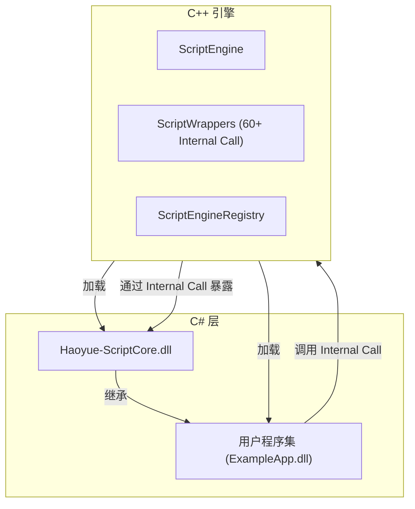
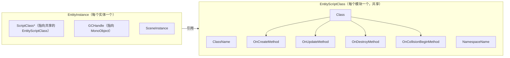
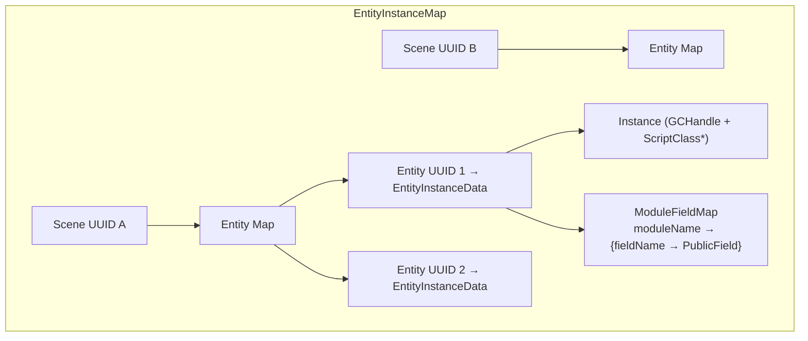
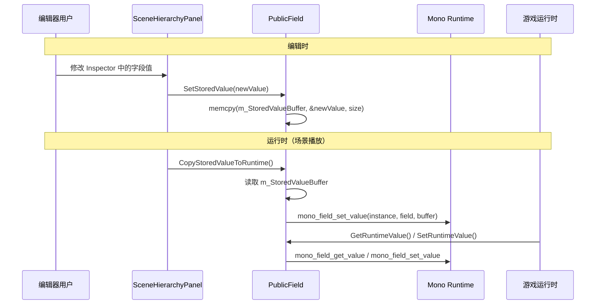
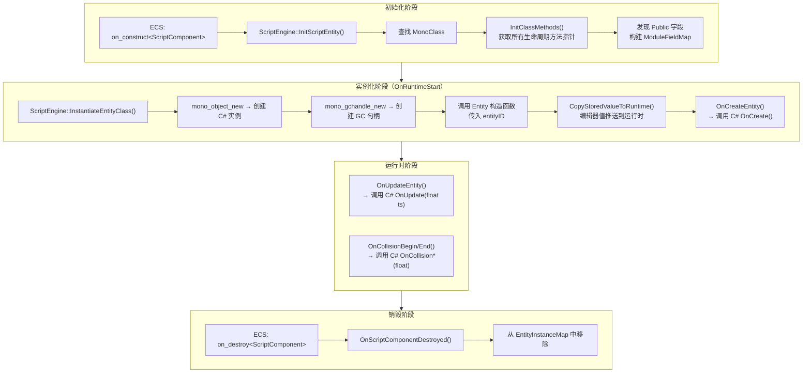
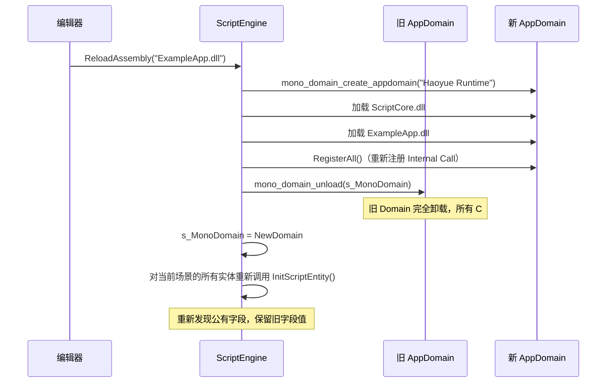
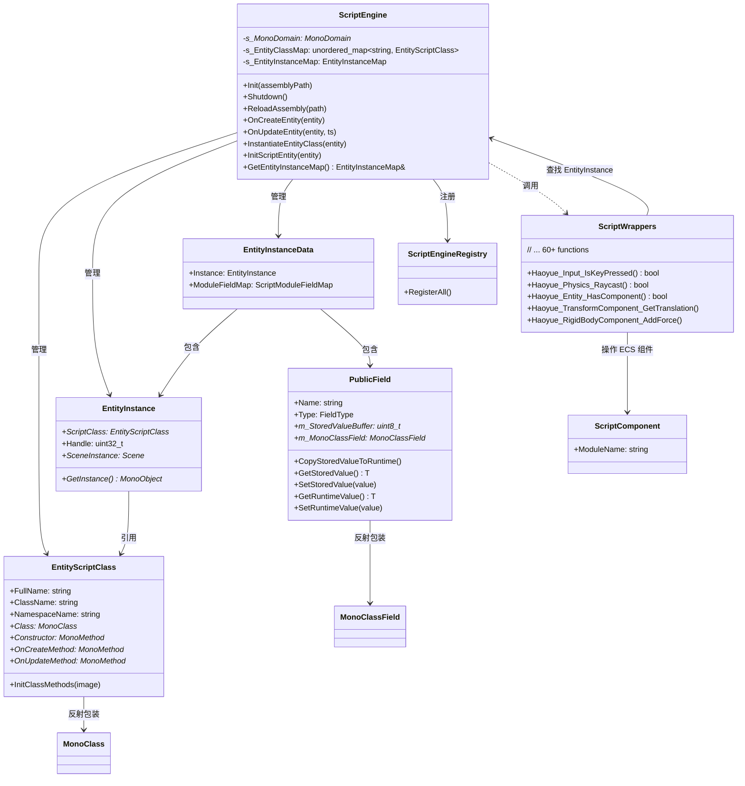

# Haoyue 引擎 C# 脚本模块文档

## 目录

- [1. 概述](#1-概述)
- [2. Mono 运行时嵌入详解](#2-mono-运行时嵌入详解)
  - [2.1 为什么选择 Mono](#21-为什么选择-mono)
  - [2.2 Mono 域的初始化](#22-mono-域的初始化)
  - [2.3 程序集加载机制](#23-程序集加载机制)
  - [2.4 两个程序集的架构](#24-两个程序集的架构)
- [3. Internal Call 双向绑定机制](#3-internal-call-双向绑定机制)
  - [3.1 mono_add_internal_call 原理](#31-mono_add_internal_call-原理)
  - [3.2 C# 侧与 C++ 侧的签名映射](#32-c-侧与-c-侧的签名映射)
  - [3.3 组件注册表（ScriptEngineRegistry）](#33-组件注册表scriptengineregistry)
- [4. ScriptEngine 核心架构](#4-scriptengine-核心架构)
  - [4.1 EntityInstance 与 EntityScriptClass](#41-entityinstance-与-entityscriptclass)
  - [4.2 EntityInstanceMap —— 三层索引结构](#42-entityinstancemap--三层索引结构)
  - [4.3 PublicField —— 公有字段管理](#43-publicfield--公有字段管理)
  - [4.4 实体的完整生命周期](#44-实体的完整生命周期)
  - [4.5 脚本实体的运行时流程](#45-脚本实体的运行时流程)
- [5. C# Wrappers —— 引擎功能暴露层](#5-c-wrappers--引擎功能暴露层)
  - [5.1 Wrapper 函数类别](#51-wrapper-函数类别)
  - [5.2 Transform 读写模式](#52-transform-读写模式)
  - [5.3 物理查询封装](#53-物理查询封装)
  - [5.4 渲染资源句柄传递](#54-渲染资源句柄传递)
- [6. 运行时集成](#6-运行时集成)
  - [6.1 生命周期总览](#61-生命周期总览)
  - [6.2 ECS 集成：ScriptComponent](#62-ecs-集成scriptcomponent)
  - [6.3 Assembly 热重载](#63-assembly-热重载)
  - [6.4 场景切换与上下文管理](#64-场景切换与上下文管理)
  - [6.5 碰撞事件回调](#65-碰撞事件回调)
- [7. 设计决策分析](#7-设计决策分析)
  - [7.1 为什么使用 Domain 热切换而非 Process 隔离](#71-为什么使用-domain-热切换而非-process-隔离)
  - [7.2 为什么 PublicField 使用存储值缓冲区分于运行时值](#72-为什么-publicfield-使用存储值缓冲区分于运行时值)
  - [7.3 为什么 Wrapper 函数使用 entityID 而非直接传递 MonoObject](#73-为什么-wrapper-函数使用-entityid-而非直接传递-monoobject)
  - [7.4 为什么 ScriptCore 与 AppAssembly 分离](#74-为什么-scriptcore-与-appassembly-分离)
  - [7.5 为什么 Internal Call 注册使用字符串签名而非强类型](#75-为什么-internal-call-注册使用字符串签名而非强类型)
- [8. 调试与诊断](#8-调试与诊断)
- [附录：完整数据流](#附录完整数据流)

---

## 1. 概述

Haoyue 引擎使用 **Mono 运行时**将 C# 脚本作为游戏逻辑的 DSL（领域特定语言）嵌入 C++ 引擎。引擎架构采用**双程序集**模型：

- **Haoyue-ScriptCore.dll** —— 引擎内置 C# 基类库，定义了 `Entity` 基类、`Input`、`Physics`、`Mesh` 等引擎 API
- **用户程序集**（如 `ExampleApp.dll`）—— 用户编写的游戏逻辑脚本，继承自 `Haoyue.Entity`，使用引擎提供的 API

C++ 引擎通过 **Internal Call** 机制将 60+ 个原生函数注册到 Mono 运行时，C# 脚本通过这些函数调用引擎的渲染、物理、输入等子系统。

| 特性 | 实现方式 |
|------|----------|
| 运行时语言 | C# 7.0+ via Mono |
| 嵌入方式 | Mono JIT 运行时，C++ 宿主进程 |
| C++↔C# 互调 | `mono_add_internal_call()` + 反射 |
| 脚本生命周期 | `OnCreate()` → `OnUpdate()` → `OnDestroy()` |
| 物理事件 | `OnCollisionBegin/End`、`OnTriggerBegin/End`、2D 版本 |
| 实时重载 | `ReloadAssembly()` —— 创建新 Domain，热切换所有实例 |

---

## 2. Mono 运行时嵌入详解

### 2.1 为什么选择 Mono

在多个 C# 嵌入方案中，Haoyue 选择 Mono 而非 .NET Core / .NET 6+ 或 Unity IL2CPP 风格的前编译方案：

| 方案 | 嵌入复杂度 | 运行时大小 | JIT 支持 | 跨平台 | 许可证 |
|------|-----------|-----------|---------|--------|--------|
| **Mono** | 低（纯 C API） | ~5MB | **完整** | 全平台 | MIT |
| .NET Core Hosting | 高（Hosting API 复杂） | ~50MB | 完整 | 有限 | MIT |
| .NET Native AOT | 极高（需自定义宿主） | 小 | **无** | 有限 | MIT |
| CoreCLR | 极高 | ~30MB | 完整 | Windows 为主 | MIT |

Mono 的核心优势：
- **嵌入友好**：纯 C API，`mono_jit_init()`+`mono_domain_create_appdomain()` 几行代码即可启动
- **运行时程序集热卸载**：Mono 的 AppDomain 支持完整的程序集卸载和重新加载（通过 `mono_domain_unload()`），这是实现 C# 热重载的基础
- **JIT 性能**：对游戏逻辑脚本来说，Mono JIT 的性能足够（200-500ms 级别的单帧更新时间）

### 2.2 Mono 域的初始化

```cpp
static void InitMono()
{
    // 设置 Mono 搜索程序集的基础路径
    mono_set_assemblies_path("mono/lib");

    // 创建根运行时域 "Haoyue"
    auto domain = mono_jit_init("Haoyue");

    // 创建应用程序域 "HaoyueRuntime"（用于加载用户程序集）
    char* name = (char*)"HaoyueRuntime";
    s_MonoDomain = mono_domain_create_appdomain(name, nullptr);
}
```

**为什么使用两个域？**

| 域 | 作用 | 生命周期 |
|----|------|----------|
| 根域（`mono_jit_init` 创建） | 系统程序集（mscorlib） | 引擎全程 |
| 应用程序域（`mono_domain_create_appdomain`） | 用户程序集 + ScriptCore | 可随时卸载和重建 |

程序集热重载的工作方式就是：**丢弃旧的 AppDomain，创建一个新的 AppDomain，在新域中重新加载程序集**。根域始终保持不变，避免重新加载系统程序集的开销。

### 2.3 程序集加载机制

引擎使用 `LoadAssemblyFromFile()` 手动读取 DLL 文件到内存中加载：

```cpp
MonoAssembly* LoadAssemblyFromFile(const char* filepath)
{
    // 1. 用 Win32 API 打开文件
    HANDLE file = CreateFileA(filepath, FILE_READ_ACCESS, ...);

    // 2. 读取整个文件到内存
    DWORD file_size = GetFileSize(file, NULL);
    void* file_data = malloc(file_size);
    ReadFile(file, file_data, file_size, &read, NULL);

    // 3. 从内存数据创建 MonoImage
    MonoImageOpenStatus status;
    MonoImage* image = mono_image_open_from_data_full(
        reinterpret_cast<char*>(file_data), file_size, 1, &status, 0);

    // 4. 从 Image 加载 Assembly
    auto assemb = mono_assembly_load_from_full(image, filepath, &status, 0);

    free(file_data);
    mono_image_close(image);
    return assemb;
}
```

全部读取到内存再加载的目的是为了在加载完成后可以立即关闭文件句柄，避免 DLL 文件被引擎锁定，从而允许外部工具（如 IDE）编译新的 DLL 覆盖原文件。

### 2.4 两个程序集的架构



**Haoyue-ScriptCore** 定义了引擎的 C# 基类：

```
Haoyue.Entity              — 所有脚本实体的基类
Haoyue.Input               — 输入查询 API
Haoyue.Physics             — 物理碰撞查询
Haoyue.TransformComponent  — 变换组件 API
Haoyue.TagComponent        — 标签 API
Haoyue.MeshComponent       — 网格组件 API
Haoyue.RigidBodyComponent  — 3D 刚体 API
Haoyue.RigidBody2DComponent— 2D 刚体 API
Haoyue.Texture2D           — 纹理 API
Haoyue.Material            — 材质 API
Haoyue.MaterialInstance    — 材质实例 API
Haoyue.Mesh                — 网格 API
Haoyue.MeshFactory         — 网格工厂 API
Haoyue.Noise               — 噪声函数
Haoyue.Vector2/3/4         — 数学类型
Haoyue.Collider            — 碰撞器基类
Haoyue.BoxCollider/SphereCollider/CapsuleCollider/MeshCollider
```

**用户程序集**继承 `Haoyue.Entity`，实现生命周期方法：

```csharp
public class ExampleEntity : Entity
{
    public float Speed = 10.0f;  // PublicField，可在编辑器中编辑

    void OnCreate()
    {
        // 初始化逻辑
    }

    void OnUpdate(float ts)
    {
        // 每帧更新逻辑
        TransformComponent transform = GetComponent<TransformComponent>();
        transform.Translation += new Vector3(Speed * ts, 0, 0);
    }

    void OnCollisionBegin(float value)
    {
        // 碰撞事件
    }
}
```

---

## 3. Internal Call 双向绑定机制

### 3.1 mono_add_internal_call 原理

Mono 提供了 `mono_add_internal_call()` 函数，允许 C++ 宿主向 Mono 运行时注册原生函数，C# 端通过 `[MethodImpl(MethodImplOptions.InternalCall)]` 标记可以像调用普通 C# 方法一样调用这些原生函数。

```cpp
// C++ 注册
mono_add_internal_call("Haoyue.Input::IsKeyPressed_Native",
    Haoyue::Script::Haoyue_Input_IsKeyPressed);
```

```csharp
// C# 声明
[DllImport("__Internal", CallingConvention = CallingConvention.Cdecl)]
public static extern bool IsKeyPressed_Native(KeyCode key);

public static bool IsKeyPressed(KeyCode key)
{
    return IsKeyPressed_Native(key);
}
```

**函数签名匹配规则**：

Internal Call 名称使用 Mono 的标准格式：
```
Namespace.ClassName::MethodName
```

C++ 函数的参数和返回值类型必须与 C# 声明匹配。Mono 运行时执行简单的类型大小校验，但**不强制执行严格类型安全检查**——这意味著参数类型不匹配会导致运行时崩溃而非编译错误。

### 3.2 C# 侧与 C++ 侧的签名映射

引擎中的类型映射遵循以下规则：

| C# 类型 | C 类型 | 说明 |
|---------|--------|------|
| `bool` | `bool`（1 byte） | 直接传递 |
| `float` / `single` | `float` | 直接传递 |
| `int` | `int`（32-bit） | 直接传递 |
| `uint` / `ulong` | `uint32_t` / `uint64_t` | 直接传递（Entity ID 使用 `ulong`） |
| `string` | `MonoString*` | Mono 托管字符串指针 |
| `Vector3` | `glm::vec3*` | 通过指针传递值类型 |
| `ref Type` / `out Type` | 对应类型的指针 | C# ref/out 映射为 C++ 指针参数 |
| `Collider[]` | `MonoArray*` | Mono 托管数组指针 |
| `IntPtr` | `void*` | 裸指针，用于传递 `Ref<T>` 句柄 |

**向量类型的传递约定**：

引擎使用**指针传递**而非值传递来交换 `glm::vec3` 和 `Haoyue.Vector3`：

```cpp
void Haoyue_TransformComponent_GetTranslation(uint64_t entityID, glm::vec3* outTranslation)
{
    // 通过指针写入输出参数
    Entity entity = /* ... */;
    *outTranslation = entity.GetComponent<TransformComponent>().Translation;
}
```

```csharp
// C# 端——通过 ref 参数接收
[MethodImpl(MethodImplOptions.InternalCall)]
internal static extern void GetTranslation_Native(ulong entityID, ref Vector3 outTranslation);

public Vector3 Translation {
    get {
        GetTranslation_Native(EntityID, ref m_Translation);
        return m_Translation;
    }
}
```

这种指针传递方式避免了值类型在托管/非托管边界上的内存布局差异问题——`glm::vec3` 和 C# `Vector3` 在内存中都是三个连续的 float，指针传递直接读取/写入。

### 3.3 组件注册表（ScriptEngineRegistry）

`ScriptEngineRegistry` 负责两件事：

1. **注册所有 Internal Call 函数指针**
2. **初始化 C#↔C++ 组件类型映射表**

组件类型映射使得 C# 可以通过类型参数动态查询和创建组件：

```cpp
// 注册 HasComponent / CreateComponent 的函数映射
#define Component_RegisterType(Type) \
    {\
        MonoType* type = mono_reflection_type_from_name("Haoyue." #Type, s_CoreAssemblyImage);\
        s_HasComponentFuncs[type] = [](Entity& entity) { return entity.HasComponent<Type>(); };\
        s_CreateComponentFuncs[type] = [](Entity& entity) { entity.AddComponent<Type>(); };\
    }

void InitComponentTypes()
{
    Component_RegisterType(TagComponent);
    Component_RegisterType(TransformComponent);
    Component_RegisterType(MeshComponent);
    Component_RegisterType(RigidBodyComponent);
    // ... 更多组件类型
}
```

这些函数映射表由 C# 的 `HasComponent<T>()` 和 `CreateComponent<T>()` 泛型方法通过 Internal Call 调用：

```cpp
void Haoyue_Entity_CreateComponent(uint64_t entityID, void* type)
{
    Entity entity = /* 通过 entityID 查找 */;
    MonoType* monoType = mono_reflection_type_get_type((MonoReflectionType*)type);
    s_CreateComponentFuncs[monoType](entity);  // 从映射表中查找并调用
}

bool Haoyue_Entity_HasComponent(uint64_t entityID, void* type)
{
    Entity entity = /* 通过 entityID 查找 */;
    MonoType* monoType = mono_reflection_type_get_type((MonoReflectionType*)type);
    return s_HasComponentFuncs[monoType](entity);
}
```

```csharp
// C# 端使用者
if (HasComponent<RigidBodyComponent>())
{
    // ...
}
```

---

## 4. ScriptEngine 核心架构

### 4.1 EntityInstance 与 EntityScriptClass



**EntityScriptClass** 是脚本类的**元数据**，按模块名（`Namespace.ClassName`）存储在 `s_EntityClassMap` 中。所有使用同一模块的实体共享同一个 `EntityScriptClass` 实例。它在 `InitScriptEntity()` 时初始化，通过 Mono 反射查找所有生命周期方法的方法指针：

```cpp
void InitClassMethods(MonoImage* image)
{
    Constructor = GetMethod(s_CoreAssemblyImage, "Haoyue.Entity:.ctor(ulong)");
    OnCreateMethod = GetMethod(image, FullName + ":OnCreate()");
    OnUpdateMethod = GetMethod(image, FullName + ":OnUpdate(single)");
    OnPhysicsUpdateMethod = GetMethod(image, FullName + ":OnPhysicsUpdate(single)");
    OnCollisionBeginMethod = GetMethod(s_CoreAssemblyImage, "Haoyue.Entity:OnCollisionBegin(single)");
    // ...
}
```

**EntityInstance** 是每个实体的运行时状态，包含一个指向 `MonoObject` 的 GCHandle。GCHandle 是 Mono 中用于防止垃圾回收的句柄：

```cpp
struct EntityInstance
{
    EntityScriptClass* ScriptClass = nullptr;   // 共享的类元数据
    uint32_t Handle = 0;                         // GCHandle → MonoObject
    Scene* SceneInstance = nullptr;              // 所属场景
};

MonoObject* EntityInstance::GetInstance()
{
    return mono_gchandle_get_target(Handle);  // 通过 GCHandle 获取 MonoObject 指针
}
```

**为什么使用 GCHandle 而非直接存储 MonoObject*？**
- Mono 的 GC 会在收集中移动对象，直接存储的指针会在 GC 后悬空
- GCHandle 是 Mono 提供的安全引用机制：创建时 `mono_gchandle_new(instance, false)`，访问时 `mono_gchandle_get_target(handle)`，销毁时 `mono_gchandle_free(handle)`

### 4.2 EntityInstanceMap —— 三层索引结构

全局实体实例映射使用**三层嵌套的 unordered_map**：

```cpp
using ScriptModuleFieldMap = std::unordered_map<std::string,
    std::unordered_map<std::string, PublicField>>;

struct EntityInstanceData
{
    EntityInstance Instance;
    ScriptModuleFieldMap ModuleFieldMap;  // 模块名 → 字段名 → PublicField
};

using EntityInstanceMap = std::unordered_map<UUID,
    std::unordered_map<UUID, EntityInstanceData>>;
// 场景ID → 实体ID → EntityInstanceData
```



这种三层结构的设计理由：
- **场景隔离**：每个场景的脚本实例互不干扰，场景销毁时只需 `erase(sceneID)` 即可清理所有脚本实例
- **实体直接索引**：通过 `entityID` 可在 O(1) 时间内找到 `EntityInstanceData`，无需遍历
- **字段持久化**：`ScriptComponent` 被销毁时，`PublicField` 中的存储值（`m_StoredValueBuffer`）不会丢失

### 4.3 PublicField —— 公有字段管理

引擎支持在编辑器中查看和编辑 C# 脚本的公有字段，这是通过 Mono 反射在 C++ 侧直接操作字段值实现的。

**字段发现**（在 `InitScriptEntity()` 中）：

```cpp
while ((iter = mono_class_get_fields(scriptClass.Class, &ptr)) != NULL)
{
    const char* name = mono_field_get_name(iter);
    uint32_t flags = mono_field_get_flags(iter);

    if ((flags & MONO_FIELD_ATTR_PUBLIC) == 0)
        continue;  // 跳过非公有字段

    MonoType* fieldType = mono_field_get_type(iter);
    FieldType HaoyueFieldType = GetHaoyueFieldType(fieldType);

    if (HaoyueFieldType == FieldType::ClassReference)
        continue;  // 跳过引用类型字段

    // 保留旧字段值（在 Assembly 重载后恢复）
    if (oldFields.find(name) != oldFields.end())
    {
        fieldMap.emplace(name, std::move(oldFields.at(name)));
    }
    else
    {
        PublicField field = { name, typeName, HaoyueFieldType };
        field.m_EntityInstance = &entityInstance;
        field.m_MonoClassField = iter;
        fieldMap.emplace(name, std::move(field));
    }
}
```

**支持编辑的字段类型**：

| FieldType | C# 类型 | C++ 存储大小 | 编辑方式 |
|-----------|---------|-------------|----------|
| `Float` | `float` | 4 bytes | ImGui DragFloat |
| `Int` | `int` | 4 bytes | ImGui DragInt |
| `UnsignedInt` | `uint` | 4 bytes | ImGui DragInt |
| `Vec2` | `Vector2` | 8 bytes | ImGui DragFloat2 |
| `Vec3` | `Vector3` | 12 bytes | ImGui DragFloat3 |
| `Vec4` | `Vector4` | 16 bytes | ImGui DragFloat4 |
| `String` | `string` | （未完整实现） | — |

**编辑器中修改字段的流程**：



**值传递：存储值 vs 运行时值**：

`PublicField` 维护两个值空间：
- **`m_StoredValueBuffer`** —— C++ 侧的副本，编辑器修改时写入此缓冲区
- **运行时值** —— Mono 托管堆上的字段值，游戏运行时通过 `mono_field_get_value` / `mono_field_set_value` 访问

`CopyStoredValueToRuntime()` 在实体实例化后显式将编辑器的修改推送到运行时，确保编辑器的修改在运行时生效。

### 4.4 实体的完整生命周期



### 4.5 脚本实体的运行时流程

在场景运行时循环中，`Scene::OnUpdateRuntime()` 逐帧驱动所有脚本实体：

```cpp
// Scene.cpp
{
    auto view = m_Registry.view<ScriptComponent>();
    for (auto entity : view)
    {
        Entity e = { entity, this };
        if (ScriptEngine::ModuleExists(e.GetComponent<ScriptComponent>().ModuleName))
            ScriptEngine::OnUpdateEntity(e, ts);
    }
}
```

`OnUpdateEntity` 的调用链：

```cpp
void ScriptEngine::OnUpdateEntity(Entity entity, Timestep ts)
{
    // 1. 从 EntityInstanceMap 查找实体实例
    EntityInstance& entityInstance = GetEntityInstanceData(
        entity.GetSceneUUID(), entity.GetUUID()).Instance;

    // 2. 如果 OnUpdate 方法存在，调用它
    if (entityInstance.ScriptClass->OnUpdateMethod)
    {
        void* args[] = { &ts };         // 转换 TimeStep 为 float 参数
        CallMethod(entityInstance.GetInstance(),
                   entityInstance.ScriptClass->OnUpdateMethod, args);
    }
}
```

**物理事件回调**的触发来自 Box2D / PhysX 的回调函数。以 Box2D 2D 碰撞为例：

```cpp
// 在 Box2D contact listener 中
void BeginContact(b2Contact* contact)
{
    Entity& a = *(Entity*)contact->GetFixtureA()->GetBody()->GetUserData();
    Entity& b = *(Entity*)contact->GetFixtureB()->GetBody()->GetUserData();

    if (a.HasComponent<ScriptComponent>() &&
        ScriptEngine::ModuleExists(a.GetComponent<ScriptComponent>().ModuleName))
        ScriptEngine::OnCollision2DBegin(a);

    if (b.HasComponent<ScriptComponent>() &&
        ScriptEngine::ModuleExists(b.GetComponent<ScriptComponent>().ModuleName))
        ScriptEngine::OnCollision2DBegin(b);
}
```

物理回调**发生在物理引擎的更新循环中**（而非主脚本更新循环），这意味着物理回调与 `OnUpdate` 可能在不同的线程上下文中执行。

---

## 5. C# Wrappers —— 引擎功能暴露层

`ScriptWrappers.cpp` 是所有 Internal Call 函数的实现体，约 60 个函数覆盖了引擎各子系统。

### 5.1 Wrapper 函数类别

| 类别 | 函数数量 | 代表函数 |
|------|---------|---------|
| **Input** | 4 | `IsKeyPressed`, `GetMousePosition`, `SetCursorMode` |
| **Math** | 1 | `PerlinNoise` |
| **Physics** | 8 | `Raycast`, `OverlapBox/Sphere/Capsule`, NonAlloc 变体 |
| **Entity/Component** | 3 | `CreateComponent`, `HasComponent`, `FindEntityByTag` |
| **Transform** | 10 | `Get/Set Translation`, `Rotation`, `Scale`, `Transform`, `WorldTransform` |
| **Tag** | 2 | `GetTag`, `SetTag` |
| **Mesh** | 5 | `GetMesh`, `SetMesh`, `GetMaterial`, 构造函数 |
| **RigidBody 2D** | 3 | `ApplyLinearImpulse`, `Get/Set LinearVelocity` |
| **RigidBody 3D** | 11 | `AddForce`, `AddTorque`, `Get/Set Velocity`, `GetMass`, `Rotate` |
| **Texture2D** | 3 | 构造/析构/SetData |
| **Material** | 5 | `SetFloat`, `SetTexture`, `SetVector3/4` |
| **MeshFactory** | 1 | `CreatePlane` |

### 5.2 Transform 读写模式

Transform 组件使用了**按字段读写**而非整体读写的方式，允许 C# 修改单个字段而不影响其他字段：

```cpp
void Haoyue_TransformComponent_GetTranslation(uint64_t entityID, glm::vec3* outTranslation)
{
    Entity entity = LookupEntity(entityID);
    *outTranslation = entity.GetComponent<TransformComponent>().Translation;
}

void Haoyue_TransformComponent_SetTranslation(uint64_t entityID, glm::vec3* inTranslation)
{
    Entity entity = LookupEntity(entityID);
    entity.GetComponent<TransformComponent>().Translation = *inTranslation;
}
```

C# 侧封装：

```csharp
public Vector3 Translation
{
    get
    {
        GetTranslation_Native(EntityID, ref m_Translation);
        return m_Translation;
    }
    set
    {
        m_Translation = value;
        SetTranslation_Native(EntityID, ref m_Translation);
    }
}
```

### 5.3 物理查询封装

物理 Overlap 查询的封装展示了如何将 C++ 物理引擎（PhysX）的查询结果转换为 C# 可用的托管对象：

```cpp
MonoArray* Haoyue_Physics_OverlapBox(glm::vec3* origin, glm::vec3* halfSize)
{
    // 1. 调用 PhysX 的 Overlap 查询
    uint32_t count;
    if (PXPhysicsWrappers::OverlapBox(*origin, *halfSize, s_OverlapBuffer, &count))
    {
        // 2. 创建 C# 数组
        outColliders = mono_array_new(mono_domain_get(),
            ScriptEngine::GetCoreClass("Haoyue.Collider"), count);

        // 3. 将每个碰撞结果构造为 C# Collider 对象
        for (uint32_t i = 0; i < count; i++)
        {
            Entity& entity = *(Entity*)s_OverlapBuffer[i].actor->userData;

            // 根据组件类型构造不同的 C# Collider
            if (entity.HasComponent<BoxColliderComponent>())
            {
                void* data[] = { &entity.GetUUID(), &boxCollider.IsTrigger, ... };
                MonoObject* obj = ScriptEngine::Construct(
                    "Haoyue.BoxCollider:.ctor(ulong,bool,Vector3,Vector3)", true, data);
                mono_array_set(array, MonoObject*, arrayIndex++, obj);
            }
            // ... SphereCollider, CapsuleCollider, MeshCollider 类似
        }
    }
    return outColliders;
}
```

同时提供了 **NonAlloc 版本**避免每帧分配托管数组：

```cpp
int32_t Haoyue_Physics_OverlapBoxNonAlloc(glm::vec3* origin, glm::vec3* halfSize,
    MonoArray* outColliders)
{
    // 使用预先分配的 C# 数组，避免 GC 压力
    AddCollidersToArray(outColliders, s_OverlapBuffer, count, arrayLength);
    return count;
}
```

### 5.4 渲染资源句柄传递

渲染资源（如 `Texture2D`、`Material`、`Mesh`）的传递使用 `Ref<T>` 指针的**裸指针句柄**方式。C++ 侧创建 `Ref<T>` 实例，将其指针作为一个不透明的 `void*` 传递给 C#：

```cpp
// C++：创建 Ref<Texture2D>，返回指针
void* Haoyue_Texture2D_Constructor(uint32_t width, uint32_t height)
{
    auto result = Texture2D::Create(ImageFormat::RGBA, width, height);
    return new Ref<Texture2D>(result);  // 在堆上分配 Ref
}

// C++：销毁
void Haoyue_Texture2D_Destructor(Ref<Texture2D>* _this)
{
    delete _this;
}
```

```csharp
// C#：通过 IntPtr 持有句柄
public class Texture2D
{
    internal IntPtr m_Instance;  // 指向 C++ Ref<Texture2D>

    public Texture2D(uint width, uint height)
    {
        Constructor_Native(width, height);
    }

    [MethodImpl(MethodImplOptions.InternalCall)]
    internal static extern IntPtr Constructor_Native(uint width, uint height);

    ~Texture2D()
    {
        Destructor_Native(ref m_Instance);
    }
}
```

**为什么使用 `new Ref<T>` 而非直接传递指针？**

`Ref<T>` 是引擎的引用计数智能指针。在堆上分配一个 `Ref<T>` 实例并将其指针传递给 C# 是为了让 C# 侧也能安全地持有引擎资源——只要 C# 对象存活，`Ref<T>` 就不会被销毁。C# `~Texture2D()` 析构函数中调用 `Destructor_Native` 释放这个 `Ref`。

---

## 6. 运行时集成

### 6.1 生命周期总览

```
引擎初始化
    │
    ├── Application::Init()
    │      ├── ...
    │      ├── ScriptEngine::Init("Resources/scripts/ExampleApp.dll")
    │      │      ├── InitMono()
    │      │      │      ├── mono_set_assemblies_path("mono/lib")
    │      │      │      ├── mono_jit_init("Haoyue")           ← 根域
    │      │      │      └── mono_domain_create_appdomain(...)   ← 应用域
    │      │      └── LoadHaoyueRuntimeAssembly(path)
    │      │             ├── LoadAssembly("Haoyue-ScriptCore.dll")
    │      │             ├── LoadAssembly("ExampleApp.dll")
    │      │             └── ScriptEngineRegistry::RegisterAll()
    │      │                    ├── 注册所有 Internal Call
    │      │                    └── 初始化组件类型表
    │      └── ...

场景启动运行时
    │
    ├── Scene::OnRuntimeStart()
    │      ├── ScriptEngine::SetSceneContext(this)
    │      └── 遍历所有 ScriptComponent → InstantiateEntityClass()
    │             ├── mono_object_new → 创建 C# 实例
    │             ├── mono_gchandle_new → 创建安全句柄
    │             ├── 调用 Entity::ctor(ulong) 传入 entityID
    │             ├── CopyStoredValueToRuntime()
    │             └── OnCreateEntity() → C# OnCreate()

每帧更新
    │
    ├── Scene::OnUpdateRuntime()
    │      └── 遍历 ScriptComponent → ScriptEngine::OnUpdateEntity()
    │             └── CallMethod(OnUpdateMethod, &ts) → C# OnUpdate(float)

运行时停止 / 场景切换
    │
    └── Scene::~Scene()
           ├── ScriptEngine::OnSceneDestruct(sceneID)
           │      └── s_EntityInstanceMap.erase(sceneID)
           └── ...
```

### 6.2 ECS 集成：ScriptComponent

`ScriptComponent` 是引擎 ECS 中与脚本系统对接的组件：

```cpp
struct ScriptComponent
{
    std::string ModuleName;   // C# 类的全名，如 "ExampleApp.ExampleEntity"
};
```

`ModuleName` 使用 `"Namespace.ClassName"` 格式，例如 `"ExampleApp.ExampleEntity"`。引擎通过这个字符串在 `ModuleExists()` 中查找对应的 `MonoClass`：

```cpp
bool ScriptEngine::ModuleExists(const std::string& moduleName)
{
    std::string NamespaceName, ClassName;
    if (moduleName.find('.') != std::string::npos)
    {
        NamespaceName = moduleName.substr(0, moduleName.find_last_of('.'));
        ClassName = moduleName.substr(moduleName.find_last_of('.') + 1);
    }
    else
    {
        ClassName = moduleName;
    }

    MonoClass* monoClass = mono_class_from_name(s_AppAssemblyImage,
        NamespaceName.c_str(), ClassName.c_str());
    return monoClass != nullptr;
}
```

**ECS 事件连接**：

```cpp
// Scene 构造函数中
m_Registry.on_construct<ScriptComponent>().connect<&OnScriptComponentConstruct>();
m_Registry.on_destroy<ScriptComponent>().connect<&OnScriptComponentDestroy>();
```

当任何实体被添加或移除 `ScriptComponent` 时，ECS 自动触发对应的回调函数，确保脚本引擎的内部状态与 ECS 同步。这被称为"ECS 响应式编程"模式——不需要在每一帧轮询变化，而是由 ECS 事件驱动。

### 6.3 Assembly 热重载

```cpp
void ScriptEngine::ReloadAssembly(const std::string& path)
{
    // 1. 卸载旧 Domain，创建新 Domain，在新域中重新加载程序集
    LoadHaoyueRuntimeAssembly(path);

    // 2. 如果场景中有已实例化的脚本实体，重新初始化它们
    if (s_EntityInstanceMap.size())
    {
        Ref<Scene> scene = ScriptEngine::GetCurrentSceneContext();
        auto& entityMap = s_EntityInstanceMap.at(scene->GetUUID());
        for (auto& [entityID, entityInstanceData] : entityMap)
        {
            const auto& entityMap = scene->GetEntityMap();
            InitScriptEntity(entityMap.at(entityID));
        }
    }
}
```

**热重载内部过程**：



**关键观察**：`InitScriptEntity()` 中的字段保留逻辑确保重载时用户已编辑的字段值不会丢失：

```cpp
// 保存旧字段值
std::unordered_map<std::string, PublicField> oldFields;
for (auto& [fieldName, field] : fieldMap)
    oldFields.emplace(fieldName, std::move(field));

fieldMap.clear();

// ...重新发现字段...

if (oldFields.find(name) != oldFields.end())
{
    // 使用旧字段值（包含用户已编辑的值）
    fieldMap.emplace(name, std::move(oldFields.at(name)));
}
else
{
    // 创建新字段
    PublicField field = { name, typeName, HaoyueFieldType };
    // ...
}
```

### 6.4 场景切换与上下文管理

当场景切换或运行时播放时：

```cpp
void Scene::OnRuntimeStart()
{
    ScriptEngine::SetSceneContext(this);  // 设置当前场景上下文

    // 实例化所有脚本实体
    auto view = m_Registry.view<ScriptComponent>();
    for (auto entity : view)
    {
        Entity e = { entity, this };
        if (ScriptEngine::ModuleExists(e.GetComponent<ScriptComponent>().ModuleName))
            ScriptEngine::InstantiateEntityClass(e);
    }
}
```

**场景复制时脚本数据的拷贝**：

当场景被复制（如编辑器中的"复制场景"操作）时，`CopyEntityScriptData()` 负责将源场景中所有 PublicField 的存储值复制到目标场景：

```cpp
void ScriptEngine::CopyEntityScriptData(UUID dst, UUID src)
{
    auto& dstEntityMap = s_EntityInstanceMap.at(dst);
    auto& srcEntityMap = s_EntityInstanceMap.at(src);

    for (auto& [entityID, entityInstanceData] : srcEntityMap)
    {
        for (auto& [moduleName, srcFieldMap] : srcEntityMap[entityID].ModuleFieldMap)
        {
            auto& dstModuleFieldMap = dstEntityMap[entityID].ModuleFieldMap;
            for (auto& [fieldName, field] : srcFieldMap)
            {
                dstModuleFieldMap.at(moduleName).at(fieldName)
                    .SetStoredValueRaw(field.m_StoredValueBuffer);
            }
        }
    }
}
```

### 6.5 碰撞事件回调

脚本引擎同时支持 2D（Box2D）和 3D（PhysX）的碰撞事件回调：

| 回调函数 | 触发时机 | 物理后端 |
|----------|---------|---------|
| `OnCollisionBegin(float)` | 碰撞体开始接触 | PhysX 3D |
| `OnCollisionEnd(float)` | 碰撞体结束接触 | PhysX 3D |
| `OnTriggerBegin(float)` | Trigger 开始接触 | PhysX 3D |
| `OnTriggerEnd(float)` | Trigger 结束接触 | PhysX 3D |
| `OnCollision2DBegin(float)` | 2D 碰撞体开始接触 | Box2D |
| `OnCollision2DEnd(float)` | 2D 碰撞体结束接触 | Box2D |

物理回调通过在每个物理引擎帧中检测接触事件来触发。碰撞事件的参数目前为**占位符**（固定传入 `5.0f`），尚未传递完整的碰撞信息结构体。

---

## 7. 设计决策分析

### 7.1 为什么使用 Domain 热切换而非 Process 隔离

| 方案 | 实现复杂度 | 迭代速度 | 安全性 |
|------|-----------|---------|--------|
| **AppDomain 热卸载（Mono）** | 中等 | **快（秒级）** | 一般（Domain 隔离有限） |
| 独立进程 | 极高 | 慢（进程启动） | 好（完全内存隔离） |
| 反射重新加载 | 低 | 快 | 差（内存泄漏风险） |

Mono 的 AppDomain 模型是嵌入场景中唯一可行的运行时重载方案。独立进程方案虽然安全，但在游戏编辑器场景中每次代码修改都需要等待数秒启动进程，开发体验不佳。

**Domain 方案的边界**：
- 无法卸载非 `[LoadOnly]` 标记的 `MonoImage`
- `static` 变量在 Domain 卸载后自然清除
- `P/Invoke` 和 `Internal Call` 注册是全局的，不会随 Domain 卸载而清除（这就是为什么 `RegisterAll()` 每次重载都必须重新调用）

### 7.2 为什么 PublicField 使用存储值缓冲区分于运行时值

这个设计源于编辑器模式与运行模式分离的需求：

| 模式 | 编辑器修改时 | 运行时播放时 |
|------|-------------|-------------|
| **编辑模式** | `SetStoredValue()` → 写入 `m_StoredValueBuffer` | 不调用生命周期方法 |
| **运行时（播放中）** | =编辑模式行为+ `CopyStoredValueToRuntime()` | 通过 `mono_field_get/set_value` 直接读写 Mono 字段 |

**为什么不直接写入 Mono 对象？**

在编辑模式下，C# MonoObject 尚未创建（`InstantiateEntityClass()` 仅在运行时调用）。直接写入 `m_StoredValueBuffer` 是一个安全的"待发送"缓冲区，在运行时启动时一次性推送到 Mono 对象。

### 7.3 为什么 Wrapper 函数使用 entityID 而非直接传递 MonoObject

所有 Wrapper 函数都通过 `uint64_t entityID` 而非 `MonoObject*` 来标识实体：

```cpp
// 所有 Wrapper 的形式
void Haoyue_TransformComponent_GetTranslation(uint64_t entityID, glm::vec3* outTranslation);
// 而不是
void GetTranslation(MonoObject* entityObj, ...);
```

**原因**：
1. **避免跨边界类型转换**：`MonoObject*` 在 C++ 侧是无法直接使用的，需要每次都通过 `GetInstance()` 查找
2. **C# Entity 对象可能被 GC 移动**：在第一次读取和第二次读取之间，对象可能被 GC 移动，导致指针不一致
3. **兼容未来多场景复用**：entityID 是场景无关的，MonoObject 指针是场景内实例相关的
4. **调用效率**：`uint64_t` 是寄存器大小的值，直接通过 CPU 寄存器传递；指针需要额外的间接寻址

### 7.4 为什么 ScriptCore 与 AppAssembly 分离

分离为两个程序集是大多数游戏引擎脚本系统的标准模式：

```
Haoyue-ScriptCore.dll（引擎 API 层）
    ├── 定义 Entity 基类
    ├── 定义 Input / Physics / Mesh 等 API 类
    ├── 定义 Vector2/3/4 数学类型
    ├── 声明所有 Internal Call 的外部方法
    └── 包含引擎内置功能（如噪声函数）

ExampleApp.dll（用户逻辑层）
    ├── 引用 Haoyue-ScriptCore
    ├── 继承 Entity 实现游戏脚本
    └── 调用 ScriptCore 中的 API
```

**好处**：
- **API 不随用户代码重载**：`ScriptCore.dll` 只需加载一次，用户代码重载只影响 AppAssembly
- **热重载范围控制**：只有用户代码被卸载和重载，引擎提供的 API 保持稳定
- **编译分离**：用户代码的修改只需要编译 `ExampleApp.dll`，无需重新编译引擎 API
- **安全性**：用户代码无法访问 `ScriptCore` 中未暴露的引擎内部 API

### 7.5 为什么 Internal Call 注册使用字符串签名而非强类型

`mono_add_internal_call` 的调用方式决定了引擎使用字符串格式的签名：

```cpp
mono_add_internal_call("Haoyue.Input::IsKeyPressed_Native",
    Haoyue::Script::Haoyue_Input_IsKeyPressed);
```

**为什么没有使用代码生成自动化？**

在引擎当前阶段（快速迭代中），手动注册 60+ 函数签名提供了最大的灵活性。随着引擎 API 的稳定，未来可以通过：
- **Source Generator**（C# Source Generator + C++ 模板元编程）自动生成 Internal Call 注册代码
- **Bindings 自动生成**：类似 SWIG 的工具生成 C++↔C# 绑定层

但目前手动注册的方式让开发者对每个 Internal Call 的签名和参数映射有完全的控制。

---

## 8. 调试与诊断

**脚本引擎调试面板**：

```cpp
void ScriptEngine::OnImGuiRender()
{
    ImGui::Begin("Script Engine Debug");
    for (auto& [sceneID, entityMap] : s_EntityInstanceMap)
    {
        // 按场景分组显示
        for (auto& [entityID, entityInstanceData] : entityMap)
        {
            // 按实体显示其模块和字段
            for (auto& [moduleName, fieldMap] : entityInstanceData.ModuleFieldMap)
            {
                for (auto& [fieldName, field] : fieldMap)
                {
                    // 显示字段信息
                }
            }
        }
    }
    ImGui::End();
}
```

**常见问题诊断**：

| 症状 | 可能原因 | 检查方法 |
|------|---------|---------|
| `mono_class_from_name` 失败 | 用户程序集未正确编译或路径错误 | 检查 `Resources/scripts/` 下的 DLL |
| `OnCreate` 未被调用 | `m_Registry.on_construct` 连接失效 | 检查 Scene 构造函数中的 ECS 连接 |
| Internal Call 崩溃 | 签名不匹配 | 检查 C++ 参数类型与 C# `extern` 声明 |
| 热重载后值丢失 | 字段名称变化 | `oldFields` 匹配失败，检查字段名是否一致 |
| GC 相关崩溃 | `MonoObject*` 被移动 | 确保使用 `GCHandle` 而非直接存储指针 |

---

## 附录：完整数据流

### Internal Call 全链路调用示例

```mermaid
sequenceDiagram
    participant CSharp as "C# OnUpdate"
    participant Wrapper as "ScriptWrappers.cpp"
    participant EntityMap as "EntityInstanceMap"
    participant ECS as "ECS Registry"
    participant Physics as "Physics Engine"

    Note over CSharp,Physics: 示例：C# 脚本读取 Transform + 施加物理力

    CSharp->>CSharp: TransformComponent transform = GetComponent&lt;TransformComponent&gt;()
    CSharp->>Wrapper: Haoyue_Entity_HasComponent(entityID, type)
    Wrapper->>EntityMap: 查找 entityID → Entity
    Wrapper->>ECS: entity.HasComponent&lt;TransformComponent&gt;()
    ECS-->>Wrapper: true
    Wrapper-->>CSharp: true

    CSharp->>CSharp: var trans = transform.Translation
    CSharp->>Wrapper: Haoyue_TransformComponent_GetTranslation(entityID, &out)
    Wrapper->>EntityMap: 查找 entityID
    Wrapper->>ECS: entity.GetComponent&lt;TransformComponent&gt;()
    Wrapper->>Wrapper: memcpy(out, component.Translation)
    Wrapper-->>CSharp: Vector3 { x, y, z }

    CSharp->>CSharp: GetComponent&lt;RigidBodyComponent&gt;().AddForce(...)
    CSharp->>Wrapper: Haoyue_RigidBodyComponent_AddForce(entityID, &force, mode)
    Wrapper->>EntityMap: 查找 entityID
    Wrapper->>Physics: Physics::GetActorForEntity(entity)
    Wrapper->>Physics: actor->AddForce(force, mode)
    Physics-->>CSharp: (在物理引擎中处理)
```

### 模块类图


