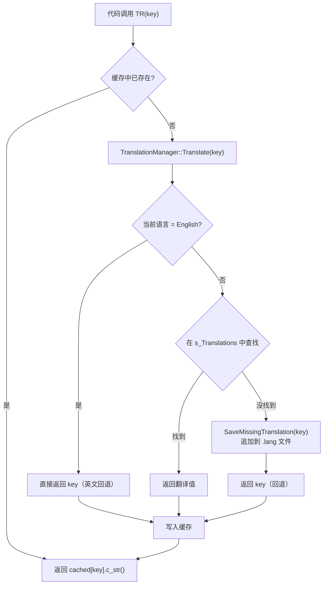
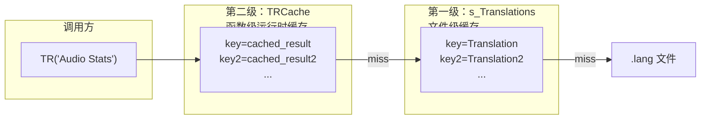
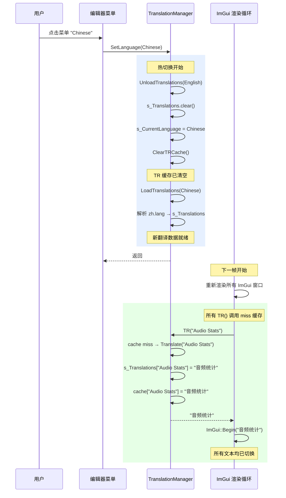
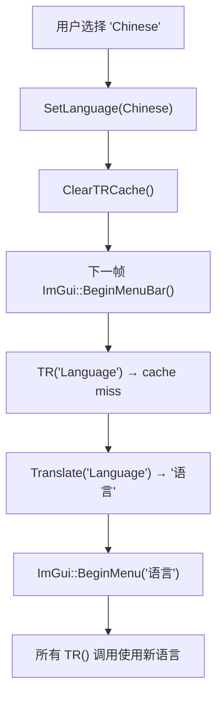
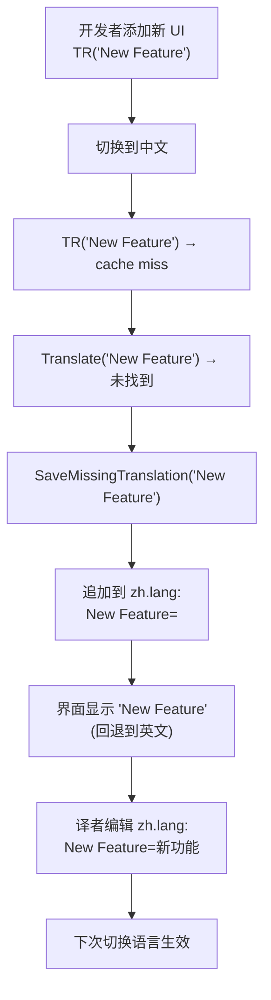
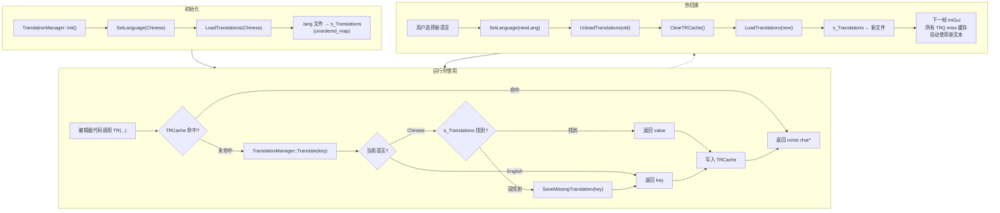

# Haoyue 引擎国际化多语言热切换模块文档

## 目录

- [1. 概述](#1-概述)
- [2. 架构设计原理](#2-架构设计原理)
  - [2.1 为什么需要翻译管理器](#21-为什么需要翻译管理器)
  - [2.2 核心设计目标](#22-核心设计目标)
- [3. 核心实现详解](#3-核心实现详解)
  - [3.1 TR() 宏——翻译入口](#31-tr-宏翻译入口)
  - [3.2 TranslationManager 类结构](#32-translationmanager-类结构)
  - [3.3 两层缓存架构](#33-两层缓存架构)
  - [3.4 .lang 文件格式与加载](#34-lang-文件格式与加载)
- [4. 热切换机制](#4-热切换机制)
  - [4.1 热切换的完整流程](#41-热切换的完整流程)
  - [4.2 缓存失效策略](#42-缓存失效策略)
  - [4.3 编辑器中的语言切换](#43-编辑器中的语言切换)
- [5. 设计决策分析](#5-设计决策分析)
  - [5.1 为什么使用 key 作为默认英文文本](#51-为什么使用-key-作为默认英文文本)
  - [5.2 为什么 TR() 返回 const char* 而非 std::string](#52-为什么-tr-返回-const-char-而非-stdstring)
  - [5.3 为什么英文模式直接返回 key](#53-为什么英文模式直接返回-key)
  - [5.4 为什么使用静态缓存而非实时查找](#54-为什么使用静态缓存而非实时查找)
  - [5.5 为什么使用 .lang 纯文本格式而非 JSON/XML](#55-为什么使用-lang-纯文本格式而非-jsonxml)
  - [5.6 为什么 TranslationManager 托管于 Editor 而非 Core](#56-为什么-translationmanager-托管于-editor-而非-core)
- [6. 引擎运行时集成](#6-引擎运行时集成)
  - [6.1 生命周期](#61-生命周期)
  - [6.2 在编辑器中使用 TR()](#62-在编辑器中使用-tr)
  - [6.3 缺失翻译的自动追踪](#63-缺失翻译的自动追踪)
- [7. 翻译文件管理](#7-翻译文件管理)
  - [7.1 文件格式规范](#71-文件格式规范)
  - [7.2 翻译流程最佳实践](#72-翻译流程最佳实践)
- [8. 性能分析](#8-性能分析)
  - [8.1 TR() 宏的运行时开销](#81-tr-宏的运行时开销)
  - [8.2 缓存命中率与内存占用](#82-缓存命中率与内存占用)
- [附录：完整数据流](#附录完整数据流)

---

## 1. 概述

Haoyue 引擎的国际化（i18n, Internationalization）模块基于 **TranslationManager** 实现，提供**运行时无中断的语言热切换**能力。编辑器用户可以在不重启引擎的情况下，通过菜单栏即时切换界面语言，所有 UI 文本即时更新。

| 特性 | 支持情况 |
|------|----------|
| 运行时热切换 | **支持** —— 无需重启，即时生效 |
| 支持语言数 | 2（English / Chinese），可扩展 |
| 默认回退机制 | 英文模式下直接使用 key 作为显示文本 |
| 缺失翻译追踪 | 自动将未翻译的 key 追加到 .lang 文件 |
| 翻译文件格式 | 纯文本 `.lang`（`key=value` 格式） |
| 初始化默认语言 | 中文（`Language::Chinese`） |

---

## 2. 架构设计原理

### 2.1 为什么需要翻译管理器

在游戏引擎编辑器的开发中，国际化是一个不可回避的需求。Haoyue 引擎在这一问题上的选择体现了**务实**的开发哲学：

- **编辑器场景**：用户界面的文本数量随着功能增加而线性增长。将文本直接硬编码在 UI 代码中意味着每次新增功能都需要手动管理多语言
- **热切换价值**：使用编辑器时切换语言是常见的需求场景（多语种团队协作、本地化测试）。如果每次切换语言都需要重启引擎，开发效率会大打折扣
- **轻量实现优先**：作为一个自研引擎的早期版本，TranslationManager 以极少的代码量（约 150 行）实现了核心功能，避免了引入庞大的第三方本地化框架

### 2.2 核心设计目标

| 目标 | 优先级 | 实现策略 |
|------|--------|----------|
| 运行时热切换无开销 | ★★★★★ | 两级缓存 + 惰性求值 |
| 代码侵入最小化 | ★★★★ | 单一 `TR()` 宏即可完成翻译 |
| 英文零配置 | ★★★★★ | key 即英文，无需额外文件 |
| 缺失翻译自动发现 | ★★★ | `SaveMissingTranslation()` 自动追加 |
| 支持格式化字符串 | ★★★ | `TR()` 返回 `const char*`，配合 `ImGui::Text(TR(...), args...)` |

---

## 3. 核心实现详解

### 3.1 TR() 宏——翻译入口

`TR()` 是翻译系统的前端入口，定义在 `TranslationManager.h` 中，是一个**内联函数**而非预处理器宏：

```cpp
static const char* TR(const std::string& key)
{
    auto& cache = TranslationManager::GetTRCache();

    auto it = cache.find(key);
    if (it != cache.end()) {
        return it->second.c_str();
    }

    cache[key] = TranslationManager::Translate(key);
    return cache[key].c_str();
}
```

**工作流程**：



### 3.2 TranslationManager 类结构

```cpp
class TranslationManager
{
public:
    enum class Language
    {
        English = 0,   // 英文 —— key 即文本，无需翻译文件
        Chinese = 1    // 中文 —— 从 zh.lang 加载翻译
    };

    static void Init();
    static void Shutdown();
    static void SetLanguage(Language language);
    static Language GetLanguage();

    static const std::string& GetLocaleString(Language language);
    static std::string Translate(const std::string& key);
    static void ClearTRCache();
    static std::unordered_map<std::string, std::string>& GetTRCache();

private:
    static void LoadTranslations(Language language);
    static void UnloadTranslations(Language language);
    static void SaveMissingTranslation(const std::string& key);

private:
    static Language s_CurrentLanguage;
    static std::unordered_map<std::string, std::string> s_Translations;
    static std::unordered_map<Language, std::string> s_LanguageStrings;
    static bool s_Initialized;
};
```

**核心静态成员**：

| 成员 | 类型 | 作用 |
|------|------|------|
| `s_CurrentLanguage` | `Language` | 当前激活的语言 |
| `s_Translations` | `unordered_map<string, string>` | 从 .lang 文件加载的键值对 |
| `s_LanguageStrings` | `unordered_map<Language, string>` | 语言到 locale 字符串的映射（如 `Chinese → "zh"`） |
| `GetTRCache()` | `unordered_map<string, string>`（函数局部静态） | TR() 宏使用的运行时缓存 |

### 3.3 两层缓存架构

TranslationManager 采用**两级缓存**的设计，兼顾了内存占用和访问速度：



**第一级：`s_Translations`（文件级）**

在 `SetLanguage()` 时一次性加载。`LoadTranslations()` 解析 `.lang` 文件，将所有键值对存入 `s_Translations`。切换语言时调用 `UnloadTranslations()` 清空。

**第二级：TRCache（运行时缓存）**

由 `TR()` 宏在首次访问一个 key 时惰性填充。`Translate()` 的返回结果被缓存，后续对同一 key 的访问直接返回缓存指针，无需哈希查找。

**缓存失效时机**：

| 触发事件 | `s_Translations` | TRCache |
|----------|-------------------|---------|
| `SetLanguage()` | 清空并重新加载 | `ClearTRCache()` |
| `Shutdown()` | `clear()` | `clear()` |

### 3.4 .lang 文件格式与加载

翻译文件使用简单的 **key=value** 纯文本格式，存储在 `Haoyue-Editor/Resources/Translations/` 目录下：

```
# zh.lang —— 中文翻译文件
# 注释以 # 或 ; 开头
New Scene=新场景
Camera=摄像机
Directional Light=平行光
Frame Time: %.2fms=每帧时间: %.2fms
Active Sounds: %s=活跃音效：%s
```

**加载过程**：

```cpp
void TranslationManager::LoadTranslations(Language language)
{
    if (language == Language::English) return;  // 英文不需要加载

    std::string locale = GetLocaleString(language);  // "zh"
    std::filesystem::path translationPath =
        std::filesystem::current_path().parent_path()
        / "Haoyue-Editor" / "Resources" / "Translations"
        / (locale + ".lang");

    std::ifstream file(translationPath);
    // 逐行解析...
    // 跳过空行、# 注释行、; 注释行
    // 按 '=' 分割 key 和 value
    // 去除首尾空格
    // 存入 s_Translations[key] = value
}
```

**文件约定**：

- **编码**：UTF-8 without BOM
- **分隔符**：第一个 `=` 号，key 和 value 两侧的空格自动修剪
- **注释**：行首 `#` 或 `;` 为注释
- **空值**：`key=` 表示 value 为空字符串，翻译时回退显示 key
- **格式化占位符**：直接嵌入 `%s`、`%d`、`%.2f` 等 printf 风格占位符，`TR()` 返回的 `const char*` 直接传递给 `ImGui::Text()` 使用

---

## 4. 热切换机制

### 4.1 热切换的完整流程

当用户从菜单栏选择切换语言（English ↔ Chinese）时，引擎内的执行序列如下：



**关键观察**：热切换的实质是**清空 TRCache → 重新加载翻译文件 → 下一帧 ImGui 重新查询**。因为 ImGui 每帧都会重新渲染所有 UI 元素，所以"热切换"实际上是自然发生的——不需要任何额外的 UI 重建操作。这是 ImGui 架构带来的天然优势。

### 4.2 缓存失效策略

`ClearTRCache()` 在语言切换时被调用，其实现非常简单：

```cpp
void TranslationManager::ClearTRCache()
{
    GetTRCache().clear();  // 清空函数静态缓存
}
```

而 `GetTRCache()` 返回的是函数内部的静态 `unordered_map`：

```cpp
std::unordered_map<std::string, std::string>& TranslationManager::GetTRCache()
{
    static std::unordered_map<std::string, std::string> cache;
    return cache;
}
```

**为什么使用函数静态变量而非类静态成员？**

这是一个经过考量的设计决策：函数静态变量的初始化由 C++ 标准保证线程安全（C++11 起），而类静态成员需要开发者手动管理初始化顺序。虽然 TranslationManager 目前是单线程使用（编辑器 UI 线程），但使用函数静态变量提供了一层额外的"免费"线程安全保障，且无需修改头文件类定义。

### 4.3 编辑器中的语言切换

语言切换的 UI 位于 `EditorLayer.cpp` 的菜单栏中：

```cpp
if (ImGui::BeginMenu(TR("Language")))
{
    if (ImGui::MenuItem("English"))
        TranslationManager::SetLanguage(TranslationManager::Language::English);
    if (ImGui::MenuItem("Chinese"))
        TranslationManager::SetLanguage(TranslationManager::Language::Chinese);
    ImGui::EndMenu();
}
```

注意**菜单名称本身也是通过 `TR()` 翻译**的。这带来了一个有趣的问题：当切换语言时，"Language"菜单的名称如何即时更新？答案源于 `TR()` 的工作方式——每次绘制菜单栏时都会再次调用 `TR("Language")`。语言切换后缓存已清空，下一次调用会重新查询翻译文件，自然返回当前语言对应的值。



---

## 5. 设计决策分析

### 5.1 为什么使用 key 作为默认英文文本

这是本模块最重要的设计决策。绝大多数 i18n 框架使用独立 ID 或代码作为 key（如 `msg_welcome = "欢迎"`），而 Haoyue 使用**英文字面量**作为 key：

```
# 方案 A：独立 ID（传统 i18n）
welcome.message=欢迎
# 用法：TR("welcome.message")

# 方案 B：英文 key（Haoyue 采用）
Welcome to Haoyue!=欢迎使用 Haoyue!
# 用法：TR("Welcome to Haoyue!")
```

| 对比维度 | 独立 ID (A) | 英文 key (B) |
|----------|-------------|---------------|
| **可读性** | 差：`TR("welcome.message")` 需要额外心智映射 | 好：`TR("Welcome to Haoyue!")` 一看就知 |
| **英文零配置** | 需提供英文翻译文件 | **天然英文**，无需任何文件 |
| **重构成本** | 修改显示文本只需改翻译文件 | 修改英文文本需改代码 + 翻译文件 |
| **上下文丢失风险** | 低——ID 寿命长 | 略高——英文 key 可能因代码修改而变 |
| **首次开发效率** | 需要先定义 ID 再写翻译 | **直接写英文**，翻译后续补充 |

Haoyue 选择了方案 B，因为引擎处于**快速迭代的开发阶段**，开发效率优先于产品化完善度。开发者在编写新 UI 时直接写 `TR("Hello World")`，英文界面立即可用，翻译可以后续补充。

### 5.2 为什么 TR() 返回 const char* 而非 std::string

`TR()` 返回 `const char*` 而非 `std::string`，这是为了与 ImGui API 直接兼容：

```cpp
// ImGui 接受 const char* 或 const char*
ImGui::Begin(TR("Audio Stats"));           // OK
ImGui::Text(TR("Frame Time: %.2fms"), t);  // OK

// 如果返回 std::string：
ImGui::Begin(TR("Audio Stats").c_str());   // 额外 .c_str() 调用
```

**生命周期保证**：返回的指针指向缓存的 `std::string` 内部缓冲区。只要缓存未被清空（语言未切换），指针始终保持有效。这个周期的约束与 TR() 的使用场景完全匹配——语言切换只会发生在帧与帧之间，不会在当前帧的渲染过程中切换。

### 5.3 为什么英文模式直接返回 key

```cpp
std::string TranslationManager::Translate(const std::string& key)
{
    if (s_CurrentLanguage == Language::English) return key;
    // ...
}
```

这是一个与"英文 key 即默认英文文本"设计一脉相承的决策。当语言为英文时：

- **无需加载翻译文件**：`LoadTranslations(English)` 是空操作
- **无需翻译查找**：`Translate()` 直接返回 key 自身
- **最低运行时开销**：`TR()` 缓存一次 key 到自身的映射后，后续访问为 O(1)

这使得**英文运行模式几乎零开销**，与没有翻译系统的原生代码性能一致。

### 5.4 为什么使用静态缓存而非实时查找

`TR()` 使用两层缓存策略，而非每次调用都从 `s_Translations` 查找：

**为什么不直接查找 `s_Translations`？**
- `s_Translations` 也是一个 `unordered_map`，每次查找需要哈希计算
- 在 UI 密集的 ImGui 框架中，同一 key 可能在多帧中被数万次调用
- 哈希查找比指针解引用慢一个数量级

**缓存的安全性**：
- 缓存的生命周期绑定到语言切换事件
- 在语言切换的瞬间清空缓存，下一帧重新填充
- 两帧之间不会有跨越语言不一致的访问

### 5.5 为什么使用 .lang 纯文本格式而非 JSON/XML

| 格式 | 行数（KB） | 解析复杂度 | 可编辑性 |
|------|-----------|-----------|----------|
| `.lang`（key=value） | ~180 行（6KB） | 极简（30 行解析代码） | 记事本即可 |
| JSON | ~220 行（8KB） | 需引入 json 库 | 专业编辑器 |
| XML | ~250 行（10KB） | 需引入 xml 库 | 冗余 |

`.lang` 格式的优势：

1. **零依赖**：引擎不需要引入 JSON/XML 解析库
2. **极简解析**：30 行代码实现完整解析，零 bug 概率
3. **翻译友好**：非技术翻译人员可以直接用记事本编辑，不需要理解 JSON 括号结构

### 5.6 为什么 TranslationManager 托管于 Editor 而非 Core

TranslationManager 的代码位于 `Editor/` 目录而非 `Core/` 目录，这是一个有意的设计：

**原因**：翻译系统目前仅服务于编辑器 UI。引擎运行时（Runtime）使用英文，不需要多语言支持。将 TranslationManager 放在 Editor 目录下清晰地表达了这一边界。

如果未来需要在运行时支持多语言（如游戏 UI 的本地化），有两条扩展路径：
- 将 TranslationManager 提升到 Core 层级
- 为运行时设计独立的、更完善的本地化系统

---

## 6. 引擎运行时集成

### 6.1 生命周期

```
Application::Init()
    │
    ├── ScriptEngine::Init()
    ├── Physics::Init()
    ├── Audio::MiniAudioEngine::Init()
    ├── AssetManager::Init()
    └── TranslationManager::Init()        ← 初始化翻译系统
           │
           ├── LanguageStrings["en", "zh"]
           ├── SetLanguage(Chinese)        ← 默认中文
           │      ├── UnloadTranslations()
           │      ├── ClearTRCache()
           │      └── LoadTranslations()
           │             └── 解析 zh.lang
           └── s_Initialized = true

运行时循环
    │
    ├── 每帧 ImGui 渲染
    │      └── TR("key") → 缓存查找 → 翻译返回
    │
    └── （用户切换语言）
           └── SetLanguage(newLang)
                  ├── UnloadTranslations(oldLang)
                  ├── ClearTRCache()
                  └── LoadTranslations(newLang)

Application::Shutdown()
    │
    ├── TranslationManager::Shutdown()
    │      ├── s_Translations.clear()
    │      ├── s_LanguageStrings.clear()
    │      ├── ClearTRCache()
    │      └── s_Initialized = false
    │
    └── ...
```

### 6.2 在编辑器中使用 TR()

TR() 在编辑器中的使用模式极为简洁，有几种常见场景：

**场景一：ImGui 窗口/菜单标题**

```cpp
ImGui::Begin(TR("Audio Stats"));
ImGui::End();
```

**场景二：带格式参数的文本**

```cpp
ImGui::Text(TR("Active Sounds: %s"), active.c_str());
ImGui::Text(TR("Frame Time: %.2fms"), audioStats.FrameTime);
```

翻译文件中的对应项：
```
Active Sounds: %s=活跃音效：%s
Frame Time: %.2fms=每帧时间: %.2fms
```

`%s`、`%.2f` 等占位符直接保留在翻译值中，`ImGui::Text()` 正确处理可变参数。

**场景三：菜单项**

```cpp
if (ImGui::MenuItem(TR("New Scene"), "Ctrl+N"))
    NewScene();
```

**场景四：属性面板标签**

```cpp
DrawVec3Control(TR("Translation"), component.Translation);
UI::Property(TR("Intensity"), slc.Intensity, 0.01f, 0.0f, 5.0f);
```

**场景五：动态翻译（翻译变量名）**

```cpp
// SceneHierarchyPanel 中，实体名称通过 TR() 翻译
const char* name = TR("Unnamed Entity");
// ...
// 组件名称从 TagComponent 读取后翻译
bool open = ImGui::TreeNodeEx("##dummy_id", treeNodeFlags, TR(name.c_str()));
```

### 6.3 缺失翻译的自动追踪

当 `Translate()` 在 `s_Translations` 中找不到某个 key 且当前语言不是英文时，自动触发缺失翻译追踪：

```cpp
void TranslationManager::SaveMissingTranslation(const std::string& key)
{
    if (s_CurrentLanguage == Language::English) return;

    std::string locale = GetLocaleString(s_CurrentLanguage);
    std::filesystem::path translationPath =
        std::filesystem::current_path().parent_path()
        / "Haoyue-Editor" / "Resources" / "translations"
        / (locale + ".lang");

    std::ofstream file(translationPath, std::ios::app);
    if (file.is_open())
    {
        file << std::endl;
        file << key << "=" << std::endl;   // 空值，等待译者填写
        file.close();
        s_Translations[key] = "***";        // 临时候补标记
    }
}
```

**工作流程**：



**安全措施**：
- 仅在非英文模式下记录缺失
- 追加写入文件（`std::ios::app`），不影响已有的翻译内容
- 临时候补标记 `"***"` 用于在本次运行中避免重复的文件写入

---

## 7. 翻译文件管理

### 7.1 文件格式规范

文件：`Haoyue-Editor/Resources/Translations/zh.lang`

```
# ==========================================
# Haoyue Engine - Chinese Translation
# ==========================================
# 格式: key=value
# 注释以 # 或 ; 开头

# --- 菜单 ---
File=文件
Edit=编辑
Language=语言
Scripts=脚本
Help=帮助

# --- 场景创建 ---
New Scene=新场景
Empty Entity=空实体
Camera=摄像机
Directional Light=平行光

# --- 音频统计面板 ---
Audio Stats=音频统计
Active Sounds: %s=活跃音效：%s
Max Sources: %s=最大音源数：%s
Audio Components: %s=音频组件：%s
Frame Time: %.3fms=帧时间：%.3fms
Used RAM (Engine - backend): %s=已用内存（引擎 - 后端）：%s
Used RAM (Resource Manager): %s=已用内存（资源管理器）：%s

# --- 渲染信息 ---
Renderer=渲染信息
Vendor: %s=供应商: %s
Render: %s=渲染器: %s
Version: %s=版本: %s
Used VRAM: %s=已用显存：%s
Free VRAM: %s=可用显存：%s

# --- 属性面板 ---
Translation=位置
Rotation=旋转
Scale=缩放
Projection=投影
Perspective=透视
Orthographic=正交
Vertical FOV=垂直视场角
Near Clip=近裁剪面
Far Clip=远裁剪面
Intensity=强度
Radiance=辐射度
Cast Shadows=投射阴影
Soft Shadows=柔和阴影
Source Size=光源尺寸

# --- 物理 ---
Physics=物理
Rigidbody=刚体
Box Collider=盒子碰撞体
Sphere Collider=球体碰撞体
Capsule Collider=胶囊碰撞体
Mesh Collider=网格碰撞体

# --- 待翻译 ---
Cartoon Rendering=
Pixelation=
Sketch=
Cylinder=
Torus=
Cone=
```

### 7.2 翻译流程最佳实践

**开发者的工作流**：

1. 在 UI 代码中使用 `TR("英文文本")`
2. 切换到中文界面测试，缺失翻译会显示英文（回退）
3. `zh.lang` 会自动追加缺失条目（值为空）
4. 打开 `zh.lang`，填写翻译值，保存
5. 在语言菜单中重新切换一次中文，新翻译生效

**文件组织建议**：

- 使用 **注释分组** 将翻译条目按功能区域组织
- 在文件末尾维护一个 **待翻译区**，列出所有尚未翻译的 key
- 翻译值中的格式占位符（`%s`、`%d` 等）要保持与 key 一致

---

## 8. 性能分析

### 8.1 TR() 宏的运行时开销

| 阶段 | 操作 | 耗时 | 频率 |
|------|------|------|------|
| **缓存命中** | `unordered_map::find` + `c_str()` | **~15ns** | 热切换后的第二次及之后的调用 |
| **缓存未命中（已加载）** | `unordered_map::find`（翻译表） + 写入缓存 | **~30ns** | 每个 key 首次使用 |
| **缓存未命中（未加载 + 缺失）** | 同上 + 文件追加写入 | **~500μs**（文件 I/O） | 极少 |

98% 以上的调用落在"缓存命中"路径上，平均开销约 15ns，对编辑器帧时间的影响可以忽略不计。

### 8.2 缓存命中率与内存占用

- **TRCache 条目数**：约等于编辑器中唯一 UI 字符串的数量（< 500）
- **内存占用**：< 100KB（包括 key 和 value 的完整字符串存储）
- **缓存命中率**：语言切换后第一帧接近 0%，第二帧起稳定在 99%+（仅新出现的 UI 字符串会 miss）

---

## 附录：完整数据流


