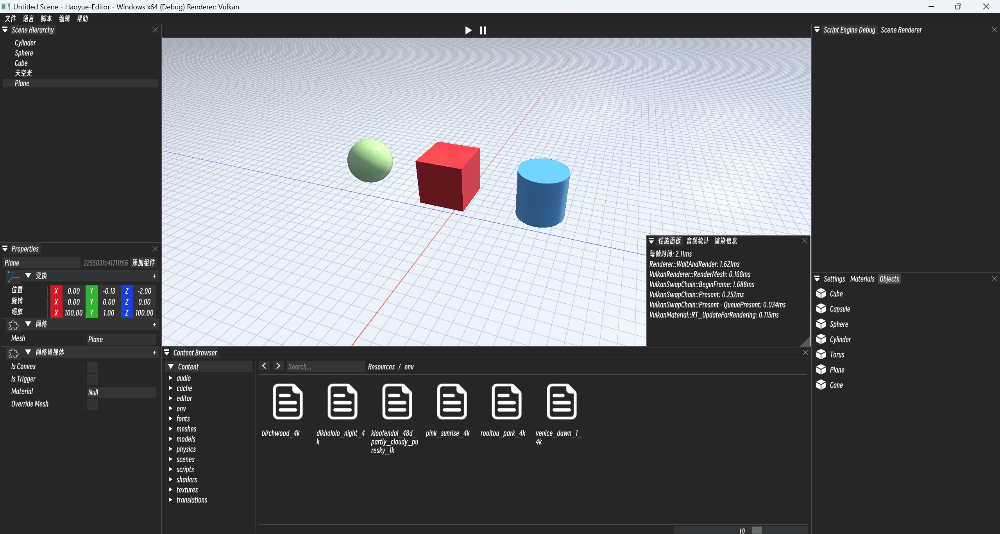
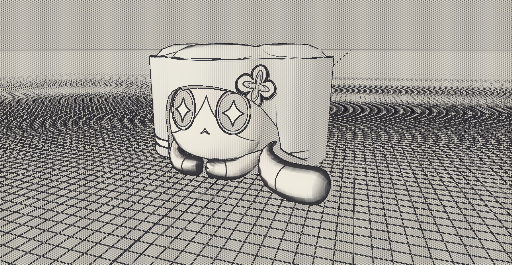

# Haoyue Engine

<div align="center">

**一个现代化的 C++ 游戏引擎，基于 Vulkan 图形 API**

[](LICENSE) [](https://isocpp.org/) [](https://www.vulkan.org/) [](https://www.microsoft.com/windows)

</div>

## 🎯 项目简介

Haoyue 是一个功能丰富的现代 C++ 游戏引擎，采用 Vulkan 作为底层图形 API，提供高性能的渲染能力和完整的工具链。引擎包含可视化编辑器、物理系统、音频系统、资源管理系统等核心模块，适合开发 3D 游戏和交互式应用。



## ✨ 主要特性

### 🎮 核心功能
- **高性能渲染系统**：基于 Vulkan 的现代渲染管线，支持 PBR 材质
- **场景管理系统**：实体组件系统（ECS），支持场景序列化和运行时编辑
- **物理引擎集成**：支持碰撞检测和刚体模拟
- **音频系统**：完整的音频播放和管理，支持多种音频格式
- **资源管理**：高效的资产导入、管理和序列化系统

### 🛠️ 开发工具
- **可视化编辑器**：完整的场景编辑器，支持实时预览和属性编辑
- **脚本系统**：C# 脚本支持，便于快速原型开发和游戏逻辑编写

### 🎨 渲染特性
- PBR材质系统
- 动态阴影映射
- Bloom 后处理效果
- 天空盒和环境光照
- 2D/3D 混合渲染
- 线框和轮廓渲染模式

## 📚 技术文档

深入理解引擎架构和实现细节：

- **[渲染模块文档](Docs/RenderingModule.md)** — Vulkan 渲染管线、多线程架构、级联阴影映射、风格化渲染效果详解
- **[音频模块文档](Docs/AudioModule.md)** — 双线程音频架构、miniaudio 集成、3D 空间音频与声源优先级管理
- **[C# 脚本模块文档](Docs/ScriptModule.md)** — Mono 运行时嵌入、Internal Call 双向绑定、ECS 脚本生命周期与热重载机制
- **[国际化多语言模块文档](Docs/TranslationModule.md)** — 运行时热切换 i18n 架构、两级缓存设计、缺失翻译自动追踪

## 🔗 参考资源

本引擎的开发参考了以下优秀的开源项目和课程：

- **[Hazel](https://github.com/StudioCherno/Hazel)** - 现代C++游戏引擎框架
- **[games104](https://games104.youkexueyuan.com/)** - 游戏引擎架构与开发课程
- **[godot](https://github.com/godotengine/godot)** - 开源游戏引擎
- **[sbox-public](https://github.com/faceslab/sbox-public)** - 游戏引擎相关资源
- **[cocos](https://github.com/cocos/cocos-engine)** - Cocos游戏引擎

## 🚀 快速开始

### 1. 克隆仓库

```bash
git clone https://github.com/yourusername/Haoyue.git
```

### 2. 安装依赖

确保已安装以下软件：
- [Visual Studio 2022](https://visualstudio.microsoft.com/)
- [Python 3.8+](https://www.python.org/)
- [Vulkan SDK](https://vulkan.lunarg.com/)
- [Git LFS](https://git-lfs.github.com/)

### 3. 生成项目文件

打开build文件夹点击setup.bat立刻生成

<div align="center">

</div>